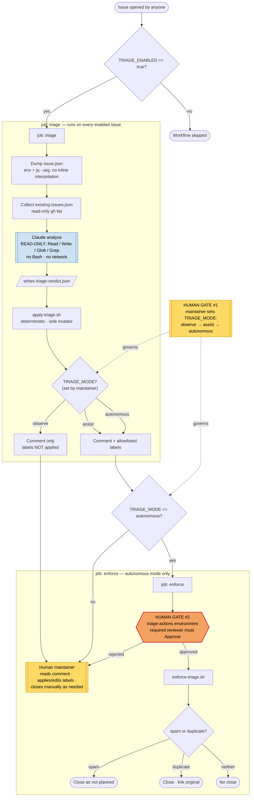

# Issue-triage workflow — flow, actors, and human gates

How `.github/workflows/issue-triage.yml` runs end to end, who is responsible for each step, and the
two places a human stays in the loop. For the threat model behind these choices see
[`README.md`](./README.md); for the label allowlist see [`../labels.md`](../labels.md).

## Flow

## The two human gates

* **Gate #1 — mode selection (standing decision).** A maintainer sets the `TRIAGE_MODE` repo
  variable, deciding how much authority the bot has at all: `observe` (comment only) → `assist`
  (comment + labels) → `autonomous` (adds gated closing). Changing it is one variable edit and takes
  effect on the next issue. This is where you dial autonomy up as trust grows.
* **Gate #2 — per-issue close approval (autonomous only).** The `enforce` job is bound to the
  `triage-actions` GitHub Environment. GitHub **pauses** the job and waits for a required reviewer
  to click **Approve** before `enforce-triage.sh` can close anything. Reject it and control falls
  back to the human. This is the "safe verdict before it goes ham."

In `observe` and `assist` modes there is no Gate #2 because nothing destructive happens — the human
is simply the next actor, acting on the bot's comment and labels at their own pace.

## Who does what, when, where

| Actor                           | Does what                                                                                                                          | When                                            | Where                                                                 |
| ------------------------------- | ---------------------------------------------------------------------------------------------------------------------------------- | ----------------------------------------------- | --------------------------------------------------------------------- |
| **Reporter** (anyone)           | Opens an issue                                                                                                                     | Trigger                                         | GitHub                                                                |
| **GitHub Actions**              | Fires the workflow; checks the kill switch                                                                                         | On `issues: opened`                             | `issue-triage.yml` → `on:` + `if: vars.TRIAGE_ENABLED`                |
| **Deterministic pre-steps**     | Serialize the issue via `env` + `jq --arg`; list open issues read-only                                                             | Start of `triage` job                           | `issue-triage.yml` → "Dump issue payload", "Collect open issues"      |
| **Claude (LLM)**                | Reads `issue.json` + `existing-issues.json`, classifies, drafts comment, suggests labels, flags duplicate/spam — **read-only**     | After context is prepared                       | `triage-prompt.md`; runs with `--allowedTools "Read,Write,Glob,Grep"` |
| **Claude (LLM)**                | Writes the one file it can act through                                                                                             | End of analysis                                 | `triage-verdict.json` (its only output)                               |
| **`apply-triage.sh`**           | Validates the verdict, escapes `#`-numbers, drops non-allowlist labels, posts the comment; applies labels in `assist`/`autonomous` | Immediately after analysis, every enabled issue | `apply-triage.sh`; targets `$ISSUE_NUMBER` from the event             |
| **Maintainer — Gate #1**        | Sets/changes `TRIAGE_MODE` (and `TRIAGE_ENABLED`)                                                                                  | Standing config decision                        | Repo → Settings → Variables                                           |
| **Maintainer (observe/assist)** | Reads the triage comment; confirms/edits labels; closes duplicates/spam manually                                                   | After the bot comments                          | GitHub issue UI                                                       |
| **Maintainer — Gate #2**        | Approves or rejects the close                                                                                                      | Per issue, `autonomous` only                    | GitHub → the paused `enforce` job / `triage-actions` environment      |
| **`enforce-triage.sh`**         | Closes as "not planned" for spam, or closes + links the original for duplicates                                                    | Only after Gate #2 approval                     | `enforce-triage.sh`; targets `$ISSUE_NUMBER` from the event           |

## What each mode does at a glance

| Mode                | Bot comments | Bot labels               | Bot closes           | Human role                         |
| ------------------- | ------------ | ------------------------ | -------------------- | ---------------------------------- |
| `observe` (default) | ✅           | ❌ (suggests in comment) | ❌                   | Does all labeling/closing manually |
| `assist`            | ✅           | ✅ (allowlist only)      | ❌                   | Closes manually; adjusts labels    |
| `autonomous`        | ✅           | ✅ (allowlist only)      | ✅ **after Gate #2** | Approves/rejects each close        |
