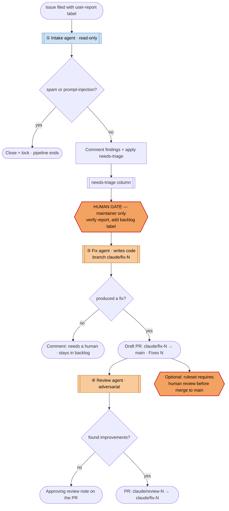

# Agentic issue pipeline — flow, actors, and the human gate

How a user report travels from filed to reviewed-fix-PR across four stages, and the one place a
human must act. Security rationale is in [`README.md`](./README.md); labels in
[`../labels.md`](../labels.md).

## Flow

Blue = low-autonomy (comment / label / close-own-issue only). Orange = high-autonomy (writes code,
opens PRs). The gate is the wall between them — **autonomy escalates only across the `backlog`
label, which only a human can apply.**

## The human gate

There is exactly one required human action: **a maintainer adds the `backlog` label** to a
`needs-triage` issue they've verified. It's enforced, not just convention:

* No agent has `backlog` in any allowlist — nothing automated can promote an issue.
* The fix agent additionally refuses unless `sender.type == 'User'` **and** the promoter has
  `write`/`admin`/`maintain` on the repo.

Everything before the gate is reversible and non-destructive-to-code; everything after it writes
code but only ever lands as a **draft PR you review and merge**. (Dragging the card to a Backlog
column can be your visual habit — but on a personal-account Project the *label* is what the machine
watches. See the README's upgrade note.)

## Who does what, when, where

| Actor                                | Does what                                                                         | When                        | Where                                                     |
| ------------------------------------ | --------------------------------------------------------------------------------- | --------------------------- | --------------------------------------------------------- |
| **Reporter** / template              | Files an issue carrying `user-report`                                             | Trigger                     | GitHub                                                    |
| **Intake agent (Claude, read-only)** | Classifies, drafts comment, flags spam/dupes → writes `triage-verdict.json`       | On `user-report`            | `intake-prompt.md`                                        |
| **`apply-intake.sh`**                | Posts comment; closes+locks spam; else applies `needs-triage` (+ type labels)     | Right after analysis        | `apply-intake.sh` (sole mutator, targets `$ISSUE_NUMBER`) |
| **Maintainer — the gate**            | Verifies the report, adds `backlog`                                               | After intake                | GitHub issue UI (label)                                   |
| **Fix agent (Claude)**               | Branches `claude/fix-N`, implements a scoped fix, runs checks/tests, commits      | On human `backlog`          | `fix-prompt.md`                                           |
| **`open-fix-pr.sh`**                 | Pushes + opens a **draft** PR (or comments if no fix)                             | After the agent             | `open-fix-pr.sh`                                          |
| **Review agent (Claude)**            | Adversarially reviews the diff, commits concrete suggestions to `claude/review-N` | On `claude/fix-*` PR opened | `review-prompt.md`                                        |
| **`open-review-pr.sh`**              | Opens a PR into the fix branch (or leaves an approving note)                      | After the review            | `open-review-pr.sh`                                       |
| **Maintainer — merge**               | Merges suggestions into the fix, then the fix into `main`                         | End                         | GitHub PR UI                                              |

## Enable each stage independently

| Repo variable         | Turns on | Recommended rollout                                                   |
| --------------------- | -------- | --------------------------------------------------------------------- |
| `INTAKE_ENABLED=true` | Stage ①  | Start here — low risk.                                                |
| `FIX_ENABLED=true`    | Stage ③  | Enable once you trust intake and are ready for code-writing autonomy. |
| `REVIEW_ENABLED=true` | Stage ④  | Enable alongside or after ③.                                          |

Set at **Settings → Secrets and variables → Actions → Variables**.
