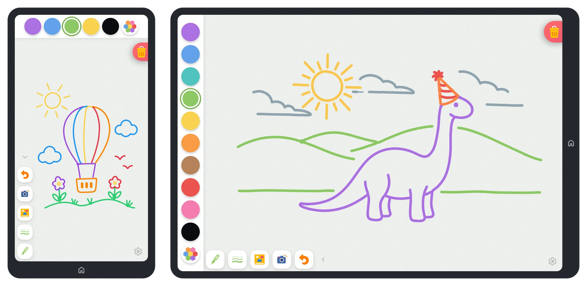
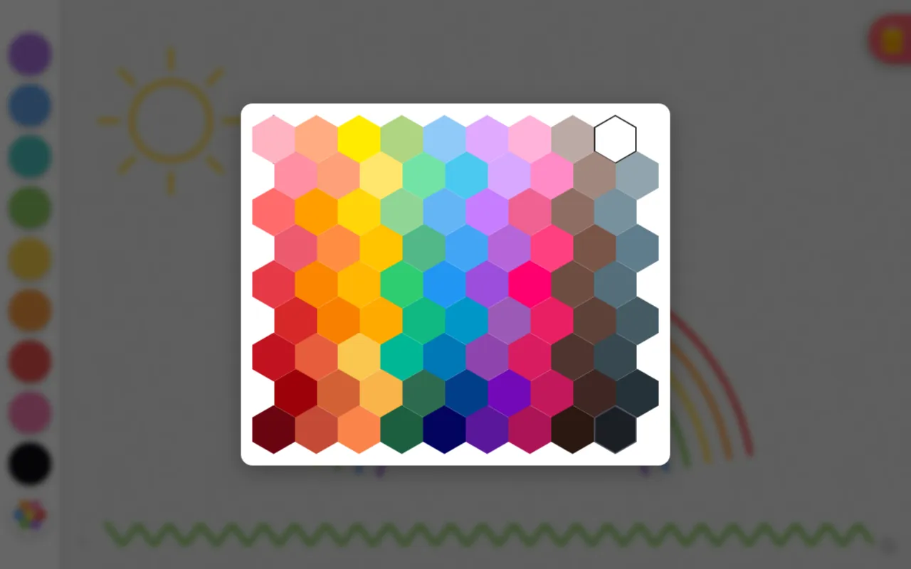
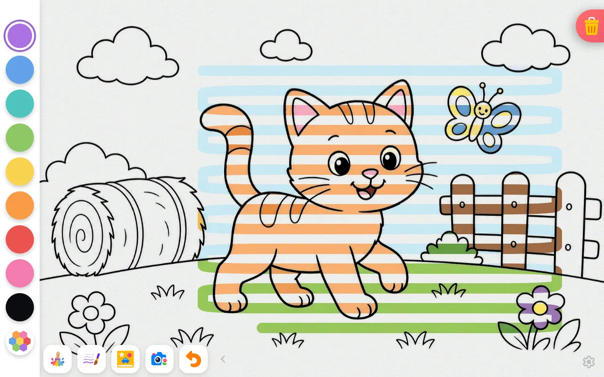

# Splotch

**A drawing app for toddlers (2+).** Big buttons, bright colors, and no menus to get lost in — just
touch the screen and scribble. Grown-up stuff stays safely out of reach behind a parental gate.

**Try it right now at [splotch.art](https://splotch.art/)** — it's an offline-first PWA on the web,
and the same codebase ships as native Android and iOS apps.



## What can it do?

* **Draw** with a pen, a waxy crayon, or the *magic brush* — with subtle pencil-scratch sounds as
  you go
* **Pick colors** from a kid-sized palette, or tap the rainbow button to explore 88+ curated colors
  in a honeycomb grid
* **Color** built-in coloring books, where the magic brush reveals the picture underneath as you
  scribble
* **AI-ify** a drawing into a polished illustration (token-gated — it calls a paid model)
* **Clear** by dragging the trash can — a deliberate gesture little hands won't trigger by accident
* **Take it anywhere** — installable, works fully offline, keeps the screen awake while drawing

| The honeycomb color picker                                                        | The magic brush revealing a coloring page                                                  |
| --------------------------------------------------------------------------------- | ------------------------------------------------------------------------------------------ |
|  |  |

## Quick start

```bash
npm install
npm run dev     # → http://localhost:5173
```

That's genuinely it. For everything else — prerequisites, the dual web/native build, env vars,
testing, deployment, and conventions — head to the [contributing guide](docs/CONTRIBUTING.md).

## Finding your way around

One SvelteKit codebase ships two targets: the web app on Netlify (SSR + `/api/*` functions) and
fully static native apps via Capacitor. The best entry points, roughly in reading order:

| Start here                                                 | For                                                              |
| ---------------------------------------------------------- | ---------------------------------------------------------------- |
| [Contributing guide](docs/CONTRIBUTING.md)                 | Dev setup, the dual-build, testing, code conventions             |
| [Architecture guide](.claude/skills/architecture/SKILL.md) | Tech stack, file-by-file source map, UI element glossary         |
| [Mobile guide](.claude/skills/mobile/SKILL.md)             | Android/iOS toolchains, native builds, store releases            |
| [docs/adrs/](docs/adrs/)                                   | Architectural decision records — the *why* behind how it's built |
| [GitHub Issues](https://github.com/kylemit/splotch/issues) | The live backlog ([how it's organized](docs/ISSUE-WORKFLOW.md))  |
| [Design styleguide](https://splotch.art/design)            | The live design-token styleguide, straight from the app          |
| [Scrapbook](https://kylemit.github.io/Splotch/)            | Committed run outputs — proof sheets, icon gallery, perf reports |
| [Privacy policy](https://splotch.art/privacy)              | What the app collects (spoiler: nothing it doesn't have to)      |

## License

MIT
