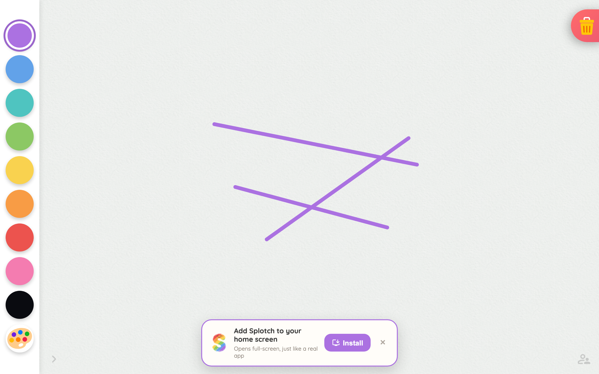
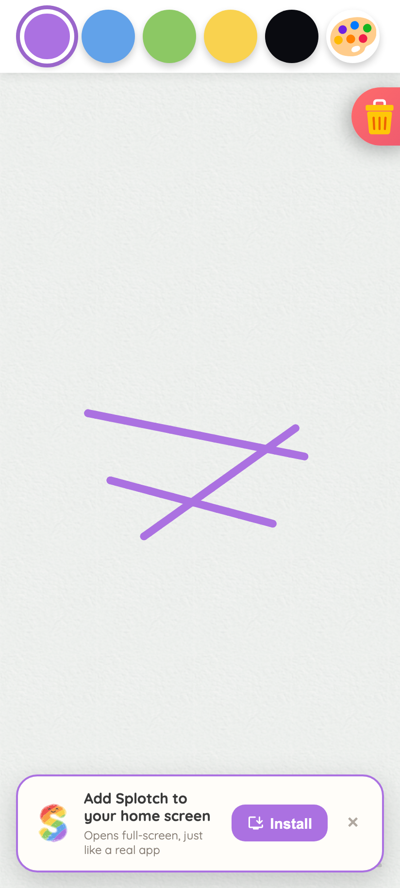
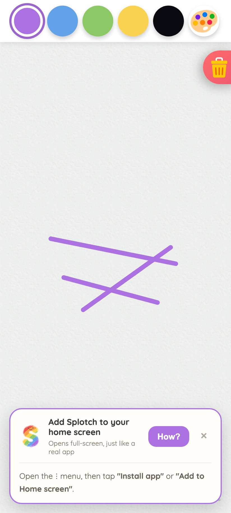
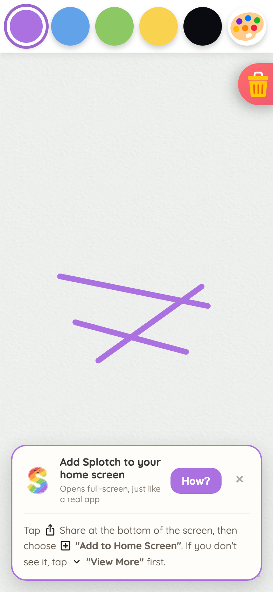
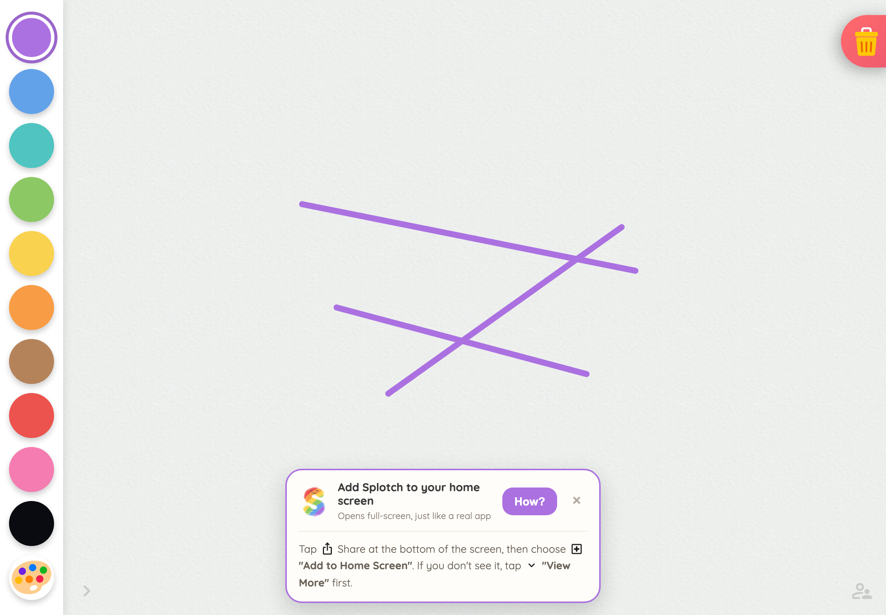
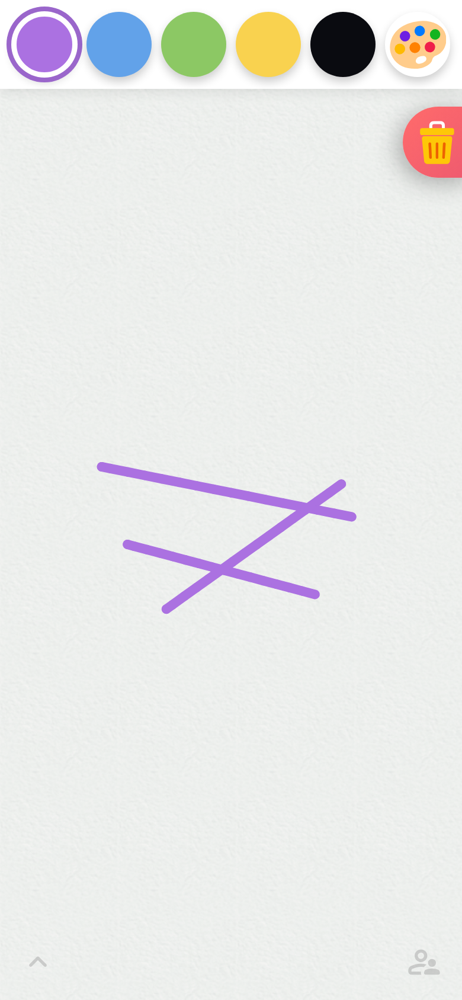

# ADR-0039: Friendly PWA Install Prompt — Capture `beforeinstallprompt`, Fall Back to Guided Hints

**Status:** Active **Date:** 2026-06

## Context

On the web target, the best way to "install" Splotch is to add it to the home screen so it launches
full-screen like the native apps. Until now the only in-app help was a static, per-OS step list
buried in the Parent Center Setup tab (`SetupInstructions.svelte`). Parents had to find the faint
Parent Help button, open the Setup tab, and follow written instructions — far from the "one tap to
install" experience modern browsers can offer.

Browsers expose install very differently, and the difference drives the whole design:

* **Chromium (Android Chrome, desktop Chrome/Edge)** fires a `beforeinstallprompt` event when the
  PWA install criteria are met (valid manifest, served over HTTPS, a registered service worker). The
  page can call `preventDefault()` to suppress the browser's own mini-infobar, stash the event, and
  later call `.prompt()` from a user gesture to show the **real one-tap native install dialog**.
  This is the gold standard.
* **iOS Safari** exposes **no install API at all** — no `beforeinstallprompt`, no programmatic "Add
  to Home Screen". The only path is the user manually opening the Share sheet and choosing "Add to
  Home Screen". No web app can do better than *guide* the user there. The in-app Chrome/Firefox/Edge
  WebViews on iOS (`CriOS`/`FxiOS`/`EdgiOS`) can't even do that, so we must not promise it.
* **Native Capacitor shell** is already installed, so the entire feature is inert there.

The audience is toddlers, so a large, eye-catching install card is a hazard — a child will tap it
before a parent ever sees it. The prompt must be present but restrained, and worded for the parent.

## Decision

A single reactive module, `web/src/lib/state/install.svelte.ts`, owns install state and the
`beforeinstallprompt` capture (modeled on `network.svelte.ts`: a `$state` object plus an `init*()`
function called once from `+page.svelte`, web-only). One deviation from that model: the
`beforeinstallprompt` / `appinstalled` listeners register at **module load**, not inside `init*()` —
the event is one-shot and on a repeat visit (service worker already controlling the page) Chromium's
installability check races hydration, so an `onMount`-time listener could miss it forever. The
module also owns device detection (`installDeviceOs()`); consumers must not re-sniff the UA. It
computes a `mode`:

| `mode`    | Meaning                                                                     | UI                                               |
| --------- | --------------------------------------------------------------------------- | ------------------------------------------------ |
| `oneTap`  | Chromium fired `beforeinstallprompt`; the event is stashed                  | A button that replays it → native install dialog |
| `android` | Android browser, no live prompt (criteria unmet, Firefox, already declined) | Friendly "open the ⋮ menu" hint                  |
| `ios`     | Real iOS Safari                                                             | Friendly "tap Share → Add to Home Screen" hint   |
| `none`    | Already installed, native shell, or unsupported browser                     | Nothing                                          |

`promptInstall()` replays the stashed event from a user gesture and returns the outcome. A
`beforeinstallprompt` event can only be `prompt()`ed once, so on `accepted` we mark installed (and
persist it), and on `dismissed` we drop back to the manual hint and stop surfacing the floating
banner on this device. A stale or already-spent prompt returns `'unavailable'` (never throws —
callers' busy flags must not strand) and likewise drops to the manual hint.

Two surfaces consume the state:

1. **Install Banner** (`InstallBanner.svelte`) — a small, rounded, parent-facing pill anchored
   bottom-center. It appears only after the child has drawn at least a few strokes
   (`canvasState.strokeCount`, fed by a new `onStrokeEnd` engine callback that fires at stroke
   commit), so it feels earned, and it mounts between strokes — never while a finger is mid-stroke.
   On `oneTap` its button fires the native dialog; on `ios`/`android` it expands an inline how-to.
   It is dismissible, and the dismissal is remembered.

   On phones the banner is wider than the gap between the bottom-corner controls (actions toggle,
   Parent Help button), and shrinking it to fit would cram the parent-facing copy into ~260px.
   Instead it stacks **above** those controls (`z-index` over their 900/901), and the takeover is
   kept short: five strokes after it appears — proof the child kept drawing and no parent is
   engaging (the countdown pauses while the how-to is expanded or the native dialog is up) — it
   auto-dismisses. The auto-clear persists the same `dismissed` flag as the × button, briefly swaps
   the pill to a parting message ("these steps are always in the Parent Center"), then animates the
   pill into the Parent Help button so the message lands spatially too. Lifting the banner above the
   corner controls instead was rejected: with the actions panel expanded the required lift would
   push the banner toward mid-canvas.
2. **Parent Center → Setup tab** — the existing step list, upgraded to show the one-tap button above
   the per-OS manual steps when available (the prompt is browser-wide — Android *or* desktop
   Chromium — so it belongs to no single OS section). Section ordering and the installed checkmark
   come from the install module (`installDeviceOs()`, `install.installed`), not a component-local
   re-detection. The Setup guide ignores the banner's `dismissed` flag, so a parent can always find
   it.

Persistence uses the existing dual-layer storage (`splotch-install-dismissed`,
`splotch-install-completed`). An `appinstalled` listener marks the app installed no matter which
path the browser used. The persisted installed flag is not trusted forever: `beforeinstallprompt`
only fires when the app is *not* installed, so a later event clears a stale flag (installed once,
then uninstalled — localStorage survives a PWA uninstall) and re-offers one-tap.

## Consequences

**+** Android/Chromium parents get a genuine one-tap install, surfaced at a natural moment, instead
of hunting through written instructions.

**+** iOS gets the best experience the platform physically allows — a friendly, correctly-targeted
Share-sheet hint — and we never promise one-tap where it can't exist (including iOS in-app
browsers).

**+** Kid-safe: restrained, parent-worded, gated behind real drawing engagement, dismissible, and
never re-nags once installed or declined.

**+** One source of truth (`install.svelte.ts`); the banner and the Setup tab are thin consumers.
Fully unit-tested (mode detection, install/decline/replay, `appinstalled`, persistence).

**−** `beforeinstallprompt` is Chromium-only and fires only when the PWA criteria are met, so the
one-tap path never appears in `vite dev` (no service worker) or on Firefox — those correctly fall
back to the manual hint, which makes the one-tap path harder to verify locally (needs a production
build / preview).

**−** The engine gains one more callback (`onStrokeEnd`). It is a single call in
`commitActiveCommand()`, consistent with the existing callbacks-out pattern (ADR-0004), but it is
one more wire between the imperative engine and reactive state.

## Appearance by context

Point-in-time screenshots (2026-07) of the banner in each context it can run, captured from emulated
devices. They are **not** kept in sync automatically — if the banner changes enough that these
mislead, regenerate them with
[`assets/0039-install-banner/generate-screenshots.mjs`](assets/0039-install-banner/generate-screenshots.mjs)
(it emulates each UA/viewport, draws the three qualifying strokes, and synthesizes
`beforeinstallprompt` for the one-tap shots).

| Context                                                           | Mode                                                       | Screenshot                                                                                       |
| ----------------------------------------------------------------- | ---------------------------------------------------------- | ------------------------------------------------------------------------------------------------ |
| Desktop Chrome/Edge                                               | `oneTap` — Install button fires the native dialog          |           |
| Android phone, Chrome (install criteria met)                      | `oneTap`                                                   |             |
| Android phone, no live prompt (Firefox, criteria unmet, declined) | `android` — "How?" expands the ⋮-menu hint                 |       |
| iPhone, Safari                                                    | `ios` — "How?" expands the Share-sheet hint                |  |
| iPad (tablet), Safari                                             | `ios`                                                      |   |
| iPhone, Chrome (CriOS in-app WebKit)                              | `none` — no banner; Add-to-Home-Screen doesn't exist there |       |
