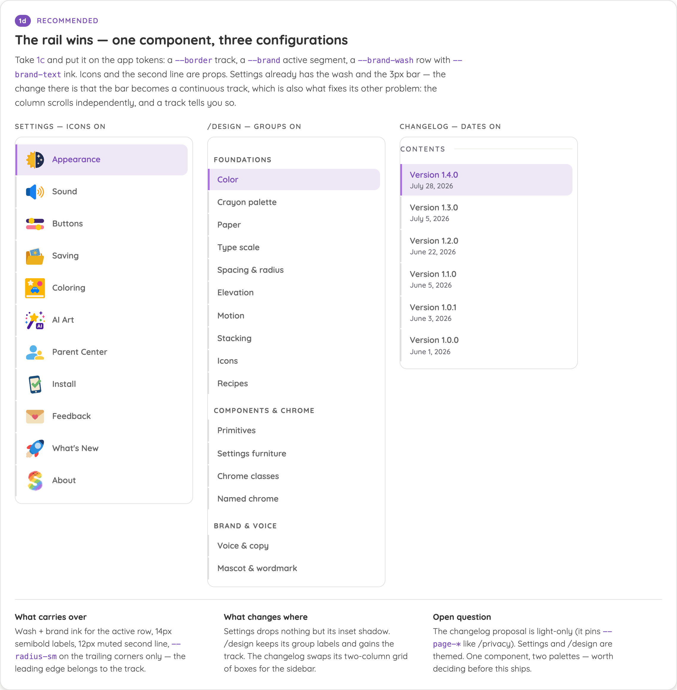

# Handoff — sidebar TOC (option 1d, guide-rail)

One sidebar treatment for Settings, `/design` and `/changelog`. Extracted from
`Sidebar TOC study.dc.html` (option **1d**).



---

## The decision

All three sidebars are the same pattern — a scrollspy table of contents over one
continuously scrolling document — so they should look the same. The winning
treatment is the **guide-rail TOC**: a continuous hairline track down the whole
list, with the current row's segment thickened and tinted.

| Today | Conventional name | Change |
| --- | --- | --- |
| Settings (`WideShell.svelte`) | active-indicator list | inset bar becomes a continuous track |
| `/design` | grouped anchor nav (pill) | gains the track; groups stay |
| `/changelog` (proposed) | guide-rail TOC | ships as-is, on app tokens |

Why the rail: the highlight has to read as a *reading position*, not a selection.
A pill on its own is indistinguishable from a hover leftover, and an indicator
that exists only on the active row draws no line down the list. The track also
makes it visible that the column is its own scroller — the thing `WideShell`'s
`revealNavRow()` already works around.

---

## Visual spec

All values are existing tokens. Nothing new enters `tokens.ts`.

**Track (every row)**

```css
border-left: var(--border-width) solid var(--border);  /* 1px #e0e0e0 */
```

Rows sit flush against each other with no vertical gap, so the borders join into
one continuous line. `gap` on the list container breaks the track — use
padding inside the row instead.

**Row**

```css
display: flex;
align-items: center;
gap: var(--space-3);            /* 12px */
padding: 9px var(--space-4);    /* 16px h */
border-radius: 0 var(--radius-sm) var(--radius-sm) 0;   /* trailing corners only */
color: var(--text-soft);
font-size: var(--font-size-sm);
font-weight: var(--font-weight-semibold);
line-height: 1.3;
text-align: left;
transition: background var(--duration-fast) ease, color var(--duration-fast) ease;
```

The leading edge belongs to the track, so it never rounds.

**Active row**

```css
border-left: 3px solid var(--brand);
padding-left: 13px;             /* holds the label on one x-position */
background: var(--brand-wash);
color: var(--brand-text);
```

`--brand-text` on `--brand-wash` clears WCAG AA; `--brand` carries the track,
which holds no text (the 3:1 non-text floor applies) — the same reasoning as
today's `WideShell` comment.

**Hover** — guarded behind `@media (hover: hover)`, non-active rows only:

```css
background: var(--surface-hover);
color: var(--text-strong);
```

**Optional parts**

| Part | Spec |
| --- | --- |
| Leading icon | 34×34, `flex-shrink: 0` — `SectionIcon` as today |
| Second line | `--font-size-xs`, `--font-weight-medium`, `--text-soft`, 2px under the label |
| Group label | `--font-size-xs`, bold, `0.1em` tracking, uppercase, `--text-soft`, `0 10px`, `18px` above / `6px` below — sits **outside** the track (the break is deliberate) |
| Rule label | `RuleLabel` above the list, as `/changelog` uses today |

---

## Per-surface changes

### 1. `web/src/lib/components/settings/WideShell.svelte`

Only `.settings-nav` and `.settings-nav-item` change. No script changes — the
scrollspy, `revealNavRow()` and the jump arithmetic are untouched.

- `.settings-nav`: drop `gap: 2px` (it breaks the track). Keep the width, the
  `overflow-y`, `overscroll-behavior: contain`, and the four-layer edge-shade
  background exactly as they are.
- `.settings-nav-item`: `border-radius: var(--radius-md)` →
  `0 var(--radius-sm) var(--radius-sm) 0`; add the `border-left` track; padding
  `8px 14px` → `9px 16px`.
- `.settings-nav-item.active`: replace `box-shadow: inset 3px 0 0 var(--brand)`
  with the 3px `border-left` + 13px `padding-left`. Wash and ink are unchanged.

Watch the edge shades: the two `local` gradient covers paint over the track at
whichever end is at rest. Verify the track doesn't appear to stop short at the
top and bottom of the scrolled column.

### 2. `web/src/routes/design/+page.svelte`

`.toc-items` and `.toc-items a` only.

- `.toc-items`: `gap: 1px` → `0`.
- `.toc-items a`: add the track; `border-radius: var(--radius-sm)` →
  `0 var(--radius-sm) 0 0` pattern above; padding `6px 10px` → `9px 16px`.
- `.toc-items a.active`: keep the wash + `--brand-text`, add the 3px segment.
- `.toc-label` keeps its `padding: 0 10px` and stays outside the track.

The `.chip-nav` (below 980px) is a different pattern and is **not** in scope.

### 3. `web/src/routes/changelog/+page.svelte`

The real change: the contents block stops being a two-column grid of bordered
boxes and becomes the sidebar.

- `.contents ol` → the rail list; `.contents a` → the row, with
  `<span>Version x</span>` as the label and `.contents-date` as the second line.
- Drop `border: var(--border-width) solid var(--page-rule)` and
  `justify-content: space-between` — the date moves under the version, not
  beside it.
- The page needs a two-column shell (sidebar + releases) for this to be a
  sidebar at all. `PageShell`'s sheet is `max-width: 880px`; a 216–232px column
  plus a 40px gutter leaves ~600px of release notes, inside the `62ch`
  `--page-measure`. Below the shell's 920px breakpoint the sidebar should stack
  above the releases as it does today.
- Add a scrollspy so the active release tracks the reading position, matching
  the other two. Without it the rail marks a click target, which is the one
  thing the treatment is chosen not to do.

---

## Extracting the component

`SidebarToc.dc.html` in this project is the working reference. In the app it
should land as `web/src/lib/components/nav/SidebarToc.svelte`.

### Props

```ts
interface SidebarTocItem {
  id: string;
  label: string;
  /** Second line — the changelog's date. */
  meta?: string;
  /** Leading spot icon — Settings only. */
  icon?: IconName;
  /** Uppercase group heading this item opens, if any — /design only. */
  group?: string;
}

interface Props {
  items: SidebarTocItem[];
  /** The scrollspied section — an indicator, not a page state. */
  active: string;
  onSelect: (id: string, trigger: HTMLElement) => void;
  /** aria-label for the <nav>. */
  label: string;
}
```

No `variant` prop. The four demo variants exist to compare them; once 1d wins
there is one treatment, and the differences between the three surfaces are
entirely data — an item with an `icon` renders one, an item with `meta` renders
a second line, an item with a new `group` emits a heading first. A `variant`
prop here would re-open the drift the component is meant to close.

### What stays out

- **Scrollspy.** Each host measures a different scroller — `WideShell` reads its
  own pane's `scrollTop` with a visual-scale correction, `/design` reads
  `window`. Both already exist and both are correct; the component takes
  `active` and renders it.
- **Scroll-into-view of the active row.** `WideShell`'s `revealNavRow()`
  (24px clearance, `prefers-reduced-motion` aware) is the behaviour, but it is
  the host's scroller. If it's worth sharing, extract it separately as
  `revealRow(nav, row, clearance)` — `/design`'s `CHIP_SCROLL_INSET_PX` is the
  same value for the same reason.
- **Jump behaviour.** Settings scrolls a pane by arithmetic; the other two are
  anchor links. `onSelect` covers both.
- **The parental gate.** Settings' Parent Center row unlocks before jumping.
  That belongs in the host's `onSelect`, not in a nav component.

### Recipe entry

Add to `RecipeSections.svelte` alongside the existing card/pill recipes:

> **Sidebar TOC** — a scrollspy table of contents over one continuous document.
> `--border` hairline track down the full list · active segment 3px `--brand` ·
> active row `--brand-wash` fill with `--brand-text` ink · `--radius-sm` on the
> trailing corners only. Icons and a second line are per-item. Use it wherever a
> column indexes one scrolling page; use the `Button` primitive's chip variant
> for anything that actually switches pages.

Then register it in `ChromeSections.svelte`'s named-chrome index, which already
describes the settings shells ("One section list, two responsive shells").

---

## Open question — palette

`/changelog` pins a light-only `--page-*` palette (matching `/privacy`), while
Settings and `/design` are themed. The component should read
`var(--page-link, var(--brand-text))`-style fallbacks so one implementation
serves both, **or** the changelog adopts the theme. Worth settling before this
ships — it changes the component's public surface.

---

Source: KyleMit/Splotch @ `main` — see `github.md` for the file map.
