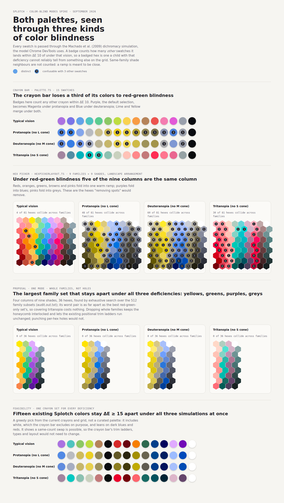
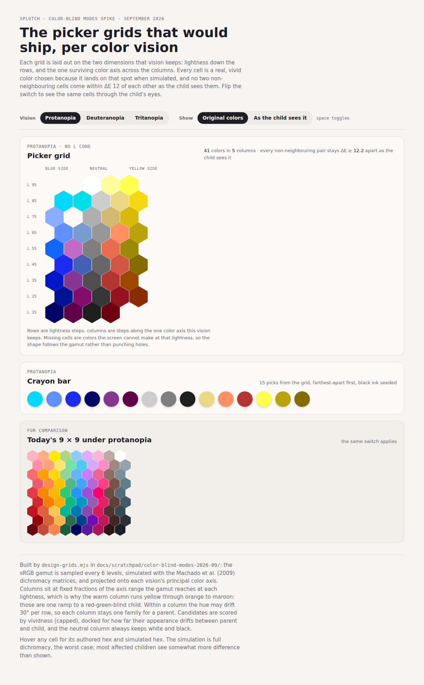

# Color-blind modes spike — 2026-09-13

**Question:** what would it take to offer color-blind modes in Splotch, and which spots in the hex
grid are wasted on colors a color-blind child cannot use?

**Short answer:** a single opt-in parent setting is the right first release, not three per-type
modes. Under it, the crayon bar swaps its 15 hexes for 15 that stay apart under every deficiency at
once (feasible from colors Splotch already owns), and the hex picker drops five of its nine hue
families — whole columns, not individual hexes — because under red-green blindness those five
columns *are* one column. Roughly two to three days of work for that first release; the numbers, the
reasoning, and the code it touches are below.

Evidence in this folder:

| File              | What it is                                                                                                           |
| ----------------- | -------------------------------------------------------------------------------------------------------------------- |
| `cvd-lib.mjs`     | The simulation and distance arithmetic, plus loaders that read both palettes straight out of the source files        |
| `audit.mjs`       | The audit; `node docs/scratchpad/color-blind-modes-2026-09/audit.mjs` from the repo root reproduces `audit.out.txt`  |
| `audit.out.txt`   | Its verbatim output: every confusable pair, the family-vs-family matrices, the subset searches                       |
| `proof-sheet.mjs` | Renders `proof-sheet.html`, both palettes as each kind of vision sees them, each hex badged with its collision count |
| `proof-sheet.png` | That page, rendered (`proof-sheet-grid.png` is the hex-grid section alone)                                           |

### Per-deficiency grids (added 2026-09-14)

| File               | What it is                                                                                                                                                                                                                                                                                                                                            |
| ------------------ | ----------------------------------------------------------------------------------------------------------------------------------------------------------------------------------------------------------------------------------------------------------------------------------------------------------------------------------------------------- |
| `design-grids.mjs` | Designs one picker grid per deficiency from the whole sRGB gamut and writes `grids.json`: rows are lightness steps, columns are fractions of the one color axis that vision keeps (measured on the simulated color), each column's hue may drift 30° per row so it stays one family for a parent, and no two non-neighbouring cells come within ΔE 12 |
| `grids-sheet.mjs`  | Renders `grids.html`: the grid and a 15-crayon bar per deficiency, with a switch between the authored colors and the child's view, and today's 9 × 9 under the same switch                                                                                                                                                                            |
| `grids-*.png`      | That page, rendered in both views                                                                                                                                                                                                                                                                                                                     |

What the designer settled on, and why the earlier family-subset answer (yellows, greens, purples,
greys) is superseded by it: under red-green blindness yellow, orange, red and maroon sit on the
*same* gamut edge and differ only by lightness, so one warm column runs yellow through orange to
maroon and reads as a single yellow-to-brown ramp to the child. A grid built from the current
equal-lightness hue families can never express that; a grid laid out on lightness × axis can. The
five columns per deficiency are: strong blue, purple, neutral, and two warm steps for protan and
deutan (41 and 40 cells); strong teal, green, neutral, and two red-side steps for tritan (38 cells).
Three scoring decisions shaped the picks and are named as constants in the script: vividness is
capped so neon never wins on chroma alone, a color is docked for how far its appearance drifts
between parent and child (the "should we show what they see" question, answered as a tiebreaker
rather than a rule), and the neutral column always keeps white and black.

## Method and its limits

Every swatch is passed through the Machado, Oliveira & Fernandes (2009) dichromacy matrices at
severity 1.0, in linear sRGB — the model Chrome DevTools' "Emulate vision deficiencies" uses — and
distances are CIE76 ΔE in CIELAB on the simulated colors. Two thresholds carry the reading: ΔE below
10 is hard to tell apart at a glance for adjacent large swatches, and ΔE below 5 is near-identical.

Two caveats worth carrying into any decision:

* **Severity 1.0 is the worst case.** Most color blindness is anomalous trichromacy, a milder shift
  of one cone rather than its absence. The confusable sets below are upper bounds; a palette that
  works for dichromats works for the milder majority too.
* **The child is almost certainly undiagnosed.** Splotch is for ages 2+, and color-vision screening
  is rarely reliable before 4 or 5. A parent choosing a mode is choosing on a hunch or on family
  history — a strong reason for one setting that covers everything over a menu of medical terms.
  Prevalence is roughly 1 in 12 boys and 1 in 200 girls for the red-green types together, and around
  1 in 10,000 for blue-yellow (tritan).

## Findings

### The crayon bar (`palette.ts`, 15 swatches)

Pairs a deficiency pulls under ΔE 15 (the near-identical ones bold):

| Vision | Pairs | Worst offenders                                                                                                                    |
| ------ | ----: | ---------------------------------------------------------------------------------------------------------------------------------- |
| protan |     8 | **Purple ≈ Magenta (3.5)**, Purple ≈ Indigo (5.7), Lime ≈ Yellow (8.1), Indigo ≈ Magenta, Brown ≈ Red, Green ≈ Orange, Pink ≈ Grey |
| deutan |    12 | **Lime ≈ Yellow (3.6)**, Purple ≈ Blue (5.5), Teal ≈ Grey (6.6), Pink ≈ Grey (7.8), Brown ≈ Red, Teal ≈ Pink, Lime ≈ Orange, …     |
| tritan |     4 | **Teal ≈ Mint (4.9)**, Pink ≈ Magenta, Orange ≈ Pink, Blue ≈ Teal                                                                  |

Purple is the default selection, and under both red-green types it is one of the collisions. The
trim order's "core rainbow" (Red, Orange, Green, Yellow, Blue, Purple, Black — what a small phone
keeps) fares better than the full box but still pairs Green with Orange under protan (9.7) and
Purple with Blue under deutan (5.5).

### The hex picker (`hexPickerLayout.ts`, 9 families × 9 shades)

Only cross-family collisions are counted: shade neighbours inside a family are a ramp and are
supposed to be close.

| Vision | Cross-family pairs under ΔE 10 | Hexes involved | Families that fold together                                                                                 |
| ------ | -----------------------------: | -------------: | ----------------------------------------------------------------------------------------------------------- |
| protan |                             48 |       48 of 81 | reds ↔ oranges, greens, browns, greys · blues ↔ purples · pinks ↔ greys · oranges ↔ yellows                 |
| deutan |                             67 |       60 of 81 | reds ↔ oranges, greens, browns, pinks · blues ↔ purples · pinks ↔ greys, greens, browns · oranges ↔ yellows |
| tritan |                             31 |       30 of 81 | reds ↔ pinks, oranges, yellows · greens ↔ blues                                                             |

The family-vs-family matrices in `audit.out.txt` make the structure plain. Under typical vision the
nearest two families are oranges and yellows at ΔE 7, and everything else sits 13 or more apart.
Under deutan the same table has reds–pinks at 3, oranges–greens at 2, greens–pinks at 3,
blues–purples at 2, browns–greens at 4. The grid was authored as nine equal-lightness hue rotations,
and hue is exactly the axis red-green blindness removes; what survives is lightness and a
blue–yellow axis, and nine families map onto perhaps three positions along it.

Two searches quantify how much of the grid is genuinely usable:

* **Whole families.** Exhaustive over all 512 subsets, keeping the largest set whose every pair
  stays ΔE ≥ 10 apart at every shade:
  * protan: yellows, greens, purples, pinks (worst pair 14.4)
  * deutan: reds, yellows, blues, greys (worst pair 18.9)
  * tritan: six families — yellows, greens, purples, pinks, browns, greys
  * protan **and** deutan together: yellows, greens, blues, greys (worst pair 11.9)
  * all three together: yellows, greens, purples, greys (worst pair 11.9 — the same margin as the
    red-green-only set, so covering tritan costs nothing)
* **Individual hexes.** A greedy walk keeping a hex only if it stays ΔE ≥ 15 from every hex already
  kept: the untouched grid holds 46 mutually distinct colors, protan 21, deutan 24, tritan 23, all
  three at once 21.

So a color-blind child gets about a quarter of the grid's distinctions from a grid that costs them
all 81 targets — 60 of which, under deutan, collide with something in another column.

### One crayon set for every deficiency is feasible

A greedy pick over the current crayons and then the grid finds **15 existing Splotch colors that
stay ΔE ≥ 15 apart under typical, protan, deutan and tritan vision simultaneously** (last section of
`audit.out.txt`; last section of the proof sheet). It is a feasibility exhibit, not a palette — it
includes white, which the crayon bar excludes on purpose, and leans on dark blues and reds — but it
settles the question of whether the bar can keep its 15 slots. It can, which means its trim ladder,
its types and its layout need not change.

## What the code looks like today

The pieces a mode would touch, and the constraint each carries:

* `web/src/lib/palette.ts` — the 15 crayons as `PALETTE_SOURCE`, with `PaletteLabel` derived as a
  closed union and `TIER_TRIM_PRIORITY` compile-checked to rank every label exactly once.
  `paletteHex(label)` is also used outside the drawing surface (the beta page's masthead strips,
  privacy page pills, the parental gate's splats); those callers want the *brand* palette whatever
  the child's mode is.
* `web/src/lib/hexPickerLayout.ts` — `COLOR_FAMILIES` (9 × 9, `SHADE_COUNT` fixed at 9) and the two
  static arrangements, portrait (families as rows) and landscape (the transpose).
* `web/src/lib/components/ColorPicker.svelte` — renders both grids; pure-CSS trim ladders on
  positional classes `r1`–`r9` / `c1`–`c9` (ADR-0048), each height step restating which rows carry
  the honeycomb offset. `design/trimGeometry.test.ts` parses this style block and asserts every
  threshold; `web/tests/picker-trim.spec.ts` walks the rungs in a browser.
* `web/src/lib/components/ColorPalette.svelte` — swatches tagged `data-trim-rank` from `TRIM_ORDER`;
  the portrait ladder's 13 breakpoints assume 15 swatches. `landscapeToolbar.ts` and
  `ColorMenu.svelte` (phone landscape) derive their subset from the same `TRIM_ORDER`.
* `web/src/lib/state/colors.svelte.ts` — `activeSwatch` (identity) vs `activeColor` (paint), and
  `themedSwatchColor`, the precedent for a swatch that presents a different hex than its identity.
* `web/src/lib/state/settings.svelte.ts` + `storageKeys.ts` — the `BOOL_SETTINGS` table generates
  state, setter and reload for a boolean setting from one entry; `AppearanceSection.svelte` is the
  parent-facing home (Theme picker, rotation toggles).
* `web/src/app.html` — the pre-paint script stamps `data-theme` so the prerendered page is correct
  before hydration. Only relevant if the mode is expressed in CSS; see the prerender note below.
* `web/src/lib/drawing/crayonBrush.ts` — `MAX_COLOR_TILES` is derived from `PALETTE_COLORS.length`,
  so a same-count swap needs nothing there.
* Tests that pin current shape: `palette.test.ts` (display order walks the color wheel once, trim
  order ends on the core rainbow), `hexPickerLayout.test.ts` (81 unique hexes, exact transpose),
  `colorRing.test.ts`, `platform/notchBand.test.ts`, `tests/palette-trim.spec.ts`,
  `tests/picker-trim.spec.ts`, and `tests/helpers.ts`, whose E2E helpers pick "the first
  `.hexagon`".

No existing issue covers this; the only accessibility-adjacent issue the tracker returns is #204
(dark-mode coloring variants, closed).

## Options

### 1. Punch out the confusable hexes individually — rejected

The literal reading of "remove some of the spots". The audit does identify them (the per-hex
collision tables), but the honeycomb cannot lose arbitrary cells:

* A row is a flex run of hexes, so removing one shifts everything after it and breaks the column
  alignment the interlock depends on; keeping alignment means an invisible spacer hex, which is the
  wasted space the ask wants back.
* The width ladder trims by positional class (`c2`, `c4`, …); holes make position and hue diverge,
  so the "survivors stay a rainbow" guarantee of ADR-0048 no longer holds.
* Pointer snapping resolves gap taps to the nearest hex center within half a hex's height plus slop,
  so a hole becomes a dead zone that still commits its neighbours.

And it would not reclaim space: the dialog is sized by its widest row and its row count, so only a
whole column or row removed shrinks it.

### 2. Drop whole families per mode — recommended first release

Since the collisions cluster by family (the whole reds column folds into the oranges column, not
scattered cells), remove families. For a single all-deficiency mode the exhaustive search says
**yellows, greens, purples, greys**: four columns of nine shades, 36 hexes, every cross-family pair
ΔE ≥ 11.9 under all three simulations, and the grid's landscape width drops from nine columns to
four (a landscape phone today trims to five or six columns; the mode would fit untrimmed).

Mechanically this is a second `COLOR_FAMILIES` list selected by the setting — the arrangements are
derived, so `PORTRAIT_ROWS`/`LANDSCAPE_ROWS` follow. What the existing CSS ladders do with a
four-family grid:

* **Landscape** (families as columns): rows are still nine shade levels, so the height ladder and
  its offset restatements are untouched. The width ladder, however, hides `c2` below 675 px and `c4`
  below 610 px on the assumption that nine columns are present; four columns would fit down to about
  340 px. A landscape phone in the mode would see three columns where four fit. Fix: a `reduced`
  class on the grid with a handful of `display: revert` overrides on those steps (the picker opens
  from JS state inside a closed dialog, so this needs no pre-paint stamp), and teach
  `trimGeometry.test.ts` to expect them — the test parses the style block, so it must learn the new
  rules or it goes red.
* **Portrait** (families as rows): only `r1`–`r4` exist. The height steps hide `r2` first (below 565
  px) and restate offsets by position, and walking each rung with four rows present shows the
  survivors still alternate, so the honeycomb stays interlocked; it just trims a family a little
  earlier than four rows require. Portrait phones are tall enough that the first rung rarely fires.

A curated grid (option 3) can replace this list later without touching the plumbing.

### 3. Re-author a dedicated grid for the mode — later

Four families is what the *current* families can offer, because they are equal-lightness hue
rotations. A grid designed for the surviving axes — lightness down, blue–grey–yellow across, with an
orange/vermilion column held apart from yellow by lightness rather than hue — could carry five or
six columns. The greedy per-hex figures (21–24 mutually distinct colors under a single deficiency)
put the honest ceiling around 30 distinct cells, so a 5 × 7 or 6 × 6 grid is the realistic target.
This is palette-design work with `audit.mjs` as the verifier, about a day or two, and it slots into
the same `COLOR_FAMILIES` seam as option 2.

### 4. The crayon bar: swap hexes, keep the count

Keep 15 slots and swap in a curated set that is mutually distinct under all three simulations
(feasibility shown above), so `ColorPalette.svelte`'s `data-trim-rank` ladder, `landscapeToolbar.ts`
and `ColorMenu.svelte` keep working unmodified. Shape:

* `PALETTE_COLORS` stays the brand constant for the static consumers of `paletteHex` (beta, privacy,
  parental gate); the drawing surface reads a mode-aware `activePalette()` derived from the setting,
  returning either list with its own labels and its own trim order of the same length.
* The new list needs its own trim priority (which of its swatches a small phone keeps) — the
  candidates from the audit suggest the core would be a yellow, a dark blue, a sky blue, a red, a
  dark red, black, and one of the purples.
* `palette.test.ts`'s "walks once around the color wheel" is a property of the brand palette, not of
  this one; the mode palette wants a different guard — every pair ΔE ≥ 15 under each Machado matrix
  — which means moving the arithmetic in `cvd-lib.mjs` into `web/src/lib/` as a unit-tested module
  so the palette is self-verifying rather than trusted.
* `colors.activeSwatch` and the saved custom color can name a hex the other palette lacks; toggling
  the setting should reset the selection to the mode's default swatch (Purple is in both candidate
  sets, which keeps the "index 0 is the default" rule).

### 5. The setting

One `ToggleRow` in `AppearanceSection.svelte` — "Color-blind friendly colors", help text along the
lines of *"Swaps the crayons and the color picker for colors that stay distinct for red-green and
blue-yellow color blindness."* — backed by one `BOOL_SETTINGS` entry and one `STORAGE_KEYS` key. A
`SegmentedPicker` of Protan / Deutan / Tritan is the alternative, and the undiagnosed-toddler point
above is why it loses: a parent cannot answer it, three palettes triple the curation and E2E
surface, and the all-three family set costs no margin over the red-green one. If demand for per-type
modes appears, the same seam takes a three-value setting later.

### Prerender and first paint

The crayon bar is in the prerendered home route, and the setting lives in `localStorage`, which SSR
cannot read (`readString` returns the fallback off the browser). A child in the mode would see the
brand palette for the instant before hydration, then the swap. There is precedent for accepting
exactly this: the Black swatch renders black in the prerendered HTML and flips to white on dark
paper only once `resolvedTheme()` runs client-side. The picker is inside a closed dialog at boot, so
it has no first-paint problem at all. If the flash proves unacceptable, the fix is the theme's
pattern — a `data-vision` stamp in `app.html`'s pre-paint script plus a second, CSS-hidden set of
swatches (as the picker already renders two grids) — at the cost of DOM and a new `app.html.test.ts`
drift guard.

### Rejected alternatives

* **Daltonization** (a color-correcting `feColorMatrix` filter over the page). It changes how the
  picker looks without changing the ink that lands on paper, so the child picks one color and draws
  another; and it "corrects" for one named deficiency, which brings back the diagnosis problem.
* **Shape or texture cues on swatches.** Helpful for legends and status; here the color *is* the
  content, and a toddler is not decoding a key.
* **Shrinking the hexes to fit more distinct colors.** The 60 px touch-target floor (ADR-0048) rules
  it out, as it did for trimming.

### Unaffected

Coloring-page fills, the magic brush's revealed colors, AI art, and the UI chrome: no information in
the toddler-facing chrome is carried by color alone (selection is a ring, tools are icons, the
parental gate's splats carry numerals and are contrast-checked in `a11y.spec.ts`).

## Estimate for the first release (options 2, 4, 5)

| Work                                                                                                 | Size  |
| ---------------------------------------------------------------------------------------------------- | ----- |
| Setting: storage key, `BOOL_SETTINGS` entry, `AppearanceSection` row and copy, settings E2E          | ½ day |
| Crayon bar: curate the 15-swatch set and its trim priority, `activePalette()` seam, selection reset  | 1 day |
| Color-vision module in `web/src/lib/` with unit tests; distinctness guard on the curated set         | ½ day |
| Picker: mode-specific `COLOR_FAMILIES`, `reduced` width-ladder overrides, `trimGeometry.test` update | ½ day |
| E2E: palette/picker trim specs and helpers under the mode, `/design` styleguide swatch section       | ½ day |

Two and a half to three days, plus an ADR (the `create-adr` skill) once the single-toggle decision
is confirmed, since it chooses one approach over real alternatives and constrains how the palettes
are authored from then on.

## Open questions for the decision

1. **One toggle or per-type modes?** This note recommends one toggle; the seam supports either.
2. **How far to curate the crayon set** before shipping — the greedy set proves feasibility, but a
   parent-facing palette wants a colorist's pass (and a look at it on dark paper).
3. **Is 36 hexes an acceptable picker for the mode**, or should option 3's re-authored grid ship
   with the first release?
