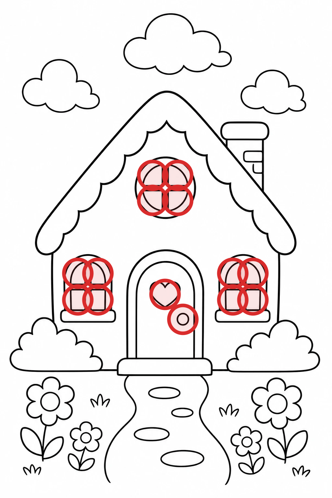
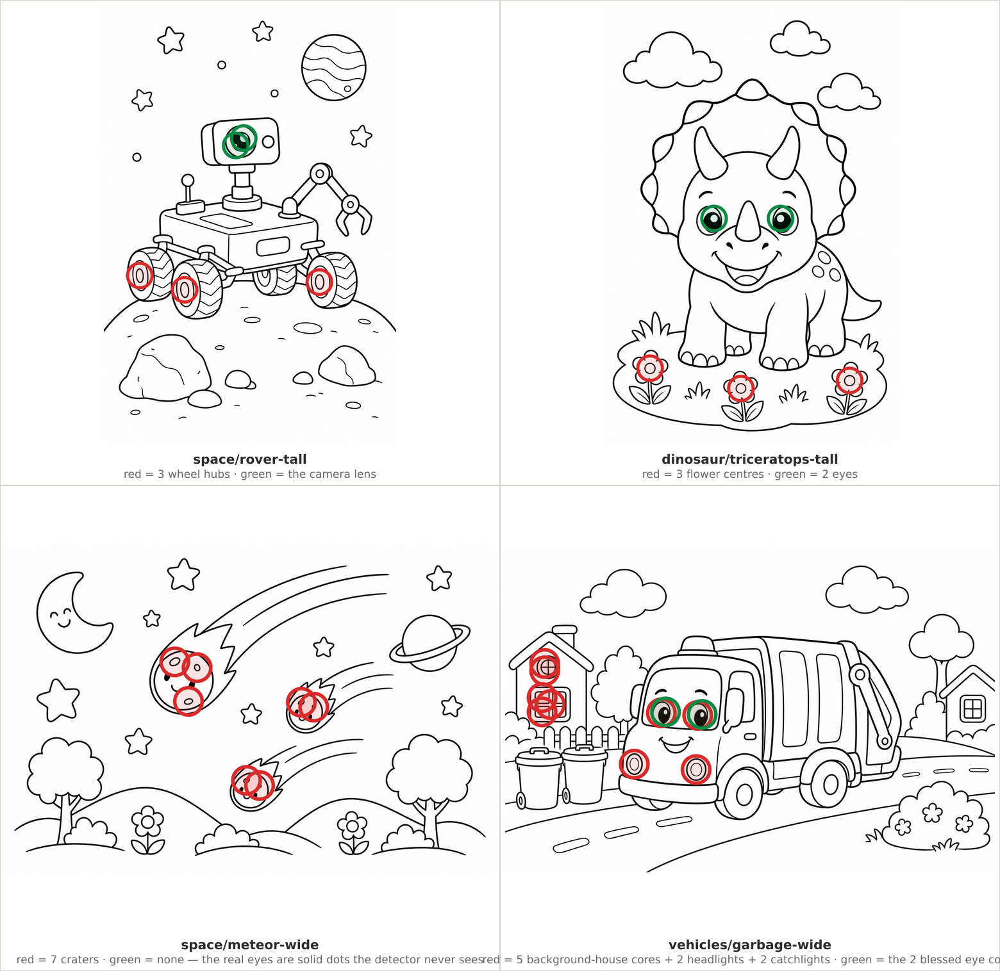
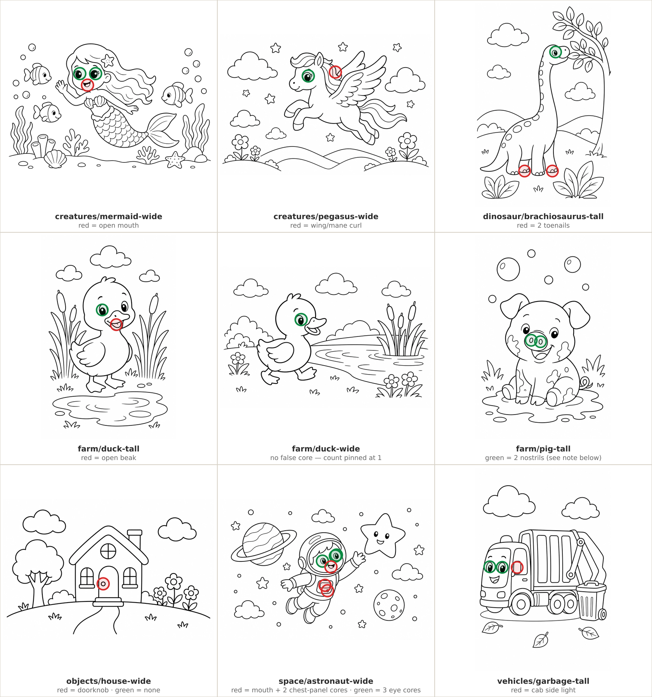
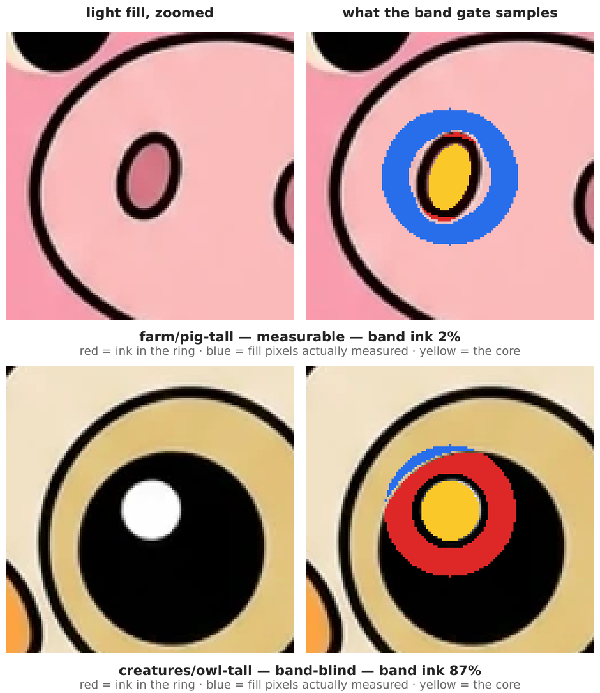
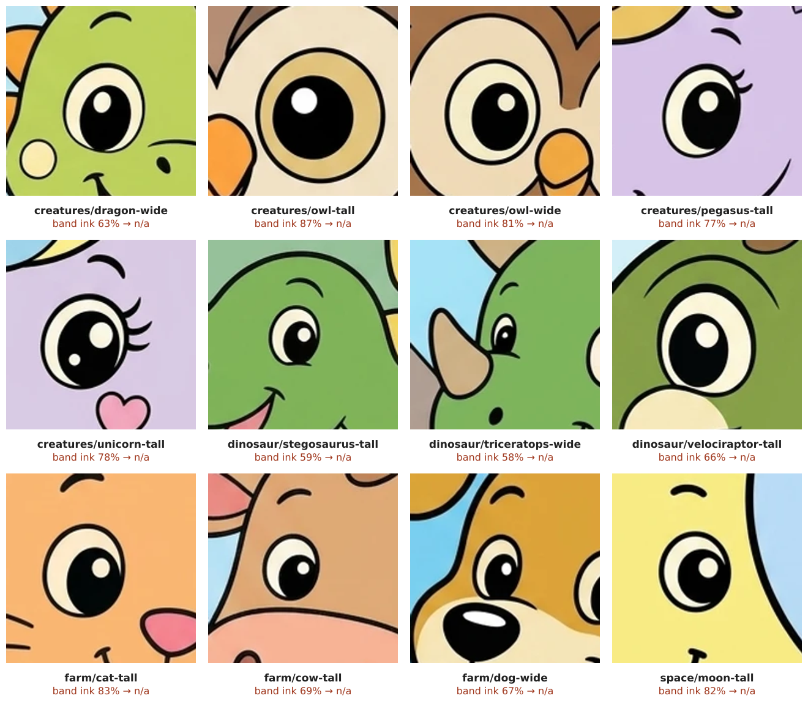
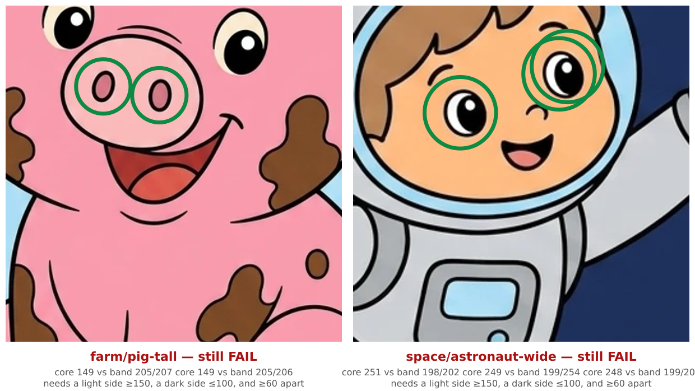
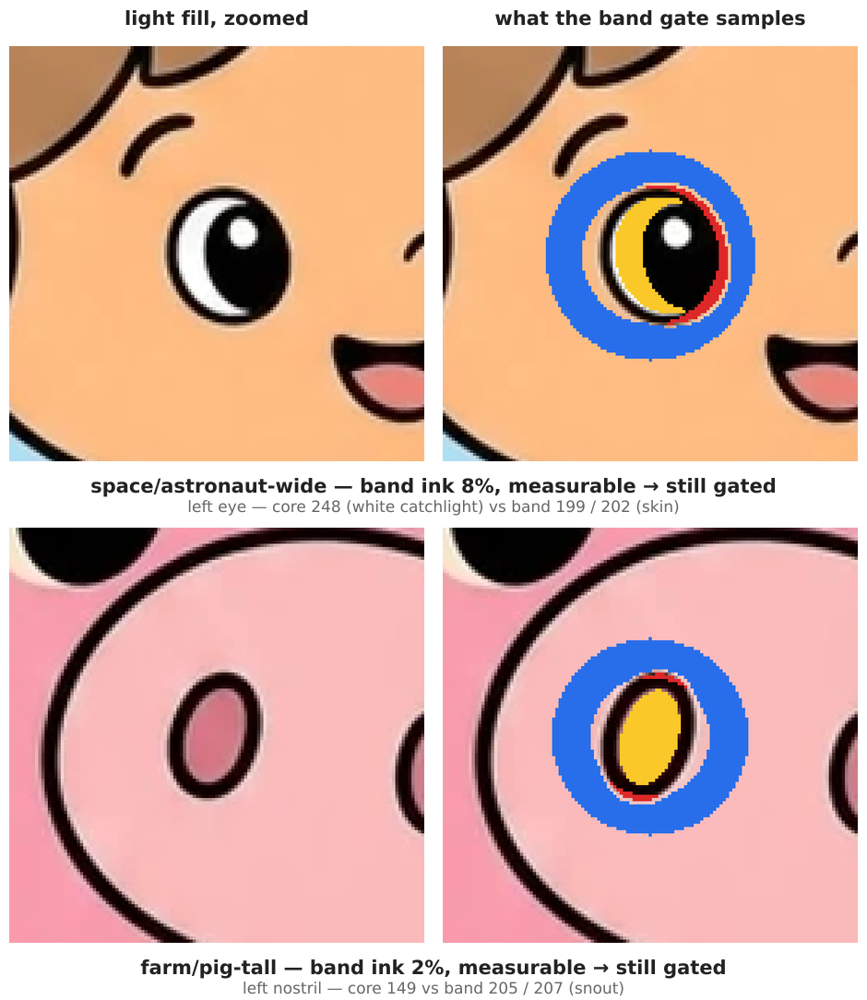

# PR \#1131 — light-eye false-positive suppression, visual walkthrough

Evidence figures backing the review comment on
[PR #1131](https://github.com/KyleMit/Splotch/pull/1131). Every marker is drawn at the exact
coordinates `findEyeCores`/`scoreEyeFill` report for the committed line art and light raws, so each
claim is checkable against the shapes themselves.

How the figures were produced: load each `web/static/coloring/<page>.outline.webp`, run
`scoreEyeFill` against `tools/asset-gen/fill-src/<page>.light.raw.webp`, then overlay the reported
core coordinates — green where `annotatedLightEyeCores` keeps the core, red where it drops it. The
annulus figures re-run the `sampleAnnulus` classification and paint ink pixels red, sampled band
pixels blue, and the core yellow.

---

### The thing being fixed, in one picture

The light-eye gate has no idea what an eye looks like. It finds **nested cores** — a small closed
region sitting two levels deep inside the line art (a catchlight inside a pupil inside an eyeball) —
and then asks whether the fill painted that core differently from the ring of fill around it. Before
this PR, *every* nested core it found was treated as eye anatomy.

Here is what it found on `objects/house-tall`. Red = a nested core the old judge scored as an eye:



Twelve window panes, the heart on the door, and the doorknob. Fourteen "eyes" on a house with no
face. All fourteen read flat (a window pane is *supposed* to be one flat colour), so the page failed
the eye gate — and a retry could never fix it, because nothing about the fill was wrong.

---

### Gate 1 — the reviewed annotation registry

New file `tools/asset-gen/lib/light-eye-annotations.mjs`. For 14 pages it records **which
coordinates are actually eyes** (green below) and, implicitly, which cores are not (red).



* **`space/rover-tall`** — three red rings sit on the *wheel hubs*; the one green is the rover's
  camera lens, its only "eye".
* **`dinosaur/triceratops-tall`** — three red rings sit on *flower centres* in the grass. Green =
  the two actual eyes.
* **`space/meteor-wide`** — seven red rings on *craters*. Green = none, and that's correct: the
  meteors' real eyes are solid black dots, which are not nested regions and were never detected.
* **`vehicles/garbage-wide`** — red on the background house's roof vent and window panes and on the
  truck's two headlights. Note the truck's eyes carry *two* nested cores each; the registry blesses
  one of the pair, which is why you see a green and a red ring stacked on each eye.

The other nine annotated pages:



Open mouths, a wing curl, toenails, a doorknob, a chest panel. Every red ring is on a shape a person
would never call an eye.

**Drift guard.** The registry stores a reviewed total core count alongside the coordinates, so the
art can't quietly change underneath it. Both failure modes, run against `space/rover-tall`:

```
unchanged             -> no error
one extra core added  -> judgeLightEyes: space/rover-tall annotation expects 5 outline cores, found 6
eye core moved 4px    -> judgeLightEyes: space/rover-tall eye annotation at 490,466 does not match the outline
```

Redraw the rover with a fifth wheel, or nudge the camera lens by 4px, and the gate refuses to run
until a human re-reviews it. That is also why `farm/duck-wide` is in the registry with nothing
suppressed — its single core *is* the eye, and the entry exists purely to pin the count at 1.

---

### Gate 2 — the band-blind rule, now applied on the light side too

The other half of the noise had nothing to do with mistaken identity. To judge "is this eye painted
or flooded flat?", the scorer samples a thin ring of fill just outside the core. If a solid black
pupil fills that ring, there is nothing to measure.

Left = the light fill zoomed in. Right = the same crop with the ring classified: **red = ink**,
**blue = fill pixels actually measured**, **yellow = the core**.



The owl's eye is beautifully painted — white catchlight, black pupil, tan sclera — and 87% of the
ring around its catchlight is the pupil's own ink. 148 measurable pixels against the pig's 1,743.
The old judge read that near-empty sample as "flat eyes" and failed the page.

Here are twelve of the pages that flip from **FAIL** to **n/a** on this rule alone, shown as the
light fill actually ships:



Every one of those has a black pupil, a white catchlight and a coloured sclera. Every one of them
was flagged as a dead fill before this PR.

---

### Gate 3 — the verdict now says "not measured" instead of guessing

`judgeLightEyes` returns `{ passes, gated }` and all three consumers report the third state.

**The audit** prints `n/a` instead of `ok`/`FAIL`. Same six pages, base branch vs this branch:

```
                                                    BEFORE                       AFTER
page                         cores lively  light    page                         cores lively  light
creatures/owl-tall               2      0  FAIL     creatures/owl-tall               2      0  n/a
farm/cow-wide                    2      1  ok       farm/cow-wide                    2      1  n/a
farm/pig-tall                    2      0  FAIL     farm/pig-tall                    2      0  FAIL
objects/house-tall              14      0  FAIL     objects/house-tall              14      0  n/a
space/astronaut-wide             6      0  FAIL     space/astronaut-wide             6      0  FAIL
space/rover-tall                 5      0  FAIL     space/rover-tall                 5      0  n/a

6 page(s) audited · 5 flagged.                      6 page(s) audited · 2 flagged.
```

Look at `farm/cow-wide`: it went `ok` → `n/a`, not `FAIL` → `n/a`. That direction matters, and it's
the half of this change that's easy to miss.

**The golden catalog** records the same distinction, and the counts split exactly that way:

| `light.eyesOk` transition | pages | what it was claiming before                        |
| ------------------------- | ----- | -------------------------------------------------- |
| `false` → `null`          | 33    | a dead fill, on pages that were fine               |
| `true` → `null`           | 24    | **a healthy fill, on pages nothing ever measured** |

Those 24 are the vacuous passes — 23 pages where the detector found zero nested cores at all, plus
`farm/cow-wide`. The old code returned `passes: true` for "no cores found", so the frozen catalog
recorded a health guarantee for pages the gate never looked at. `null` is the honest value.

**The generator** prints `eyes ungated` instead of `flat eyes`, and its `rank` no longer awards the
+150 eye-quality bonus to a candidate whose eyes were never scored — so an ungated page can still be
generated and kept, it just can't win on a signal that doesn't exist.

`toPosix` on the audit's page key is plumbing for the above: the registry is keyed by
`book/page-orient`, and the audit now normalizes its key to the same string.

---

### What still fails, and the one thing I'd look at again

Two pages stay gated and stay red:



The PR describes these as "the two remaining measurable candidates … visible to the later
asset-quality burn-down". Looking at the pixels, I don't think either is a dead fill — and both are
worth a second look before someone spends regeneration effort on them:



* **`farm/pig-tall`** — the two blessed coordinates (422,791) and (492,802) are the pig's
  **nostrils**, not its eyes. The pig's actual eyes are solid black dots higher up, correctly
  painted, and never detected. The page fails because a pink nostril on a pink snout has no
  contrast, which is exactly how a nostril should look.
* **`space/astronaut-wide`** — the blessed cores *are* on the eyes, but look at the yellow region on
  the right: the innermost nested region is the **white sclera crescent**, and the sampling ring
  around it lands entirely on face skin (199/202) while the black pupil sits just inside the ring,
  never sampled. Core 248 vs band 199/202 → "no dark neighbour" → flat. The eye is plainly painted.

Neither observation blocks anything here — this PR's stated job is removing false positives, and it
removes 33 of 35. But "the two measurable offenders" reads as "two genuinely broken pages", and by
eye they look like two more false positives that happen to survive the band test.

---

### Blast radius

**35 → 2.** 33 pages flip from a light-eye FAIL to `n/a`:

* *Band-blind, no annotation needed (21):* `creatures/dragon-wide`, `creatures/owl-tall`,
  `creatures/owl-wide`, `creatures/pegasus-tall`, `creatures/unicorn-tall`,
  `creatures/unicorn-wide`, `dinosaur/stegosaurus-tall`, `dinosaur/triceratops-wide`,
  `dinosaur/velociraptor-tall`, `farm/cat-tall`, `farm/cat-wide`, `farm/cow-tall`, `farm/dog-wide`,
  `objects/balloon-wide`, `shapes/rectangle-tall`, `shapes/square-tall`, `shapes/square-wide`,
  `shapes/star-tall`, `shapes/triangle-tall`, `shapes/triangle-wide`, `space/moon-tall` *(the 12
  shown above are a sample of these)*
* *Needed the annotation registry (12):* `creatures/mermaid-wide`, `creatures/pegasus-wide`,
  `dinosaur/brachiosaurus-tall`, `dinosaur/triceratops-tall`, `farm/duck-tall`, `farm/duck-wide`,
  `objects/house-tall`, `objects/house-wide`, `space/meteor-wide`, `space/rover-tall`,
  `vehicles/garbage-tall`, `vehicles/garbage-wide`
* *Still failing (2):* `farm/pig-tall`, `space/astronaut-wide`

**24 more pages** stop claiming an unearned pass in the golden catalog: the 23 with no detected
cores at all (`creatures/fairy-tall`, `creatures/fairy-wide`, `dinosaur/brachiosaurus-wide`,
`dinosaur/pterodactyl-tall`, `dinosaur/pterodactyl-wide`, `dinosaur/stegosaurus-wide`,
`farm/horse-wide`, `objects/apple-tall`, `objects/apple-wide`, `objects/balloon-tall`,
`objects/flower-tall`, `objects/flower-wide`, `objects/umbrella-tall`, `objects/umbrella-wide`,
`shapes/circle-wide`, `shapes/heart-tall`, `shapes/heart-wide`, `shapes/star-wide`,
`space/meteor-tall`, `space/moon-wide`, `space/ship-wide`, `space/station-tall`,
`space/station-wide`) plus `farm/cow-wide`.

**No image asset changed** — every picture above is the committed art, unmodified apart from the
markers I drew on it.
