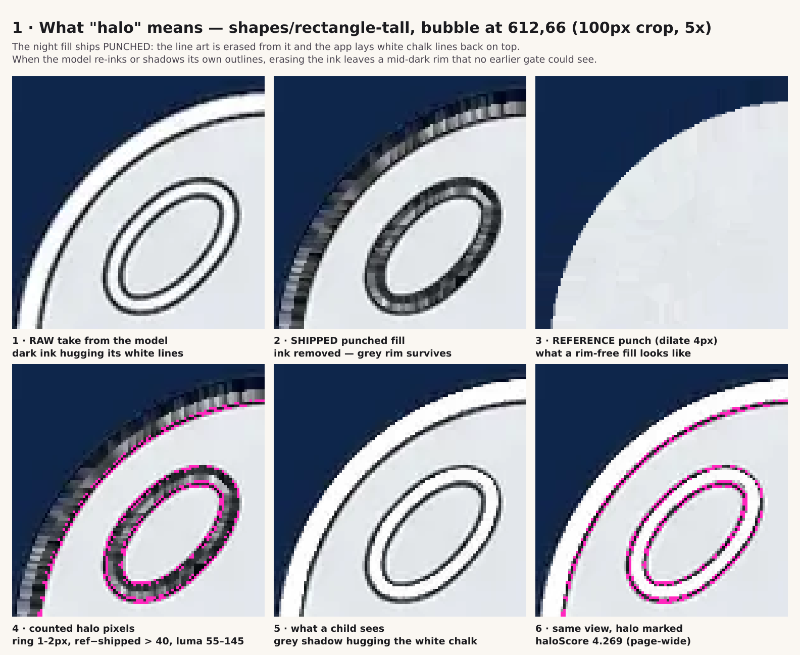
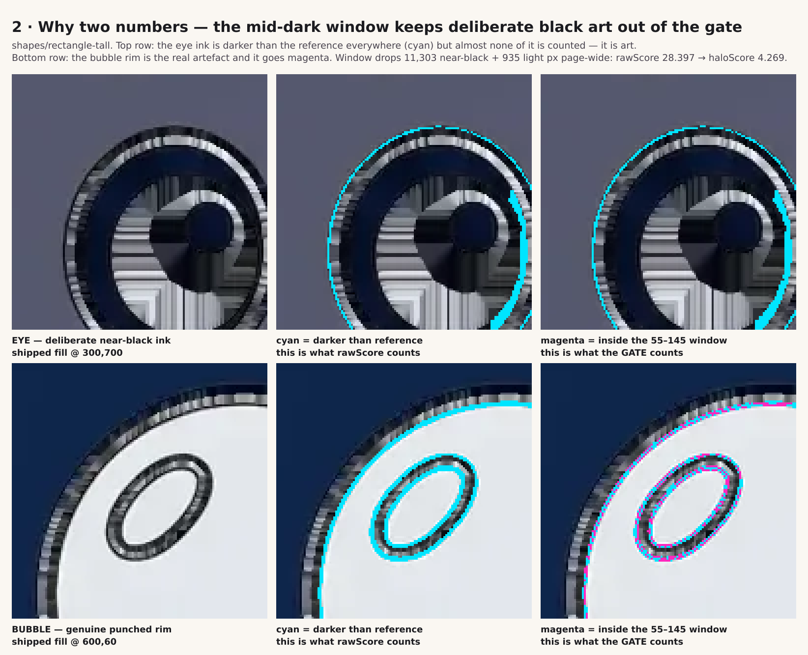
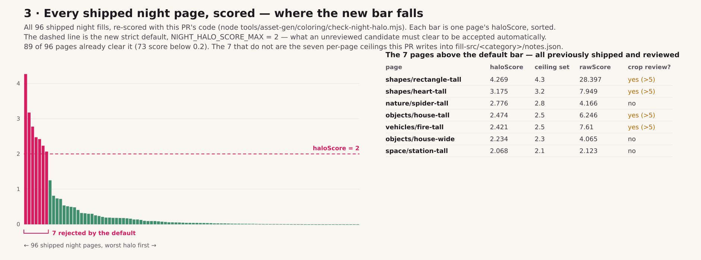
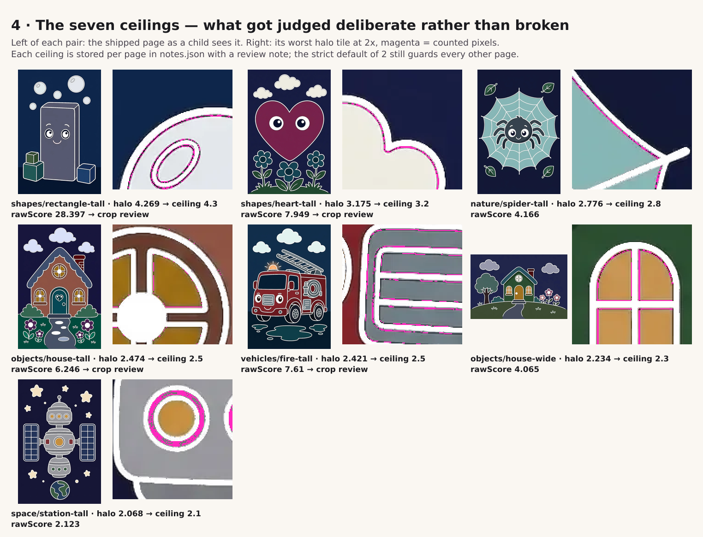
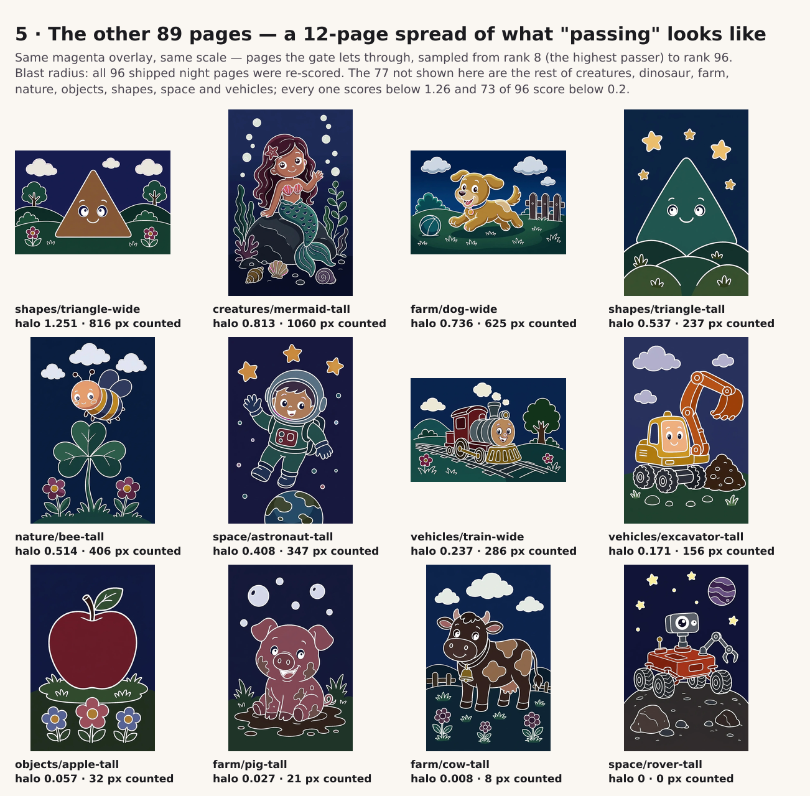
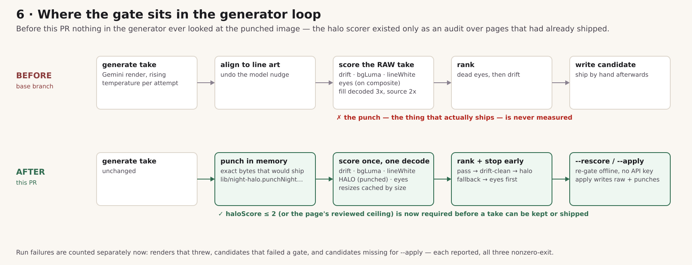
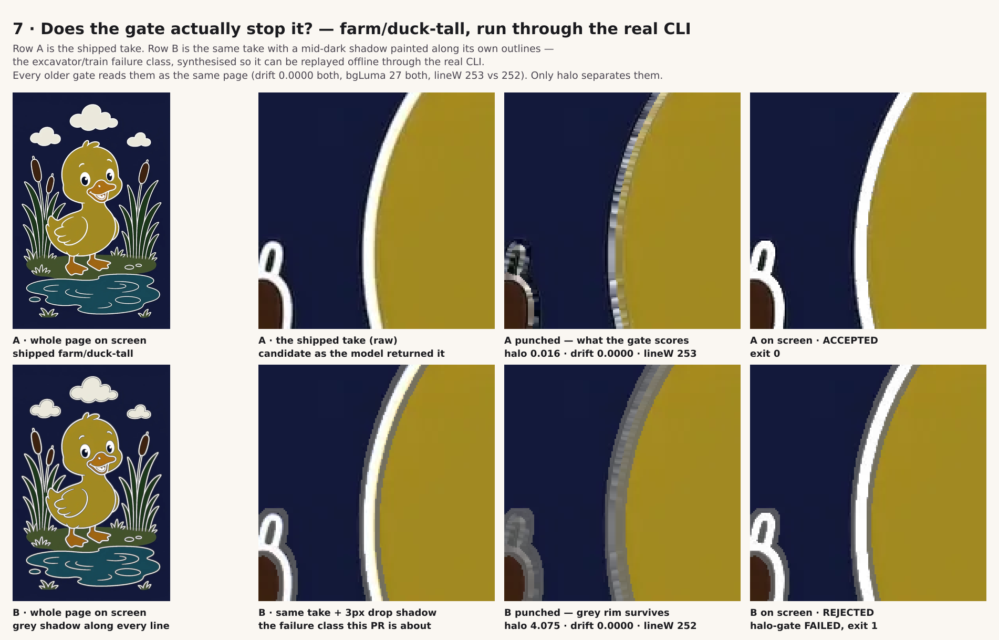
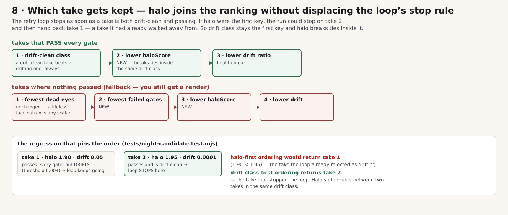

# PR 1134 — visual walkthrough of the night halo gate

> Companion to the review comment on [PR #1134](https://github.com/KyleMit/Splotch/pull/1134). It
> lives here because GitHub's comment pipeline strips image embeds out of agent-authored comments;
> in this file they render.

Reviewed the PR head ae4129577aff at its own base only (`codex/issue-271-chalk-ink-diff` @
8ade15c615d8), not against main. Everything numeric below came out of a real run on that checkout in
this session — the audit over all 96 shipped night pages, the CLI transcripts, and a base-vs-head
comparison. The figures are generated overlays: **magenta = exactly the pixels the scorer counts**,
painted onto the real shipped art, so you can check the shapes by eye. The generators that produced
each figure are in [`scripts/`](./scripts) beside this file, on a side branch so the PR's own diff
stays clean.

---

### 1 · The thing being gated: a grey rim that survives the punch

A night fill ships *punched* — the line art is erased out of it and the app lays the white chalk
back on top. When the model draws dark ink hugging its own white lines, erasing the ink leaves a
mid-dark rim behind, and that rim reads on screen as a dirty grey shadow beside every white stroke.



Panel 2 versus panel 3 is the whole idea: the shipped punch keeps a dashed grey ring the "reference
punch" (bleed the fill in from 4px beyond any plausible rim) does not have. Panel 5 is what a child
sees — the white chalk line with a grey ghost hugging it.

### 2 · Why the PR ends up with two numbers instead of one

`rawScore` counts every ring pixel darker than the reference. That over-counts wildly, because
deliberate near-black art (eye ink, lashes, pupils) is also "darker than the reference". `haloScore`
adds the luma window \[55, 145): only *mid-dark* pixels count.



Top row is the block's eye: cyan everywhere, magenta essentially nowhere — the window correctly
refuses to call eye ink a halo. Bottom row is a bubble on the same page: same cyan, and now real
magenta. Page-wide this drops 11,303 near-black and 935 too-light pixels — `rawScore` 28.397 →
`haloScore` 4.269. That is why only `haloScore` gates and `rawScore` > 5 merely asks for a crop
review.

### 3 · Where the new bar falls across the whole shipped catalog



I re-ran `node tools/asset-gen/coloring/check-night-halo.mjs <every category>` on this branch: 96
pages, 89 clear the strict default of 2, 73 score below 0.2. The 7 that don't are exactly the 7
pages that get a per-page `halo-score-max` in `notes.json` — nothing else in the catalog needed one.

### 4 · The seven ceilings, so you can judge "deliberate" for yourself

Each `notes.json` entry claims the page's score is deliberate line-adjacent shading rather than the
excavator/ship re-inked-rim class. Here is what got judged, at 2x, on the worst tile of each page:



Five read to me as clearly intentional — the house's window mullions, the fire truck's ladder rungs,
the station's amber window rings, the spider's web strands, the house-wide door frame all have
magenta tracking a shaded edge the art wants.

**One I'd want your eyes on: `shapes/rectangle-tall` (the top ceiling, 4.3).** In figure 1 its
bubble rims read to me like a dashed, uneven grey ring — closer to re-inking than to a shadow
someone designed. Locking a 4.3 ceiling on it means a future regenerated take may ship the same rim
with no complaint. `shapes/heart-tall` (3.2) is the milder version of the same question: the magenta
there sits in the cloud's outer edge. Neither blocks the PR — the default stays 2 for everything
unreviewed — but they're the two ceilings where the "deliberate" call carries the most future
weight.

### 5 · What "passing" looks like, and the blast radius

Same overlay, same scale, sampled from rank 8 (the highest passing page) down to rank 96:



No visible magenta anywhere, which is the point — the gate isn't firing on ordinary art. **Blast
radius:** all 96 shipped night pages were re-scored; 12 shown here, the other 77 are the remaining
pages across creatures, dinosaur, farm, nature, objects, shapes, space and vehicles, every one below
1.26. Note `vehicles/train-wide` and `vehicles/excavator-tall` in the grid — the pages that named
this failure class historically — now sitting at 0.237 and 0.171.

### 6 · Where the gate sits, and what the refactor did (and didn't) move



Two things I checked empirically rather than taking on faith:

* **The shared prepared analysis changes no scores.** Ran the halo audit on the base commit and on
  this head over all 96 pages and diffed `haloScore` / `rawScore` / `haloPx12` / `lineW`: **96
  pages, 0 differing.** Runtime on the `farm` category was 7.3s base vs 7.1–7.3s head — the decode
  sharing is not a speed story on the audit path; it's what lets the generator score five things per
  candidate off one decode.
* **`encodePunchedFill` produces the same bytes as before.** Re-punched all 96 committed night raws
  through `punchFill()` and `git status` came back empty — every shipped `.night.webp`
  byte-identical.

### 7 · Does the gate actually stop the failure it's named for?

Since there's no API key here, I replayed the real CLI offline. Candidate A is the shipped
`farm/duck-tall` raw. Candidate B is that same take with a 3px mid-dark shadow painted along its own
outlines — synthetic, but it's the exact shape of the failure class.



```
$ node tools/asset-gen/coloring/gen-night-fills.mjs farm/duck-tall --rescore     # candidate A
farm/duck-tall ... ok  drift 0.0000 bgLuma 27 lineW 253 halo 0.016 rawHalo 0.201
exit 0

$ node tools/asset-gen/coloring/gen-night-fills.mjs farm/duck-tall --rescore     # candidate B
farm/duck-tall ... kept least-bad attempt 1/1  drift 0.0000 bgLuma 27 lineW 252 halo 4.075 rawHalo 4.139
  halo-gate FAILED (halo 4.075 > max 2; hotspot 256,256)
1 candidate(s) failed gates.
exit 1
```

The part that makes the case for the gate existing: **every older signal reads the two candidates as
the same page** — drift 0.0000 both, bgLuma 27 both, `lineW` 253 vs 252 (both comfortably "white").
Page-median `lineWhite` genuinely cannot see this.

The per-page ceiling resolution and the new exit-code accounting also behave as advertised:

```
$ node ... gen-night-fills.mjs shapes/rectangle-tall --rescore
  halo-score-max = 4.3  [notes.json]
shapes/rectangle-tall ... ok  ... halo 4.269 rawHalo 28.397  ⚠ crop review (rawHalo 28.397 > 5)
exit 0

$ node ... gen-night-fills.mjs shapes/rectangle-tall --rescore --halo-score-max 2
  halo-score-max = 2  [cli]
shapes/rectangle-tall ... halo-gate FAILED (halo 4.269 > max 2; hotspot 640,64)  ⚠ crop review
exit 1

$ node ... gen-night-fills.mjs farm/cow-tall --rescore --apply
farm/cow-tall  (skip) no candidate to rescore at .coloring-samples-dark/farm/cow-tall.webp
1 requested candidate(s) missing for apply.
exit 1

$ node ... gen-night-fills.mjs farm/duck-tall --rescore --apply
  ✓ applied -> web/static/coloring/farm/duck-tall.night.webp        # git status: clean
```

### 8 · Why halo is the *second* ranking key, not the first



This is the subtlest change in the PR and it isn't visible in any image, so: the retry loop *stops*
the moment a take is drift-clean and passing. If halo sorted first, a run could stop on take 2 and
then hand back take 1 — a take it had already walked away from for drifting. Drift class first, halo
inside the class, drift ratio last. The fallback path keeps "fewest dead eyes" in front of
everything, which is right: a flat-eyed face is worse than any scalar.

---

### What I ran

| check                                                                       | result                                     |
| --------------------------------------------------------------------------- | ------------------------------------------ |
| `check-night-halo.mjs` over all 8 categories (96 pages)                     | ran clean; produced every number above     |
| same audit on base 8ade15c615d8 vs this head                                | 96 pages, 0 score differences              |
| `punchFill()` re-run over all 96 night raws                                 | `git status` empty — bytes unchanged       |
| `npm run test:asset-gen`                                                    | 26 files, 215 tests passed                 |
| `--rescore` accept / reject / notes-ceiling / missing-candidate / `--apply` | exit codes and messages as described above |

Only thing I'd genuinely like a second human opinion on is the `shapes/rectangle-tall` and
`shapes/heart-tall` ceilings in section 4 — the gate mechanics themselves check out.
