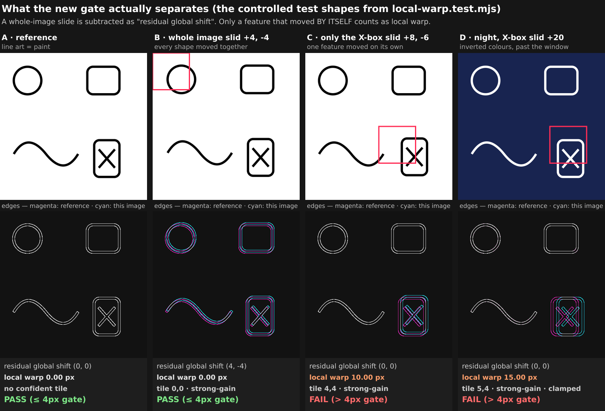
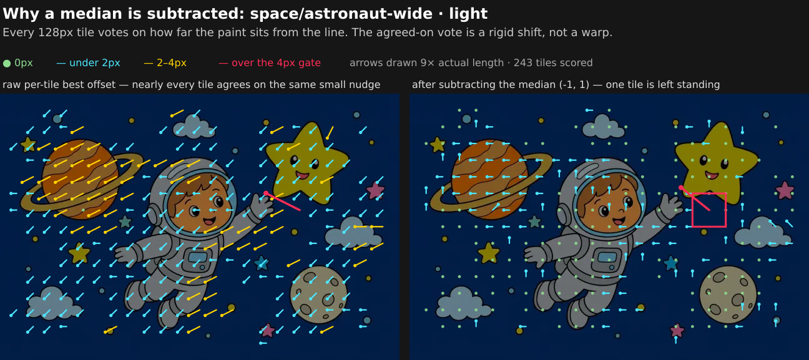
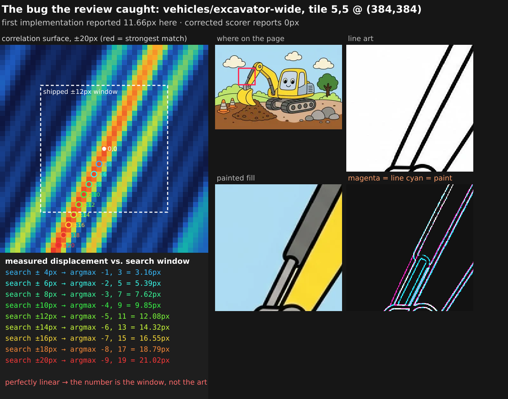
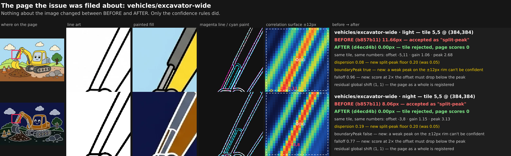
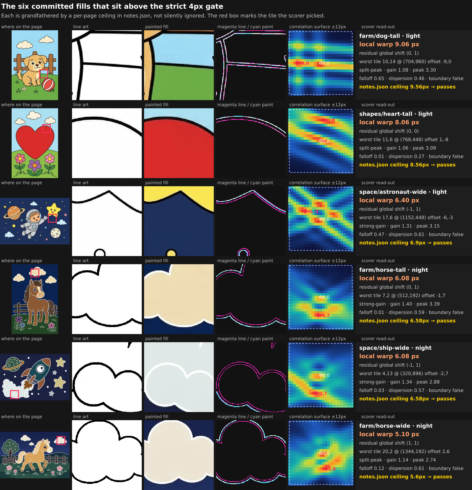
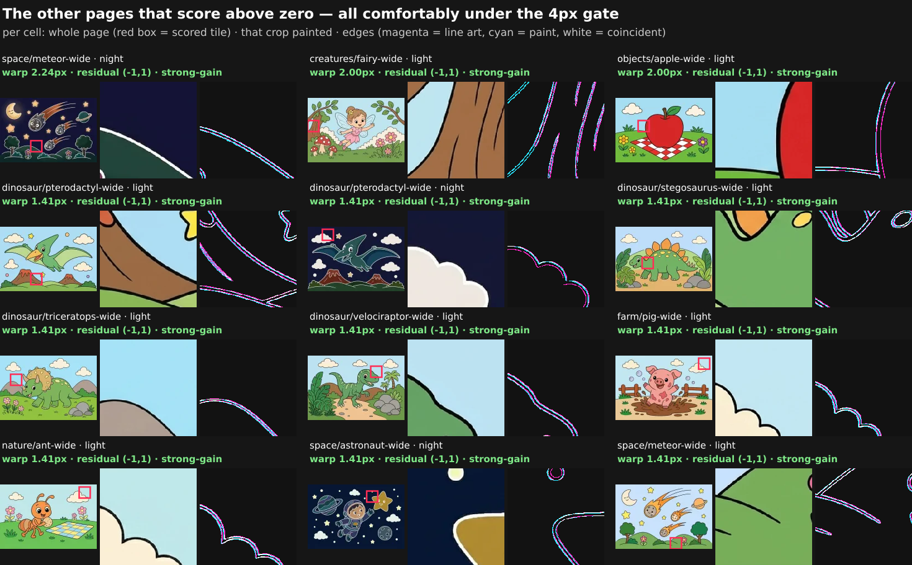

# PR #1135 — local-warp gate, visual walkthrough

I checked out `codex/issue-259-local-warp-gate` and diffed it only against its stack base
`codex/issue-268-night-halo-gate` (ae4129577aff7b84444b8feb8c844e0c07a56b70), then re-ran the scorer
myself over the committed assets and rendered what it sees. Every figure below is generated from the
line art and raw fills in this branch — nothing is a mock-up. The scripts are on
`claude/pr-1135-visual-walkthrough-0sis51` under `docs/scratchpad/pr-1135-local-warp-walkthrough/`
and re-derive the correlation surface independently of `lib/local-warp.mjs`, so a figure that
disagreed with the shipped scorer would show up as a mismatch rather than quietly agree.

**The one-sentence version:** every coloring page ships as *line art* plus a *painted fill* an image
model produced from it, and the existing gates only asked "does the paint cover the outline". This
PR adds a gate that asks a different question — **is each part of the paint in the same place as the
line it belongs to** — and it deliberately ignores the case where the whole page is nudged, because
that is already corrected elsewhere.

In every figure the colour key is the same:

* **magenta** = an edge in the line art
* **cyan** = an edge in the painted fill
* **white** = the two land on the same pixel (what you want to see)

---

## 1 · What the gate separates, on shapes you can check by eye



These are the actual fixtures from the new `tools/asset-gen/tests/local-warp.test.mjs`, rendered so
you can see them. Four shapes: a circle, a rounded box, a wave, and an X-in-a-box.

* **A** — reference against itself. Overlay is all white. `0.00px`, no confident tile.
* **B** — the *whole image* slid +4, −4. Look at the overlay: **every** shape shows the same
  magenta/cyan pair, all offset the same way. The scorer reports that as
  `residual global shift
  (4, -4)` and **local warp still `0.00px` → PASS**. This is the case the
  gate is built to ignore.
* **C** — only the X-box slid +8, −6. Now the circle, the box and the wave are *pure white* in the
  overlay and only the X-box shows a magenta/cyan pair. `local warp 10.00px` → **FAIL**, and the red
  box lands on the shape that actually moved.
* **D** — same trick in the night palette (white lines on navy) with a 20px slide, well past the
  ±12px search window. Reported as a clamped `15.00px` lower bound → **FAIL**. This column is what
  commit c8fb75c8e1d7d31ff8fb46c3c57ee65f66f1604e added; before it, a displacement too big to
  measure could fall through.

The contrast between B and C is the whole point: identical-looking pixel offsets, opposite verdicts.

---

## 2 · Why the median is subtracted, on a real page



`space/astronaut-wide` light. The page is cut into 243 overlapping 128px tiles, and each tile votes
on how far its paint sits from its line. Arrows are drawn 9× actual length so a 1px vote is visible.

* **Left** — the raw votes. It is a field of arrows all leaning the same way. That is not 243
  separate defects; it is one page-wide 1px offset counted 243 times.
* **Right** — after subtracting the component-wise median `(-1, 1)`. Almost everything collapses to
  a dot or a stub, and **one** red arrow is left, on the star the astronaut is reaching for. That
  tile is the reported `6.40px`.

Without the subtraction, this page would score ~1.4px on every ordinary tile and the real outlier
would be buried in the noise.

---

## 3 · The bug round-one review caught, and how you can see it is a bug



This is `vehicles/excavator-wide`, tile 5,5 at (384, 384) — the excavator's boom, the crop the
original issue pointed at. The first implementation (b857b11fad416fc10a92000635a9f0d64b6d1d94)
reported **11.66px** here.

The heat map on the left is the correlation surface: for every candidate offset in the search
window, how well the paint edges line up with the line edges. Red = best match. **It is not a peak —
it is a diagonal ridge**, running parallel to the boom. That is the classic aperture problem: the
boom is two long parallel lines, so sliding the crop *along* the boom matches just as well
everywhere, and there is no single answer.

The circles are the argmax for progressively wider search windows, and the table is the receipt:

```
search ± 4px  →  argmax  -1,  3   =  3.16px
search ± 6px  →  argmax  -2,  5   =  5.39px
search ± 8px  →  argmax  -3,  7   =  7.62px
search ±10px  →  argmax  -4,  9   =  9.85px
search ±12px  →  argmax  -5, 11   = 12.08px      ← the shipped window
search ±16px  →  argmax  -7, 15   = 16.55px
search ±20px  →  argmax  -9, 19   = 21.02px
```

Perfectly linear. The "measured displacement" was a readout of the search radius, not of the
artwork. Widen the window and the defect grows; that is never true of a real displacement.

The overlay panel does show one genuine thing: an extra **cyan** curve inside the boom with no
magenta counterpart — the piston the model invented. That is an extra shape, not a moved shape, and
the PR is right that a registration number is the wrong tool for it.

---

## 4 · Before → after on that page, with nothing about the image changed



I ran the pre-review scorer and the current one over the same bytes:

| Page                              | b857b11 (before) | d4ecd4b (after) | why it flips                                  |
| --------------------------------- | ---------------: | --------------: | --------------------------------------------- |
| `vehicles/excavator-wide` light   |          11.66px |          0.00px | peak sits on the ±12px rim + dispersion 0.083 |
| `vehicles/excavator-wide` night   |           8.06px |          0.00px | dispersion 0.193                              |
| `farm/pig-wide` light             |           1.41px |          1.41px | unchanged control                             |
| `dinosaur/stegosaurus-wide` light |           1.41px |          1.41px | unchanged control                             |

Those two control pages matter: the corrected rules could have been tuned to zero out the excavator
by zeroing out everything. They didn't — the straight-line plateau pages score exactly what they
scored before.

**One thing to flag while you're looking at this.** The night rejection has almost no margin. Its
orientation dispersion is **0.1933** against the new floor of **0.20** — it fails by 0.0067. Its
falloff (0.766) and boundary (`false`) checks both *pass*, so dispersion alone is holding it. A
regenerated chalk or a different decoder rounding could push it back over and re-report ~8px. The
light case is much safer (dispersion 0.083, and it is a boundary peak, so two independent rules
reject it).

---

## 5 · Blast radius, part 1 — the six committed fills above the strict 4px default



These are the pages the PR grandfathers with a per-page `warp-max` in `notes.json`. Each row is:
where on the page, the line art there, the paint there, the edge overlay, the correlation surface,
and the numbers. **No image bytes changed** — I confirmed `git diff` touches zero `.webp`/`.png`
files. What changed is that these six now carry a recorded number and a named ceiling.

What you can actually see, page by page:

* **`shapes/heart-tall` 8.06px** — the top-left curve of the heart. The magenta arc and the cyan arc
  are cleanly separated for the whole run of the curve: the red paint edge sits above the black
  line. This one is easy to confirm by eye.
* **`farm/horse-tall` 6.08px**, **`space/ship-wide` 6.08px**, **`farm/horse-wide` 5.10px** — all
  three night pages land on a **cloud/smoke edge**, and all three show the same signature: a cream
  fill whose boundary runs a few pixels outside the white chalk line along the bottom of the cloud.
  That is a consistent, recognisable class, not six unrelated one-offs.
* **`space/astronaut-wide` 6.40px** — the point of the yellow star. Real but subtler; the surface
  shows two crossing ridges, so the offset is less crisply determined than the cloud cases.
* **`farm/dog-tall` 9.06px** — the weakest of the six, and I'd point at it in review. The crop is a
  fence post crossing the horizon line, and its correlation surface is a **horizontal ridge**, i.e.
  the same family as the excavator problem, just oriented along a horizontal edge rather than a
  diagonal one.

I ran the window-stability check from section 3 on all six, since that is the test that separates a
real displacement from an aperture readout:

```
farm/dog-tall        light  tile 10,14   ±6:0,1   ±8:-8,0  ±10:-9,0  ±12:-9,0  ±16:-9,0  ±20:-9,0
shapes/heart-tall    light  tile 11,6    ±6:-2,-1 ±8:1,-8  ±10:1,-8  ±12:1,-8  ±16:1,-8  ±20:1,-8
space/astronaut-wide light  tile 17,6    ±6:-6,-3 ±8:-6,-3 ±10:-6,-3 ±12:-6,-3 ±16:-6,-3 ±20:-6,-3
farm/horse-tall      night  tile 7,2     ±6:-1,6  ±8:-1,7  ±10:-1,7  ±12:-1,7  ±16:-1,7  ±20:-1,7
space/ship-wide      night  tile 4,13    ±6:-4,6  ±8:-2,7  ±10:-2,7  ±12:-2,7  ±16:-2,7  ±20:-2,7
farm/horse-wide      night  tile 20,2    ±6:2,6   ±8:2,6   ±10:2,6   ±12:2,6   ±16:2,6   ±20:2,6
vehicles/excavator   light  tile 5,5     ±6:-2,5  ±8:-3,7  ±10:-4,9  ±12:-5,11 ±16:-7,15 ±20:-9,19
```

All six settle and stop moving once the window is wide enough. Only the excavator keeps walking. So
even `farm/dog-tall`, whose surface looks ridge-like, is measuring something window-independent —
the six baselines are real numbers, and the corrected scorer is discriminating on the right axis.

---

## 6 · Blast radius, part 2 — the twelve other pages that score above zero



All well under the gate, and the overlays show why: magenta and cyan run as a tight pair one or two
pixels apart, which is what a 1.41px score looks like. If the gate were mis-tuned you would expect
to find pages here whose overlay looks as separated as the heart above — there aren't any.

Six more pages score above zero and are **not** pictured (they are the least interesting cases, all
at or below 1.41px): `space/ship-wide` light 1.41px, and the five pages at exactly 1.00px —
`creatures/pegasus-wide` light, `creatures/unicorn-wide` light, `objects/balloon-wide` light,
`objects/house-wide` light, `space/rover-wide` light.

**Complete numeric blast radius**, from the regenerated golden catalog (schema v4 → v5):

| Band                  |    Rows | Pages                                                                                                                  |
| --------------------- | ------: | ---------------------------------------------------------------------------------------------------------------------- |
| above the 4px default |       6 | shown in section 5, each with a `notes.json` ceiling                                                                   |
| 2.00 – 2.24px         |       3 | `space/meteor-wide` night, `creatures/fairy-wide` + `objects/apple-wide` light                                         |
| 1.41px                |      10 | pterodactyl (both themes), stegosaurus, triceratops, velociraptor, pig, ant, astronaut night, meteor light, ship light |
| 1.00px                |       5 | pegasus, unicorn, balloon, house, rover — all light                                                                    |
| exactly 0.00px        |     168 | everything else                                                                                                        |
| **total scored**      | **192** | 96 pages × 2 themes                                                                                                    |

---

## 7 · What the audit prints now (real output from this branch)

The committed audit went from light-only to both themes, and from one global number to three
distinct states. All three, run for real:

**Non-failing baseline warning** — the page is over the strict default but inside its reviewed
ceiling:

```
page                         theme   keep worstTile    warp  residual  where
farm/dog-tall                light 100.0% 100.0%   9.1px       0,1  tile 10,14 (split-peak)  ⚠ baseline exception (notes.json 9.56px)
farm/dog-tall                night      -         -   0.0px       0,1
vehicles/excavator-wide      light 100.0% 100.0%   0.0px       1,1
vehicles/excavator-wide      night      -         -   0.0px       1,1

4 fill(s) audited · 0 flagged
```

**Stale ceiling** — I temporarily widened dog-tall's ceiling to 12px to trigger it (and reverted):

```
farm/dog-tall                light 100.0% 100.0%   9.1px       0,1  tile 10,14 (split-peak)  ⚠ stale warp ceiling (notes.json 12px)
```

**Real failure** — an explicit CLI value always tightens, failures sort above warnings, and each
theme gets its own runnable command (exit code 1):

```
$ node tools/asset-gen/coloring/check-fill-drift.mjs farm/dog-tall farm/horse-tall --warp-max 5
farm/dog-tall                light 100.0% 100.0%   9.1px       0,1  tile 10,14 (split-peak)  ⚠ LOCAL WARP — regenerate
farm/horse-tall              night      -         -   6.1px       0,1  tile 7,2 (strong-gain)  ⚠ LOCAL WARP — regenerate
farm/dog-tall                night      -         -   0.0px       0,1
farm/horse-tall              light 100.0% 100.0%   0.0px       0,0

4 fill(s) audited · 2 flagged
npm run gen:coloring-fills -- farm/dog-tall --apply
node --experimental-strip-types --disable-warning=ExperimentalWarning tools/asset-gen/coloring/gen-night-fills.mjs farm/horse-tall --apply
```

And the whole committed set, unmodified:

```
192 fill(s) audited · 0 flagged (light keep < 92.0%, light worst tile < 80.0%,
or local warp above its resolved ceiling; default 4px).      exit 0
```

---

## 8 · What I verified myself

* Re-scored the four calibration pages with both the pre-review scorer (extracted from
  b857b11fad416fc10a92000635a9f0d64b6d1d94) and the current one. Reproduced the PR's numbers
  exactly: excavator light 11.66 → 0, excavator night 8.06 → 0, pig 1.41 → 1.41, stegosaurus 1.41 →
  1.41.
* Ran `npm run check:coloring-fill-drift` over the full committed set: 192 audited, 0 flagged,
  exit 0.
* Ran the ceiling-resolution paths above (notes baseline, stale ceiling, CLI tightening) and got the
  documented behaviour including the exit code and the two theme-specific regeneration commands.
* Confirmed `git diff` against the stack base changes **no** image bytes — 0 `.webp`/`.png` files.
* Independently reproduced every correlation surface in these figures without importing the scorer's
  internals; the argmax matched `lib/local-warp.mjs` on every tile I checked.

Two things I'd want a second look at before this stops being a draft: the 0.0067 dispersion margin
holding the excavator night rejection (section 4), and whether `farm/dog-tall`'s fence-post ridge
(section 5) deserves a regenerated fill rather than a 9.56px ceiling — it is the one baseline whose
crop I could not read as an obvious defect the way the heart and the clouds read.
