# PR 1136 — visual walkthrough

> Companion to <https://github.com/KyleMit/Splotch/pull/1136>. Everything here is review evidence;
> nothing is wired into the build.

## What this PR actually touches

This is a **numerically inert refactor**: seven hand-written copies of `0.299R + 0.587G + 0.114B`
became one exported `luma(r, g, b)`, and three *other* grayscale conversions were deliberately left
alone behind comment fences. Because nothing about the pictures changes, a plain before/after
screenshot would show you nothing. So instead, each section below **renders the thing each touched
line decides** — the mask, the ring, the silhouette — so you can check the shapes against the art
with your own eyes, and then one section proves the pictures are bit-identical either way.

All figures are regenerable; the scripts live at `docs/scratchpad/pr-1136-luma-walkthrough/tools/`
on branch `claude/pr-1136-visual-walkthrough-tz21ft`.

**Scope:** diffed against the stack base `codex/issue-259-local-warp-gate` (4aeebad194ae), not main
— 2 commits (6bc4a54123b0, f966b13e8650), 10 files, +103/−26.

---

### Where the seven copies lived

| File (base tree)       | Line | What that expression decides                                        |
| ---------------------- | ---- | ------------------------------------------------------------------- |
| `punch-fill.mjs`       | 131  | which line-art pixels get inpainted out of every shipped fill       |
| `outline-analysis.mjs` | 25   | the `ink[]` stroke map behind eye-core finding and outline matching |
| `eye-fill.mjs`         | 280  | the per-pixel luma array every eye verdict is read from             |
| `night-scores.mjs`     | 69   | the night-sky background median                                     |
| `night-scores.mjs`     | 108  | "invented white outline" detection                                  |
| `night-halo.mjs`       | 47   | rimΔ, the halo measurement                                          |
| `night-halo.mjs`       | 54   | the rebuilt punch mask the halo scorer measures against             |

Plus an eighth copy in the proof-sheet browser bundle, which stays put — see the last section.

---

### Gate A — `punch-fill.mjs`: the holes in every shipped fill

The model paints its own black outlines into the raw fill. `luma(line art) < 150` marks those
pixels, and each one is repainted from its neighbours so the app's line-art overlay isn't doubled.
Column (c) is that mask; compare its shapes to the lines that disappear between (a) and (d).

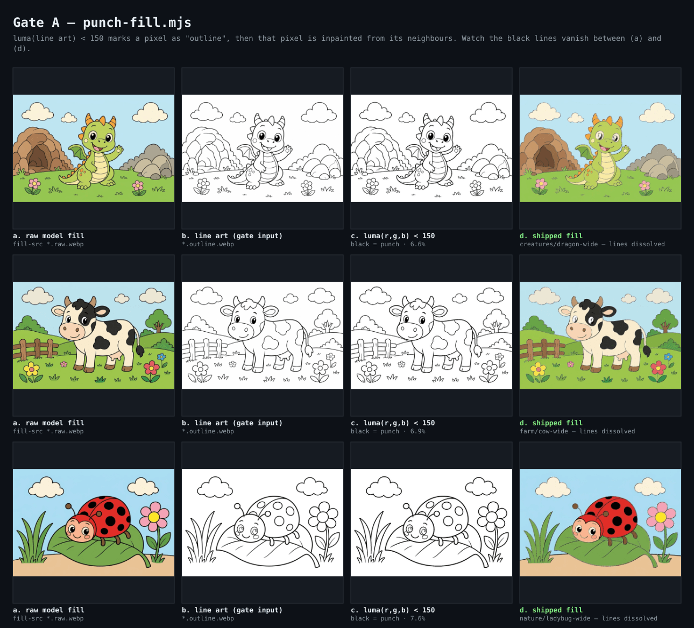

Zoomed on the cow's head, the correspondence is exact — the middle panel is precisely the ink that
vanished:

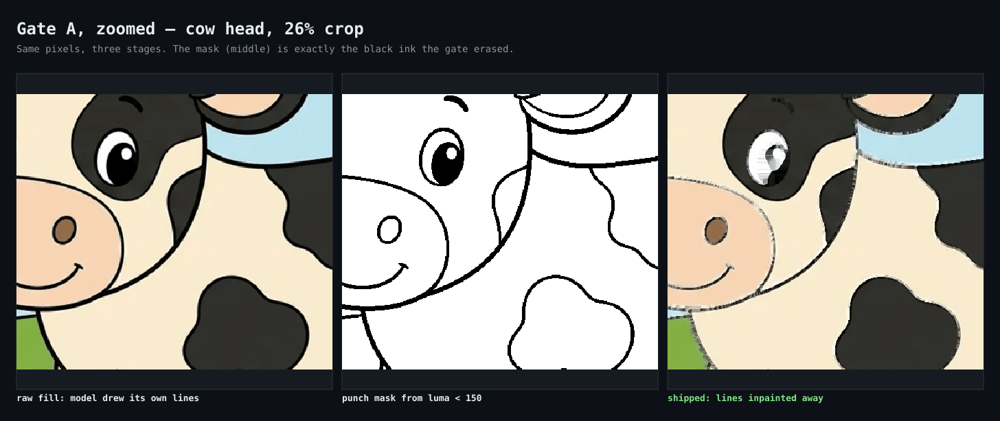

**Blast radius:** all 192 shipped fills (96 pages × light + night). 12 sampled:

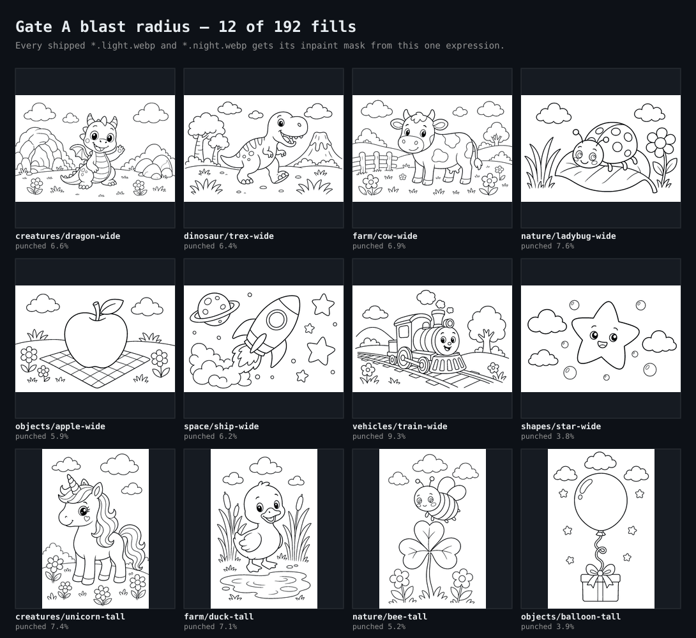

Those 12 are light fills from 12 distinct pages. The other 84 pages — every `*-tall` / `*-wide`
under `creatures/`, `dinosaur/`, `farm/`, `nature/`, `objects/`, `shapes/`, `space/`, `vehicles/` —
look the same, as does each page's night mask, which runs the identical expression against the chalk
line art instead of the pen.

---

### Gate B — `outline-analysis.mjs`: one file, two conversions

This is the subtle one, and the reason the PR adds a fence comment here. `decodeOutline()` returns
**two** products from the same image. The yellow `ink[]` mask moved onto the shared helper. The
greyscale channel next to it is libvips' own conversion, which `chalk-ink-diff.mjs` thresholds at
`OUTLINE_INK_CUTOFF`, and the PR leaves it byte-for-byte alone.

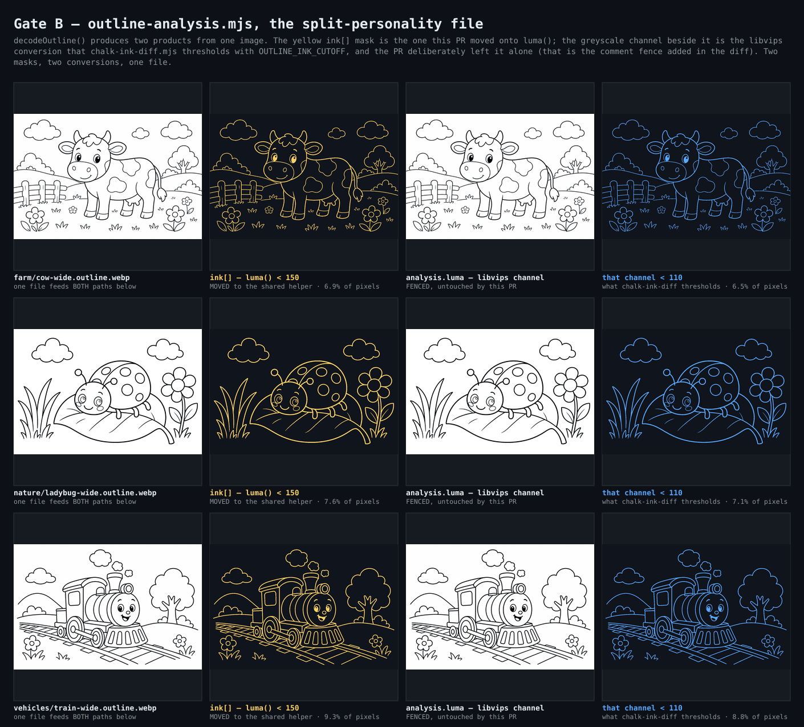

---

### Gate C — `eye-fill.mjs`: every number an eye verdict is made of

Yellow box = a nested "core" found in the line art (a catchlight, a pupil). Blue dashed ring = the
annulus sampled around it, skipping pixels near ink. The printed numbers — the core's median and the
ring's p15/p85 — are read straight out of the array this PR moved onto `luma()`.

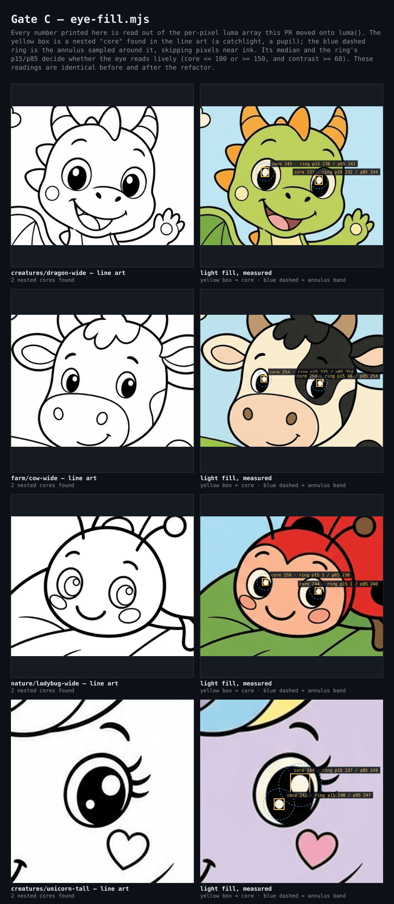

---

### Gate D — `night-scores.mjs`: is it night, and did the model invent lines?

**D1, nightness.** The open background is flood-filled from the border; the pink silhouettes are
what gets excluded. The median `luma()` over exactly the kept pixels is the score. Note how cleanly
the pink tracks the subject — that mask is the algorithm, not a hand-drawn illustration of it.

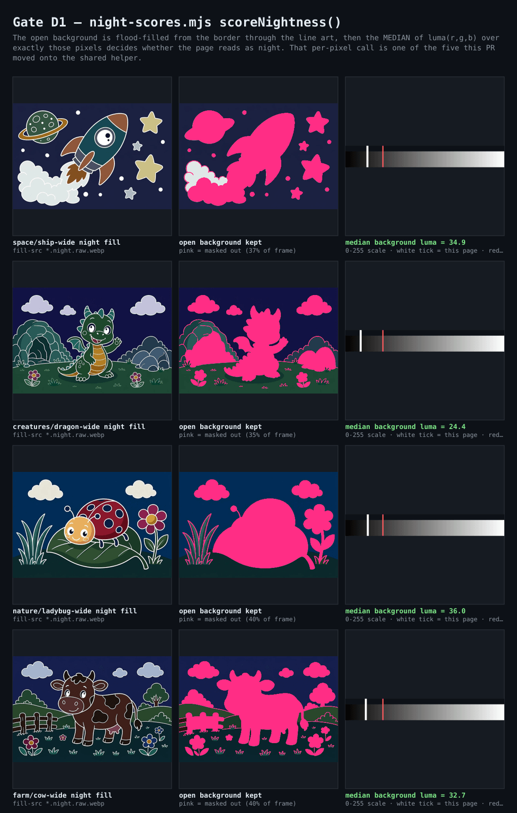

**D2, drift.** `luma() > 185` with low chroma marks a pixel "white outline-ish" — the middle column
is that mask, and you can read the chalk strokes in it. Thin white far from any source line would be
an outline the model hallucinated; on the shipped catalog every one of these lands blue.

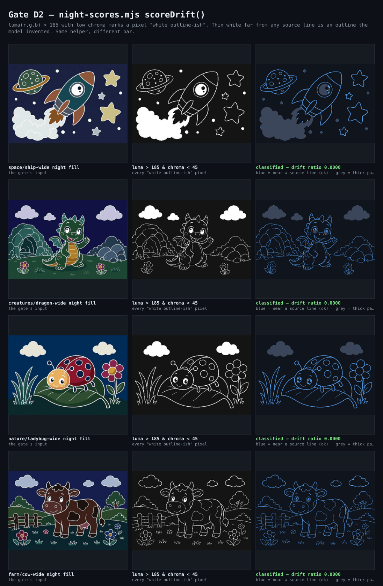

---

### Gate E — `night-halo.mjs`: rimΔ

`rimΔ = luma(reference) − luma(shipped)` — literally one helper call minus another — measured in the
1–2px rings hugging every stroke. The third column is that subtraction rendered directly, and the
train's face lights up exactly where the codebase's own comment says train-wide's halo hotspot is.

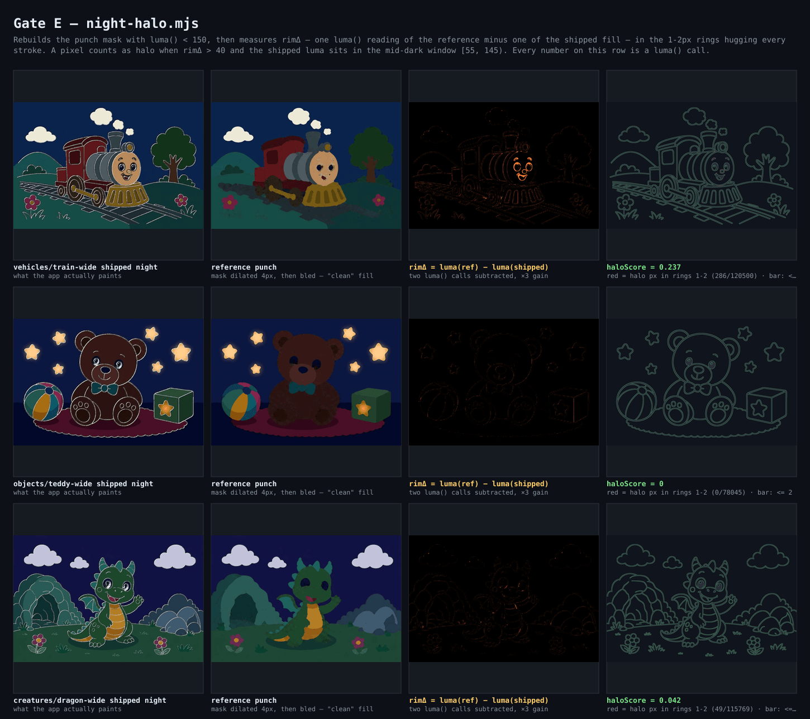

---

### The fences — why three call sites were left alone

libvips' `.grayscale()` is a **linear-light Rec.709** conversion; `luma()` is **gamma-space
Rec.601**. They agree exactly on neutral greys and diverge on colour. That single fact decides which
call sites were safe to unify.

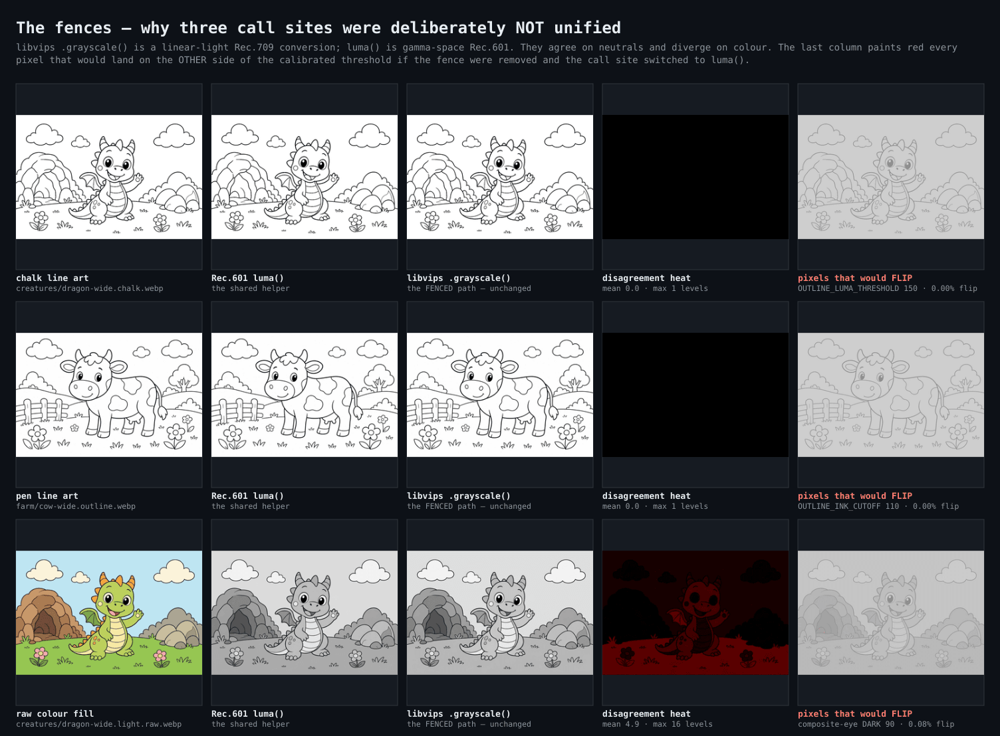

Measured over the whole catalog:

| Fenced context                            | Mean disagreement | Worst pixel | Pixels that would cross the threshold     |
| ----------------------------------------- | ----------------- | ----------- | ----------------------------------------- |
| chalk line art, 96 files, bar 150         | 0.00 levels       | 0.6         | **0**                                     |
| pen line art, 104 files, bar 110          | 0.01 levels       | 1.3         | **6 pixels, total, across all 104 files** |
| raw colour fills, 96 files, bars 90 / 200 | 4.66 levels       | 39.5        | **0.42% at 90, 1.98% at 200**             |

So the two line-art fences are conservative — on today's assets they're worth 6 pixels — but the
colour-fill fence is load-bearing, and here is what removing it would look like. On mermaid-wide,
libvips calls 70.8% of the frame "sclera white"; Rec.601 calls 18.3%. The entire body of water
changes sides:

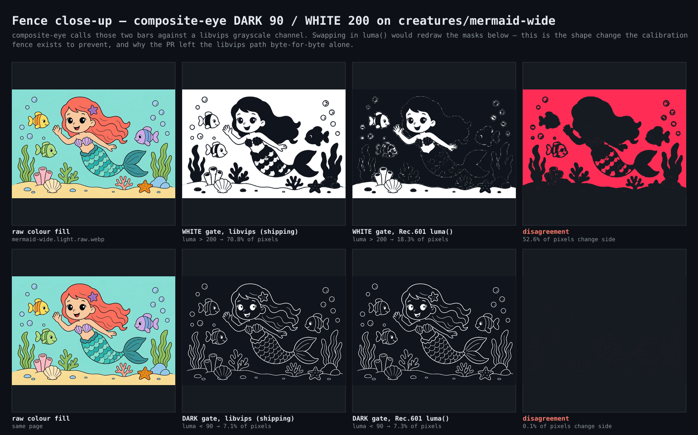

That red panel is the concrete content of "requires rebuilding the composite-eye fixtures and
re-freezing the goldens". The fence is doing real work.

---

### The receipt — the pictures really are identical

I ran the same script in two worktrees, one at the base commit and one at the PR head, over all 96
pages, capturing: the outline `ink[]` hash, the libvips luma-channel hash, every eye-core score for
the light *and* night fill, nightness, drift, and the full halo result (score, band stats,
hotspots), plus the SHA of the re-encoded punched night WebP.

```
base 4aeebad194ae   96 pages · digest e9d359c671a2a0ab
PR   f966b13e8650   96 pages · digest e9d359c671a2a0ab
$ cmp base-scores.json pr-scores.json   # no output — byte identical
```

And decoding the punched night fills each tree produced and differencing them pixel by pixel:

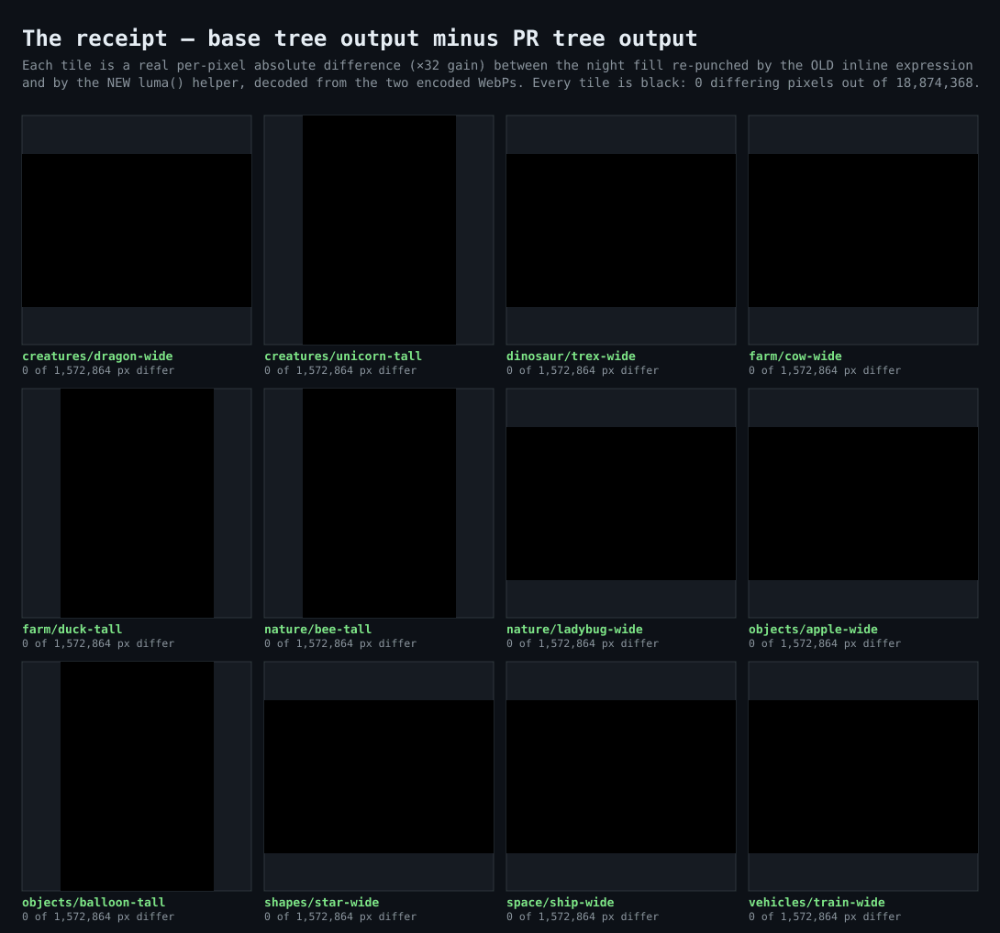

**0 differing pixels out of 18,874,368.** Those tiles are real subtractions with ×32 gain applied,
not placeholders.

---

### The median convention the PR wrote down

The other half of the diff is a comment, not code: `quantile(vals, f)` indexes `floor(f * (n - 1))`,
so at `f = 0.5` on an **even**-length array it picks the *lower* middle value and never averages the
two. Worth stating out loud since band samples are frequently even-length:

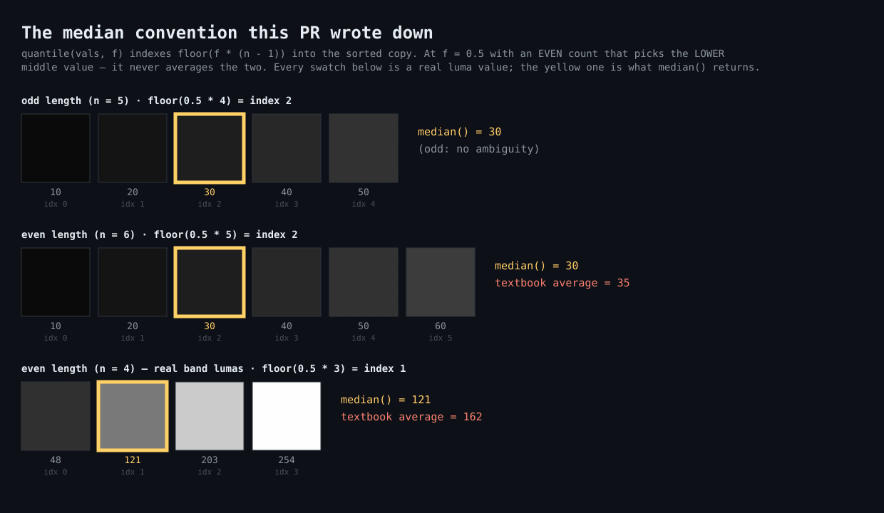

---

### The two drift guards, demonstrated

Both new tests actually fire. I appended a fresh inline copy to `regions.mjs`:

```
× keeps Rec.601 coefficient math centralized across the Node libraries
AssertionError: expected [ 'regions.mjs' ] to deeply equal []
```

…and separately swapped the proof-sheet browser bundle's coefficients to Rec.709:

```
× keeps the proof-sheet browser bundle aligned with the pipeline convention
AssertionError: expected [ 0.2126, 0.7152, 0.114 ] to deeply equal [ 0.299, 0.587, 0.114 ]
```

Both reverted afterwards. The eighth copy of the formula is genuinely in the shipped artifact — it
appears verbatim in all eight committed book sheets under `scrapbook/coloring-book-proof-sheets/`,
because that page is a self-contained browser runtime that can't import the Node module. Keeping the
copy and guarding it mechanically is the same bundle-boundary pattern `saveFolder.svelte.ts` uses.

---

### One thing I'd flag

The three fence comments now assert a calibration relationship that no test enforces — they're prose
claiming "these bars are tuned to libvips weighting". The measurements above back that up for
`composite-eye` — decisively — but the two line-art fences are protecting a 6-pixel difference
across the entire catalog. Not a change request for this PR; just worth knowing which of the three
fences is actually holding something back if a future change wants to revisit them.
