# PR #1137 — visual walkthrough

## What these six comments are actually talking about

This PR adds **six lines of comment and nothing else**. No value changed, no asset changed, no code
path changed. So there is no before/after screenshot to show — the "change" is a claim about
pictures.

What follows is those pictures. For each comment I show the art the constant encodes, and then
whether the reason the comment gives is true when you look at it. Everything below is measured from
the committed assets on PR #1137's branch. The figures are in `img/` beside this file and the
scripts that produced them are in `scripts/` — see the [README](README.md) for the metric and how to
re-run it.

This document is evidence only. It lives on `claude/pr-1137-visual-walkthrough-xzoqfv` and does not
touch PR #1137's diff.

---

### First: what the six constants encode

Each row is one of the six edited files, the picture that generator writes, and the pixel makeup of
that picture. Black/white bar = hard line art. Solid amber = soft paint.

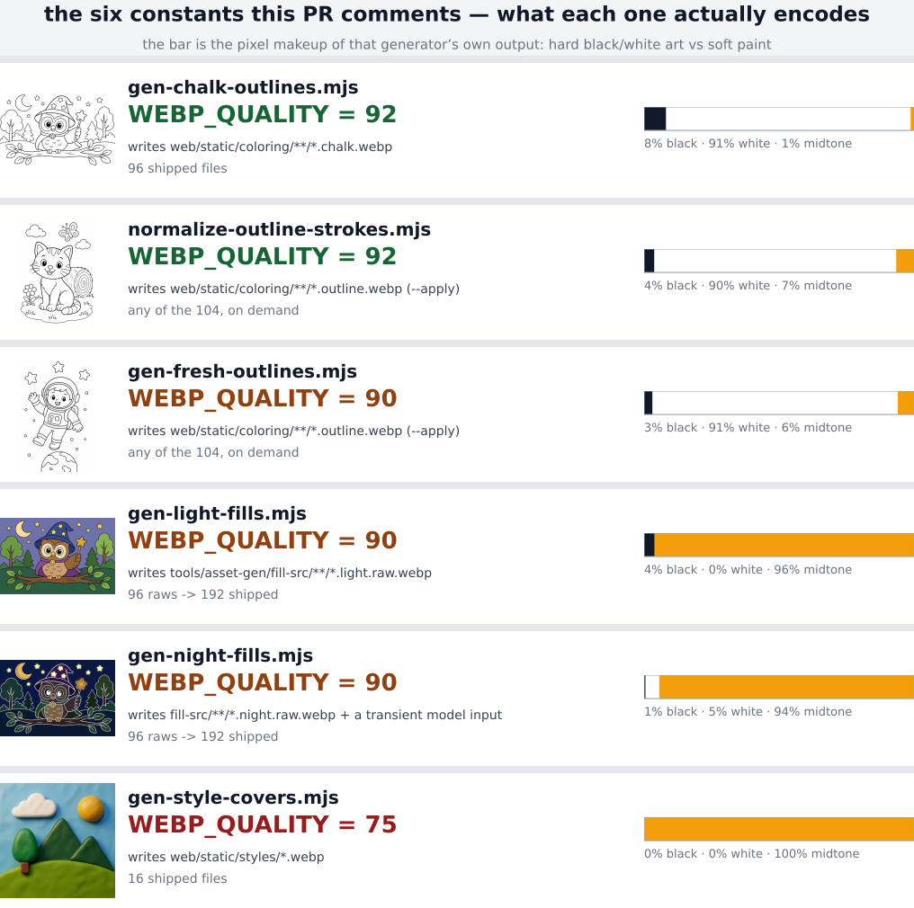

The quality tiers fall out of the pictures, not out of the code. The two q92 generators write art
that is **91% pure white paper plus a few percent pure black ink**. The two fills and the covers
write art that is **94–100% midtone paint**, with no flat paper anywhere in it. That is the whole
thesis of the PR, and you can see it in the bars.

The odd one out is row 3, `gen-fresh-outlines.mjs`: hard-edge art like rows 1 and 2, carrying the
soft tier's number. That is comment 6, at the bottom.

---

### Comment 1 & 2 — "Hard black/white edges expose WebP ringing"

Applied identically to `gen-chalk-outlines.mjs` and `normalize-outline-strokes.mjs`, both q92.

Ringing is what a lossy encoder leaves behind when it meets a hard edge: it cannot represent a step
from black to white in a smooth basis, so it overshoots and leaves a faint halo in the paper next to
the ink. Below, **red marks every paper pixel the encoder moved off pure white**. Grey is the ink
itself, for orientation. 4× zoom.

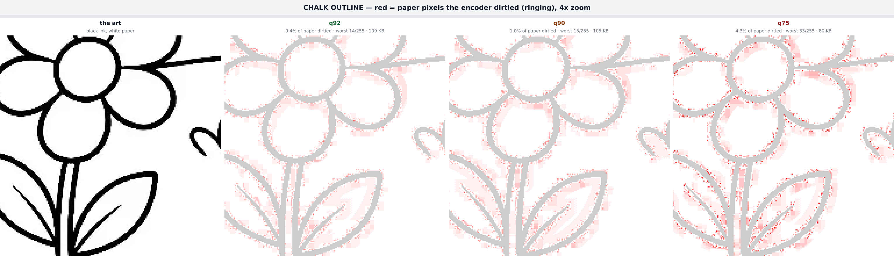

The halo is real and it hugs the strokes exactly as the word "ringing" implies. It grows as quality
drops. That is the claim, visible.

To rule out that I was just measuring damage stacked on top of the encode already baked into the
committed file, here is the same test from a **genuinely lossless source** — the outline binarized
to pure black and pure white first, then encoded exactly once:

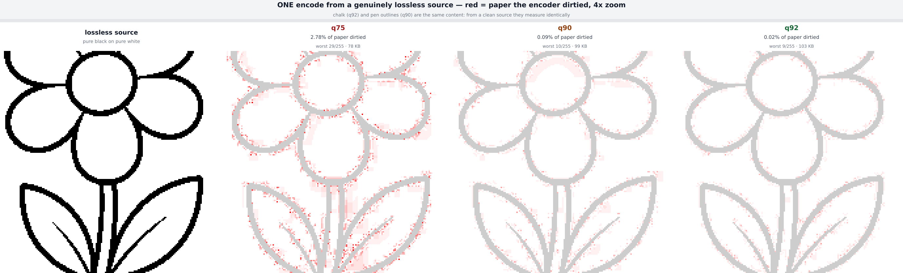

|         | paper pixels dirtied | worst deviation | size   |
| ------- | -------------------- | --------------- | ------ |
| q75     | 2.78%                | 29/255          | 78 KB  |
| q90     | 0.09%                | 10/255          | 99 KB  |
| **q92** | **0.02%**            | **9/255**       | 103 KB |

So q92 leaves about **4× less ringing than q90** and **over 100× less than q75**, for 4% more bytes.
The comment's reason holds.

**Blast radius — 12 of the 96 chalk pages this one constant encodes.** The percentages under each
are the same measurement, at q92 and at q90:

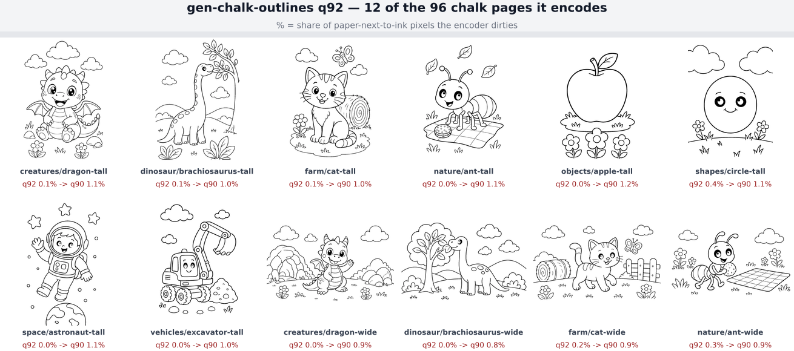

Sampled one page from each of the eight categories, then round again: dragon, brachiosaurus, cat,
ant, apple, circle, astronaut, excavator, and the wide variants. All 12 move the same direction. The
other 84 chalk pages are the remaining pages of `creatures/`, `dinosaur/`, `farm/`, `nature/`,
`objects/`, `shapes/`, `space/` and `vehicles/`.

The second half of that comment — *"downstream stages re-consume this output"* — is why this matters
more than a single encode suggests. The chalk is not a leaf asset:

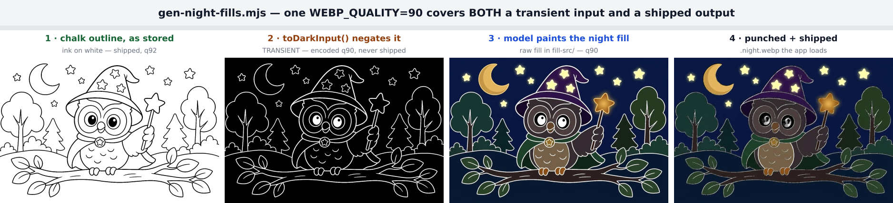

Picture 1 is the shipped chalk. Picture 2 is that same file negated and re-encoded as the model's
input. Picture 3 is what the model paints from it. Picture 4 is what a child sees. Any halo
introduced at step 1 is fed forward into every later step.

---

### Comment 3 — "Soft painted fills mask compression artifacts" (`gen-light-fills.mjs`, q90)

Same encoder, same zoom, same amplification — the only variable is what the art is made of:

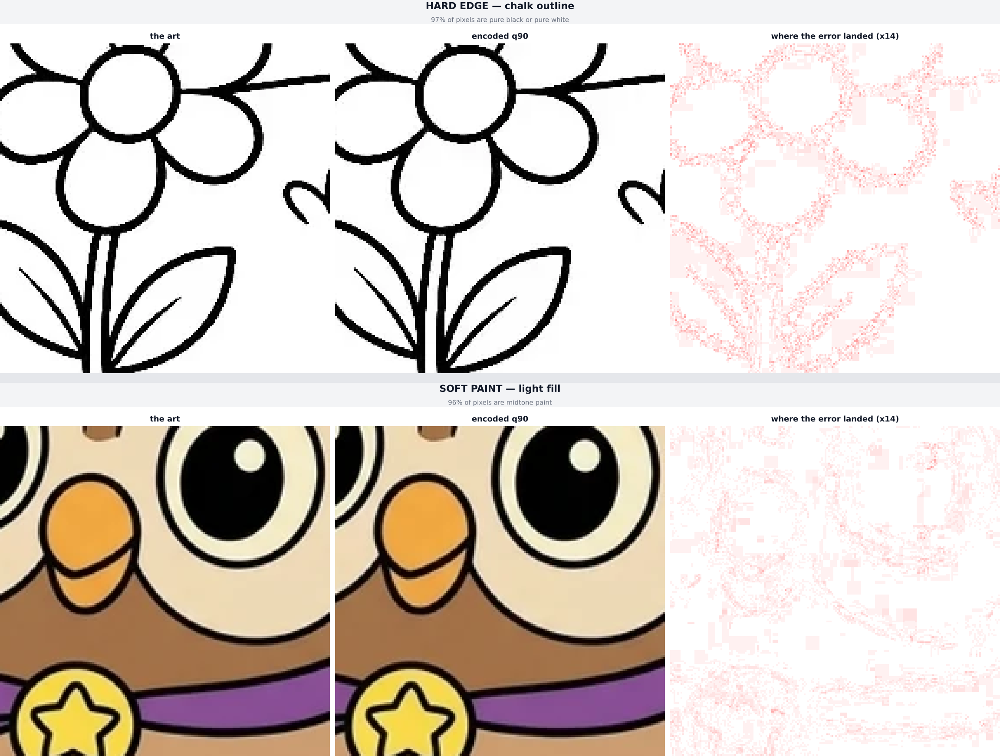

Top row, the error collects into halos sitting on flat white paper, where there is nothing to hide
behind. Bottom row, the same encoder at the same setting produces error that scatters into paint
that was already textured and coloured. Mean error across 12 fills is **0.15–0.35 out of 255** —
well under half of one 8-bit step — at either quality, and q90 saves 4.7% (light) / 7.7% (night) of
the bytes. "Masks artifacts" is a fair description of the picture.

One thing the comment does not say, worth knowing when reading it: the q90 governs the **archived
raw**, not the file the app downloads.

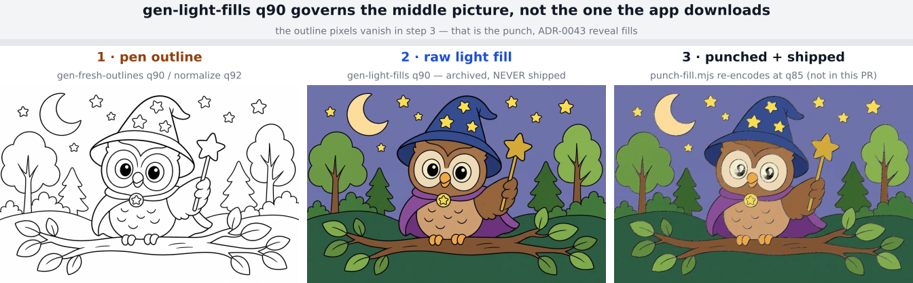

Watch the black outlines disappear between picture 2 and picture 3 — that is the punch (ADR-0043),
and it re-encodes at `punch-fill.mjs`'s own q85, which already carries its own rationale and is
correctly out of scope here.

**Blast radius — 12 of the 96 light raws, and 12 of the 96 night raws.** Each raw becomes two
shipped files — the full-size one plus its `max-1152px` responsive variant — so these two constants
stand behind 384 shipped pictures:

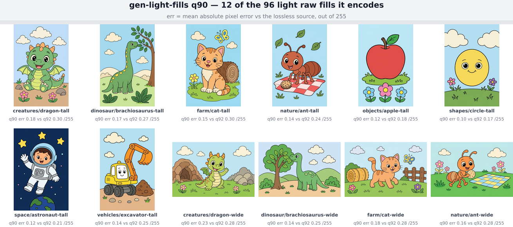

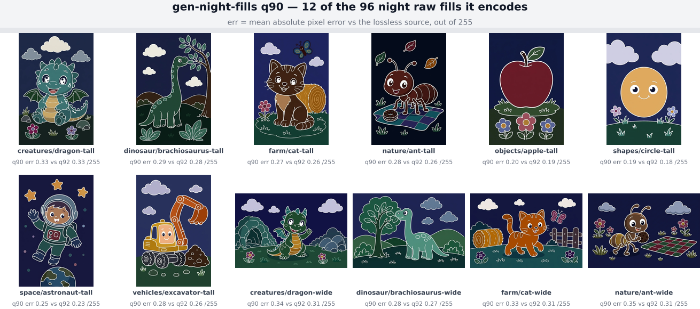

---

### Comment 4 — the night fill's second job (`gen-night-fills.mjs`, q90)

The first half of this comment is the same story as comment 3 — soft shipped fills tolerate q90,
shown in the night blast-radius sheet above. The second half is what makes it a separate comment:
the q90 also covers `toDarkInput()`. That is picture 2 of the chain above — the negated chalk,
encoded and handed to the model, then thrown away. Note what it is made of: **white lines on
near-black**, which is hard-edge content, the same class the q92 comments are about. So one constant
chosen for soft paint also governs a hard-edge transient. The comment says exactly that rather than
pretending the number was picked for one purpose, which is the honest reading of the code.

---

### Comment 5 — "Display-sized cover thumbnails hide q75 artifacts"

First, where these 16 files actually appear. This is the real app, real assets, "Pick a style":

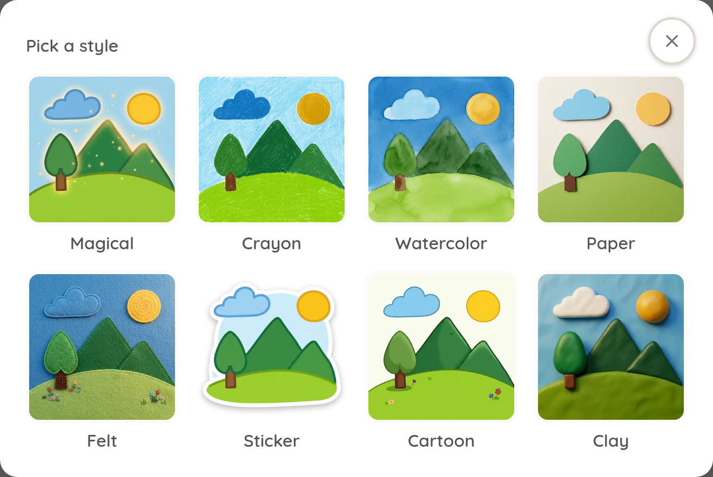

I measured the rendered thumbnail in that running modal: **141 CSS px** on a 900×900 viewport, 150
px on a 400 px phone. The source file is 448 px.

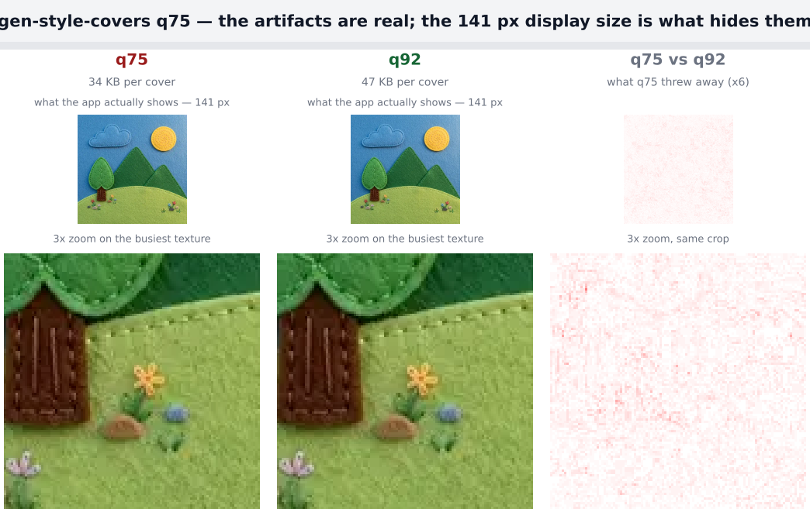

Top row is each version at the size the app really shows. They are the same picture — I cannot tell
them apart and neither can a two-year-old. Bottom row at 3× zoom is where q75 gives up: the felt
stipple flattens and the tiny flowers lose their grain. The right-hand column shows where the
discarded detail went — spread evenly through texture, never concentrated into a halo, because there
is no flat paper in this image to put a halo on. 34 KB vs 47 KB per cover.

**Blast radius — all 16 files, since there are only 16:**

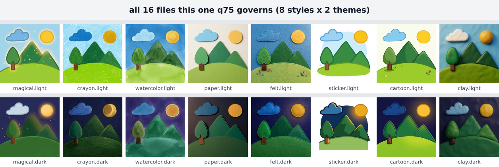

---

### Comment 6 — the fresh-outline q90, recorded as uncalibrated

This is the most interesting line in the diff, and the pictures back up the decision to write it
that way.

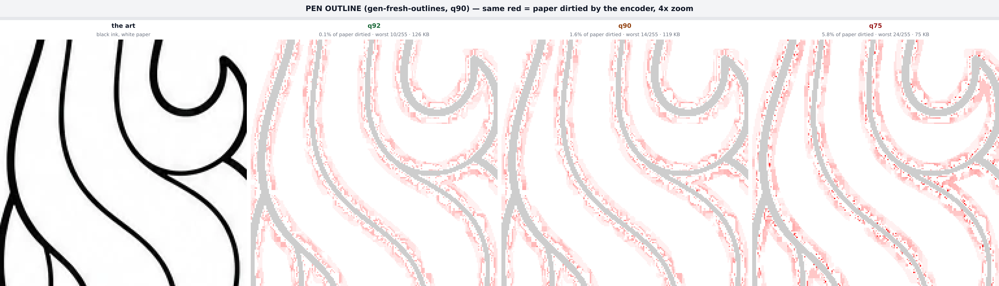

That is the pen outline, the same test as the chalk. It is the same kind of art — black ink on white
paper, 91% of pixels pure white — and it rings the same way. From a clean source, chalk and pen
outline measure within a hundredth of a percent of each other at every quality. There is nothing in
the pictures that distinguishes the two, yet one is encoded at q92 and the other at q90.

The reason that is worth flagging rather than shrugging at: **both constants write the same file.**
`normalize-outline-strokes.mjs --apply` writes the q92 candidate over
`web/static/coloring/**/*.outline.webp`, and `gen-fresh-outlines.mjs --apply` writes its q90 render
over the same path. Which quality a shipped outline carries depends on which tool last touched it.

**Blast radius — 12 of the 104 pen outlines**, with the measurement under each:

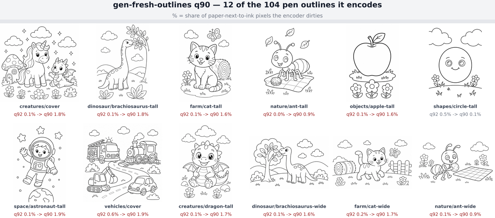

Eleven of the twelve behave identically: q92 dirties 0.0–0.2% of the paper next to the ink, q90
dirties 0.9–1.9%. The exception is `shapes/circle-tall`, which inverts (0.5% → 0.1%) — one page in
twelve, worth naming rather than hiding. Across the whole 104-file set, q90 saves **0.50 MB of 9.80
MB, 5.1%**.

So the measurements the comment asks for — "measure outline ringing and bytes before changing it" —
come out as: **roughly 4–8× more ringing, in exchange for 5% of the bytes.** That is not a reason to
change the value in this PR, which is documentation-only and correctly scoped. It is a reason the
comment is the right comment: it records honestly that no one has done this arithmetic, instead of
inventing a rationale that the pictures would not support.

---

### Summary

| Comment        | Constant | Governs                                                                  | Claim holds?                                                               |
| -------------- | -------- | ------------------------------------------------------------------------ | -------------------------------------------------------------------------- |
| chalk          | q92      | 96 shipped `*.chalk.webp`                                                | Yes — halos visible, 4× cleaner than q90                                   |
| normalize      | q92      | any of 104 `*.outline.webp`, via `--apply`                               | Yes — same content, same result                                            |
| light fills    | q90      | 96 archived raws → 192 shipped light files                               | Yes — error hides in paint, 4.7% bytes saved                               |
| night fills    | q90      | 96 archived raws → 192 shipped night files, plus a transient model input | Yes, and the transient half is real                                        |
| style covers   | q75      | all 16 `web/static/styles/*.webp`                                        | Yes — invisible at 141 px, visible at 3×                                   |
| fresh outlines | q90      | any of 104 `*.outline.webp`, via `--apply`                               | Correctly recorded as uncalibrated; the numbers above are that calibration |

Six comments, six accurate descriptions of six real pictures. The only thing the pictures add is
that the fresh-outline caveat deserves a follow-up issue: two tools write the same shipped artifact
at different qualities, and the measurement now exists to settle which one wins.
