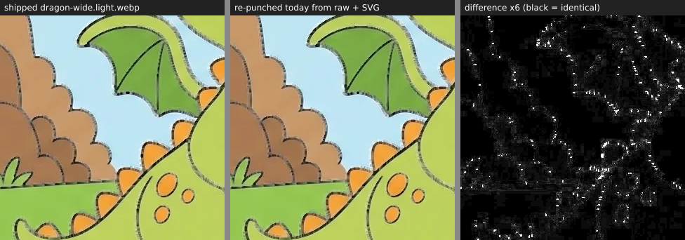

# Spike 247 — one asset, source to shipped derivative

Throwaway spike for issue 247. Traces `creatures/dragon-wide` (light) through every
committed link, names what records each link, and reports what the draft `--check`
mode found when run over the whole catalog on 2026-09-22.

## The chain

| Link | File | Last written | What records it | What proves it is current |
| --- | --- | --- | --- | --- |
| Trace source (pen raster) | `vectorized/coloring-overlays/dragon-wide.source.webp` | uncommitted | `tools/vectorize/coloring-overlays.json` keeps its sha256 + byte count | nothing — the bytes are gone; the ledger is the receipt |
| Canonical pen | `web/static/coloring/creatures/dragon-wide.overlay.svg` | efed61160ea5 (2026-08-20) | ledger: `outputSha256`, recipe params | `vectorize:coloring:check` (ledger vs bytes) |
| Light raw fill (source of truth) | `tools/asset-gen/fill-src/creatures/dragon-wide.light.raw.webp` | 24b41b10ee46 (2026-07-13) | `golden/asset-manifest.sha256` (hash); `golden/golden-scores.json` (gate scores); `docs/gemini-3.1-migration.md` (wave-level run record, no per-page model/prompt/attempt line for this page); `fill-src/creatures/notes.json` (no entry) | `check:assets:manifest` proves the bytes; nothing proves model, prompt revision, temperature, or attempt count |
| Shipped fill | `web/static/coloring/creatures/dragon-wide.light.webp` | 24b41b10ee46 (2026-07-13) | `asset-manifest.sha256` (hash only) | **nothing** — the punch has no `--check`; this spike adds one |
| Compact tier | `web/static/coloring/max-1152px/creatures/dragon-wide.light.webp` | derived from the shipped fill | `books.ts` declares source → target | `test:asset-gen` regenerates every raster derivative and requires byte equality (CI) |
| Selector tiers | `dragon-wide.selector.webp`, `max-240px/…` | derived from the SVG | `books.ts` | `test:asset-gen` requires pixel equality with a fresh Resvg render (CI) |

So the provenance gap is exactly one layer: raw + SVG → shipped fill. Everything below it
is already regenerated and compared in CI; everything above it is hashed.

## What the draft check found

`node tools/asset-gen/coloring/punch-fill-outlines.mjs --check` re-derives every
shipped fill in memory and compares bytes.

- 192 / 192 shipped fills are **STALE**: 0 fresh, 0 missing, 64 s for the whole catalog.
- Cause, from the commit history: the fills were last punched on 2026-07-13 against the
  raster `.outline.webp` (luma < 150). On 2026-08-20 (246d9043c454 "Make coloring page
  SVGs canonical") the mask became the SVG alpha and the outlines themselves became
  Vectorizer traces. No re-punch followed; `gen:assets:manifest` was regenerated over the
  new SVGs and the old fills, so `check:assets:manifest` has been green throughout.
- Magnitude on `dragon-wide.light`: 2.55 % of pixels differ by ≥ 8/255; 93.5 % of those lie
  within 3 px of ink, i.e. under or beside the vector line. Not a visible defect; a
  provenance defect.

## What re-punching would cost

Released native app 1.6.0 downloads every fill by canonical path + SHA-256
(`tools/release/coloring-pack-snapshots/1.6.0.json`, 98 files per book, ADR-0103).
Re-punching 192 fills changes 192 digests at unchanged paths, so
`check:coloring-pack-retention` would report them as no longer served — the same breach
v1.5.0 already carries (`RELEASED_PACK_BROKEN_FILES`). A freshness gate therefore cannot be
turned on by "run the punch and commit"; it needs either a grandfathered baseline until the
next retention-safe regeneration, or a retention mechanism for superseded bytes.

## The draft

- `lib/punch-fill.mjs`: `derivePunchedFill(raw)` — the pure derivation, returns bytes;
  `punchFill` now writes what it returns.
- `coloring/punch-fill-outlines.mjs --check`: fresh / STALE / MISSING per fill, exit 1 on
  any non-fresh. ~1/3 s per fill.
- Not done: an npm script + `scripts-info` entry, a CI step next to
  `check:assets:manifest`, a test, a decision record in `tools/asset-gen/docs/`, and the
  cover-thumb derivation (`gen-thumbnails.mjs`, 16 files) which has the same gap.
