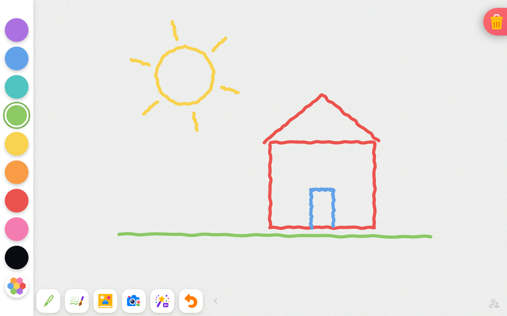
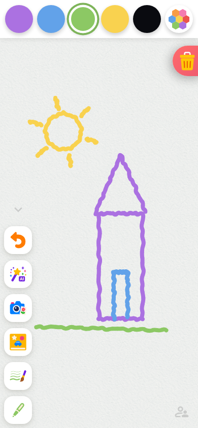
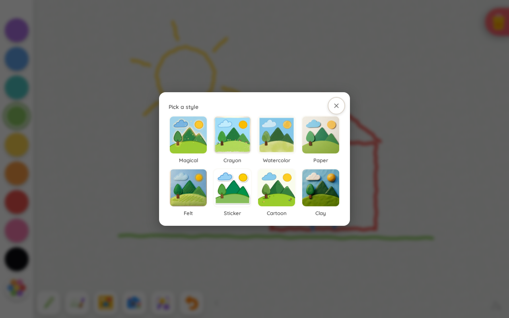
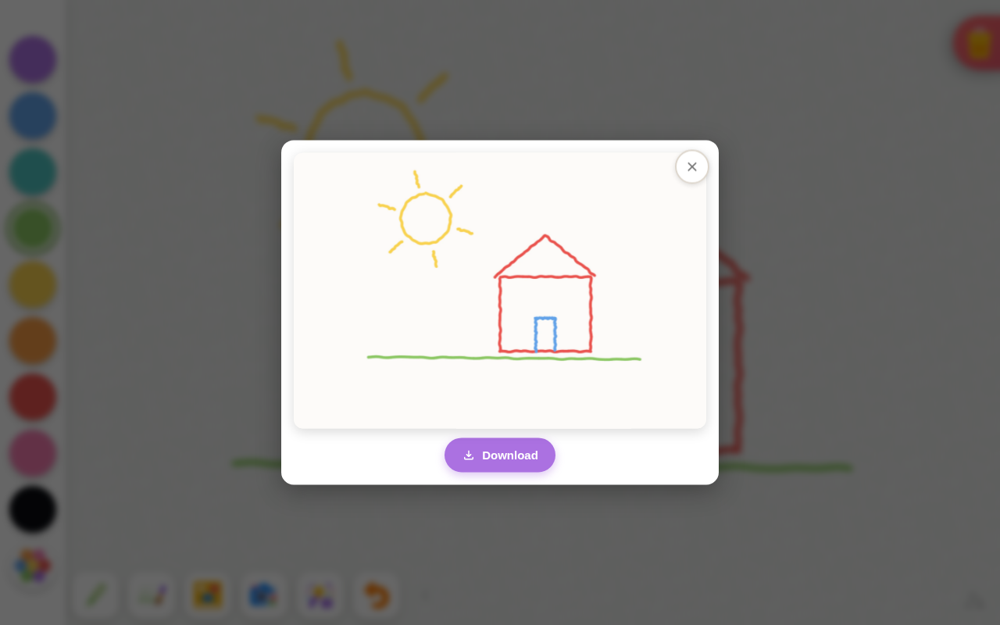
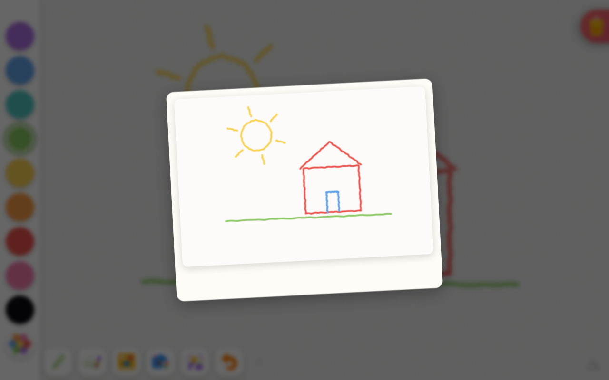

# Tiny Tweaks — design-handoff packet

Reference screenshots and the prototype prompt for the **Tiny Tweaks** feature
([issue #181](https://github.com/KyleMit/Splotch/issues/181)): a redraw coach where the AI returns
the child's drawing with 2–3 subtle improvements in their own style, pinned as a polaroid reference
beside a fresh sheet.

Captured 2026-07-27 from the running app (headless Chromium driving the real UI; the
`/api/generate-image` call was mocked to echo the drawing back — which is coincidentally exactly how
a Tiny Tweaks result should feel).

## Screenshots

### 1 · Drawing screen, tablet landscape (1280×800)

Palette left, action drawer expanded (AI wand visible), trash top-right — the corner-button
precedent for the pin's placement.



### 2 · Drawing screen, phone portrait (390×844)

Palette moves to the top, actions stack on the left — the pinned reference must track the canvas
across both layouts.



### 3 · AI style picker

The "Pick a style" grid. Tiny Tweaks becomes the lead tile.



### 4 · AI result modal

The revealed result with the Download action (auto-save off).



### 5 · Polaroid send-off, frozen mid-animation

The tilted polaroid card over the blurred canvas — the exact framing and shadow the pinned corner
thumbnail should inherit.



## Prototype prompt (for Claude design)

Upload the five screenshots above alongside this prompt to generate an interactive comparison
prototype:

```text
I'm designing a feature for Splotch, a drawing app for toddlers (age 2+). Screenshots attached:
(1) the drawing screen on tablet landscape with a child's doodle, (2) the same screen on phone
portrait, (3) the AI style picker modal, (4) the AI result modal with the Download action,
(5) the polaroid send-off moment mid-animation — the card that should shrink into the corner as
the pinned reference.

THE FEATURE — "Tiny Tweaks," a redraw coach:
The child draws something, then asks the AI for a version of their drawing with 2–3 tiny
improvements — critically, rendered in the child's own visual style (same wobbly crayon lines,
same stroke weight), not a polished illustration. That result does NOT replace their art.
Instead it becomes a pinned reference: the app saves their drawing, clears to a fresh sheet,
and the polaroid from the result modal shrinks into a corner of the canvas as a small pinned
thumbnail. The child then redraws the picture themselves, peeking at the reference — like a
kid drawing next to a reference photo. The loop repeats: redraw → tiny tweaks again → new
reference pin.

BUILD AN INTERACTIVE PROTOTYPE covering this flow:
1. Drawing screen with a child's doodle (generate a wobbly crayon-style SVG doodle, e.g. a sun
   over a house — keep it charmingly imperfect).
2. Tapping the AI button opens the style picker from screenshot 3, with a new lead tile
   "Tiny Tweaks ✨" added in front of the existing styles (recreate a few existing tiles for
   context).
3. Picking it shows a brief fake generation moment, then the result modal from screenshot 4:
   the polaroid shows the SAME doodle with 2–3 subtle improvements (e.g. sun rays more evenly
   spaced, a door added to the house, ground line extended) — same wobbly stroke style, so the
   delta is small and legible. Generate this as a second SVG variant of the same doodle.
4. On accept: the canvas clears to a fresh sheet AND the polaroid animates — shrinking and
   flying into the corner of the canvas where it stays pinned as a small thumbnail (about
   thumb-sized; it should sit inside the canvas area like the fullscreen button does, so it
   tracks the canvas in both orientations).
5. The child redraws (let me scribble with pointer/touch on the fresh canvas), peeking at the
   reference via the interaction below.
6. The AI button remains available; tapping it again loops back to step 3 with the new ink.

THE KEY INTERACTION — peeking at the pinned reference. Build THREE VERSIONS as switchable
variants (tabs or a version switcher) so I can compare them side by side:

• VERSION A — Hold-to-peek, aligned: press-and-hold the pinned polaroid thumbnail and it
  smoothly enlarges to overlay the paper area, aligned with the canvas so the child sees the
  reference at drawing scale; release and it springs back to the corner. No stuck-open state —
  spring-loaded only.

• VERSION B — Hold-to-peek, lightbox: same press-and-hold trigger, but the polaroid enlarges
  to the center of the screen over a dimmed backdrop, staying visually a "photo you're holding
  up" rather than aligning with the paper. Release springs it back.

• VERSION C — Ghost trace overlay: instead of a corner pin, the reference lays down as a
  semi-transparent (~25% opacity) layer directly on the fresh sheet, like tracing paper — the
  child draws right on top of it. Include a small affordance to toggle the ghost's visibility.

DESIGN CONSTRAINTS:
- Primary user is 2 years old: huge touch targets, zero reliance on reading, no long-press
  menus or gestures beyond simple tap / press-and-hold / drag. Nothing the child can get
  irreversibly "stuck" in.
- Match the visual language in the screenshots — colors, chunky rounded buttons, playful but
  uncluttered. The polaroid styling should match screenshot 5 exactly (white frame, shadow).
- Make it feel alive: the polaroid shrink-to-corner moment and the peek spring should be
  playful, physical animations (overshoot, squash), not linear fades.
- Single self-contained interactive HTML prototype; both doodle states as inline SVG; works
  with touch and mouse.

Also include a small "reset loop" control (clearly a dev control, visually separate) so I can
restart the flow while testing.
```
