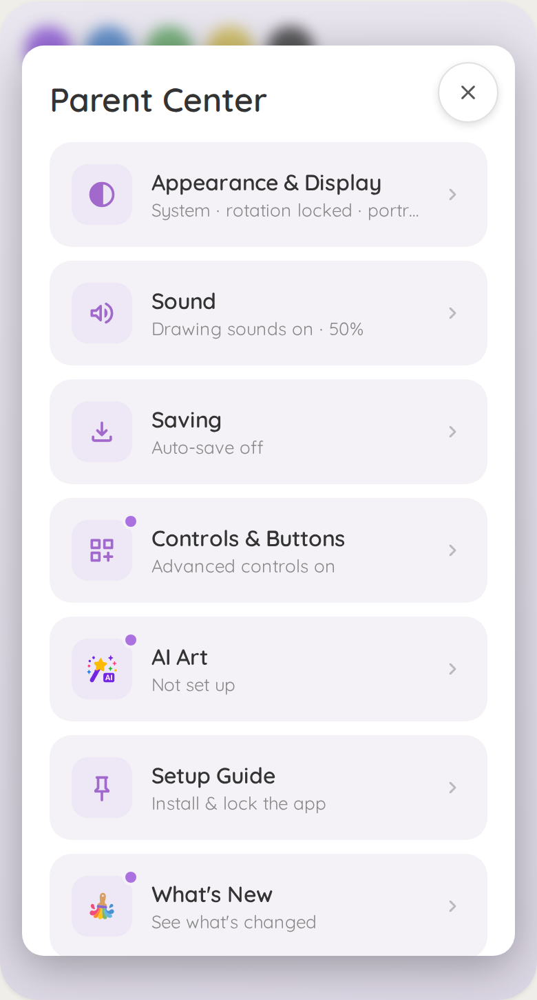
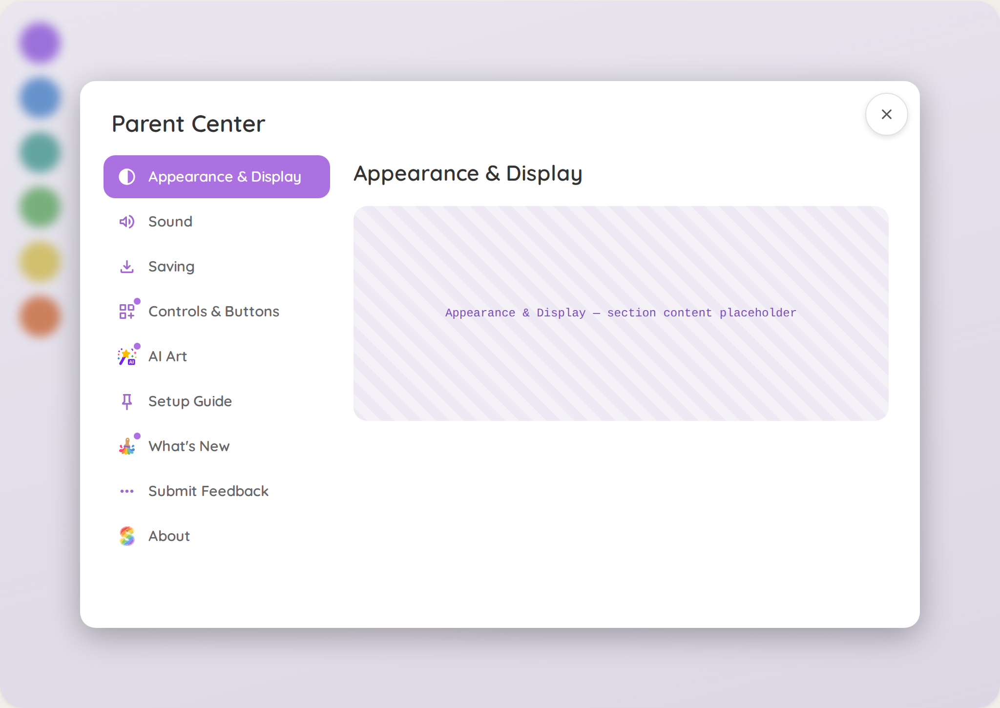
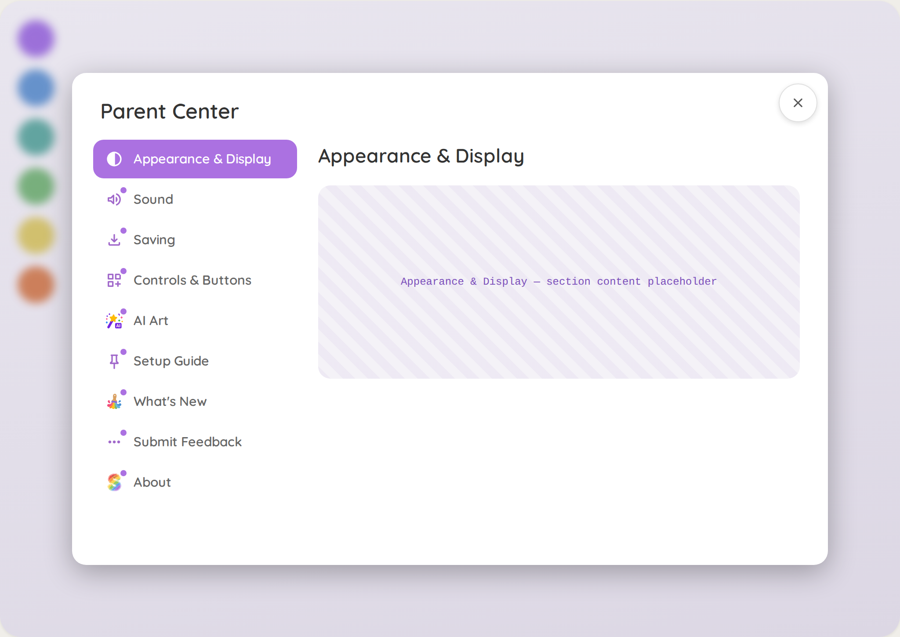
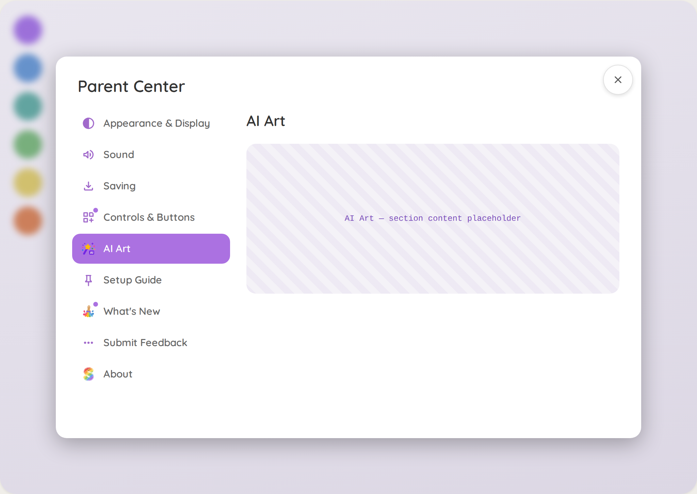

# Design handoff: Parent Center — section activity dot

Design reference for [issue #557](https://github.com/KyleMit/Splotch/issues/557). Produced in a
Claude Design session (2026-07-27) that explored three dot placements against recreations of both
Parent Center shells; **variant B — "icon badge" — is the chosen direction.**

[`index.html`](./index.html) is an interactive rebuild of that prototype using the repo's own icons
and Quicksand font: click any section to open it and watch its dot clear; "Reset: first run" dots
everything; "Simulate new release" re-dots What's New. The screenshots in `assets/shots/` are
captured from it. (The original design-session export bundled a `.dc.html` that depends on a private
runtime and shipped mislabeled screenshots — including a dot on the active purple row, which the
spec below explicitly rules out — so the prototype was rebuilt faithfully from its embedded template
and state logic, and the states re-captured.)

## The dot — exact spec

* **Color:** `var(--brand)` `#ab71e1` (same token in dark mode).
* **Size:** 8px diameter on the phone hub tile; 7px on the tablet sidebar icon.
* **Ring:** `box-shadow: 0 0 0 2px <surface-behind>` so the dot reads cleanly at the tile corner —
  ring color is the surface the icon sits on: `var(--surface-2)` on phone hub rows, `var(--surface)`
  on the tablet sidebar. Use the tokens, not hex, so dark mode works.
* **Position:** absolutely positioned at the icon container's top-right corner.
  * Phone: the 44×44 `--brand-wash` tile (`border-radius: var(--radius-md)`), dot at
    `top:-3px; right:-3px`.
  * Tablet: wrap the 20×20 `.pc-nav-icon` in a `position:relative` span, dot at
    `top:-4px; right:-4px`.
* **Shape:** perfect circle, `border-radius:50%`, no border, no shadow beyond the ring.
* **Fade-out:** `opacity 1 → 0`, `transition: opacity var(--duration-base) ease` (~200ms). Keep the
  dot element mounted (opacity 0) so the fade can play; dots never fade *in* — new ones appear
  instantly on next render.
* **Tone:** no counts, no pulsing, no appear-animation, no toasts. Static presence is the signal.

## Interactions

* **Opening a section clears its dot** synchronously in the same click, on both shells.
* **Tablet sequencing:** the dot finishes fading *before* the solid purple active background lands.
  Apply dot-clear + active change in one state update, but give the nav item's background/color
  transition a delay equal to the fade:
  `transition: background 0.15s ease 0.2s, color 0.15s ease 0.2s`.
* **Tablet default pane counts as seen:** the first section's content is on screen the moment the
  modal opens, so it is marked seen immediately — first run shows 8 dots there, not 9.
* **Phone first run shows all 9** — accepted as inviting; they melt away one by one.
* The dot itself is not interactive; no hover/press treatment.

## State model

* Persist a `sectionSeen: Partial<Record<SectionId, string>>` map through the standard dual-layer
  storage path (`storageKeys.ts` → `storage.ts`, `onDurableRestore` reloader).
* A section is dotted when `sectionSeen[id] !== currentStamp(id)`.
  * `whatsnew`: stamp = `APP_VERSION`, so every release re-dots What's New automatically.
  * All other sections: a hand-bumped literal stamp (`'1'`), raised in the PR that ships meaningful
    new content into that section. Device-conditional reveals do not bump stamps.
* Opening a section sets `sectionSeen[id] = currentStamp(id)`.

## Accessibility

* Dotted rows append visually-hidden `new` text inside the button so it joins the accessible name;
  remove it when the dot clears. The dot span itself is decorative — no role, no label.

## Explicit non-goals

* No dot on the Parent Center entry button (the child-facing screen stays quiet).
* No counts, numbers, pulses, sounds, or toasts anywhere.
* No re-dotting on releases except What's New.

## Screenshots

**Seeded state** — Controls & Buttons, AI Art, What's New dotted:

| Phone hub                                                                     | Tablet sidebar                                                                          |
| ----------------------------------------------------------------------------- | --------------------------------------------------------------------------------------- |
|  |  |

**First run** — phone dots all 9; the tablet's default-displayed section counts as seen on open, so
it shows 8:

| Phone hub                                                                                 | Tablet sidebar                                                                                                   |
| ----------------------------------------------------------------------------------------- | ---------------------------------------------------------------------------------------------------------------- |
|  |  |

**After opening AI Art** — its dot cleared before the purple active row landed; the other dots
remain:

