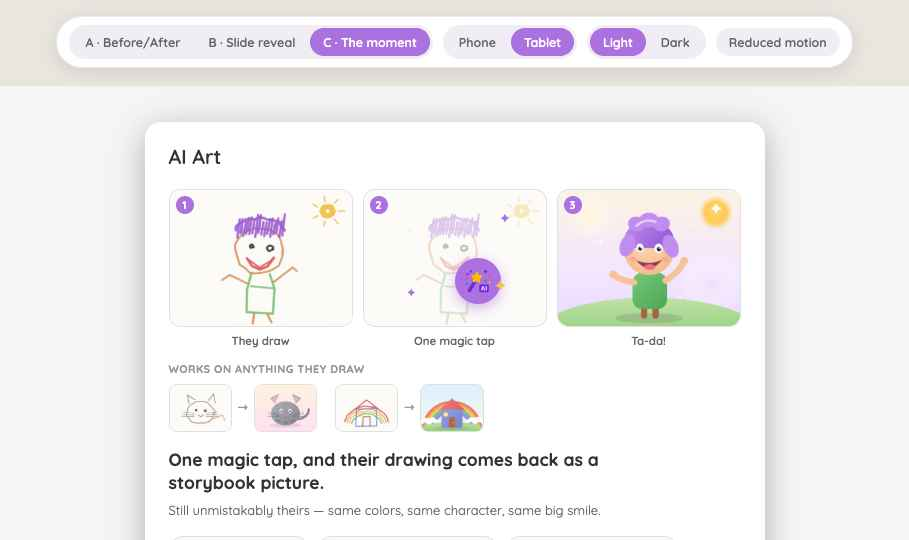
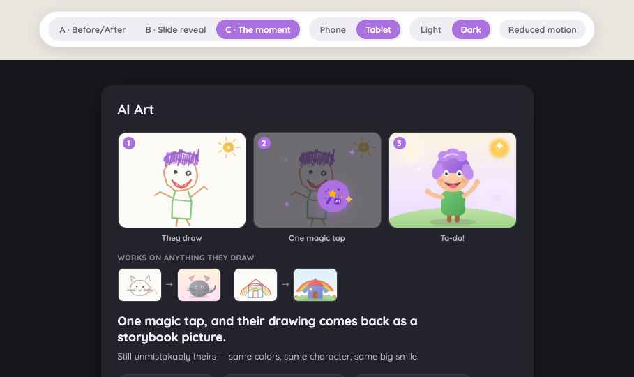
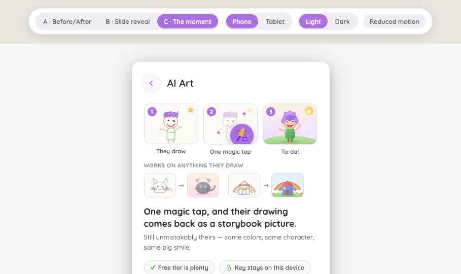
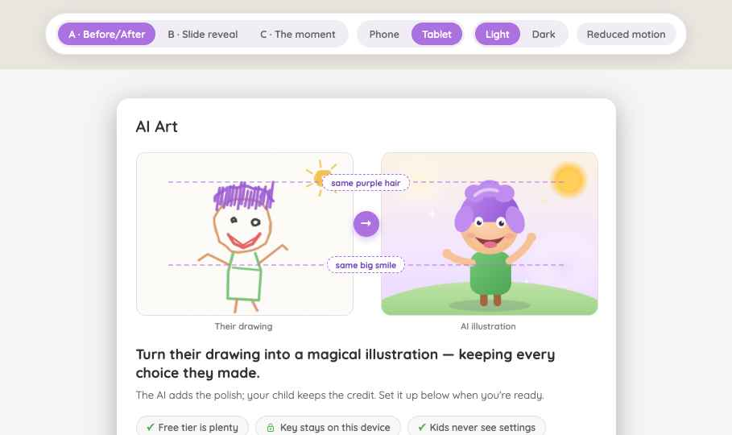
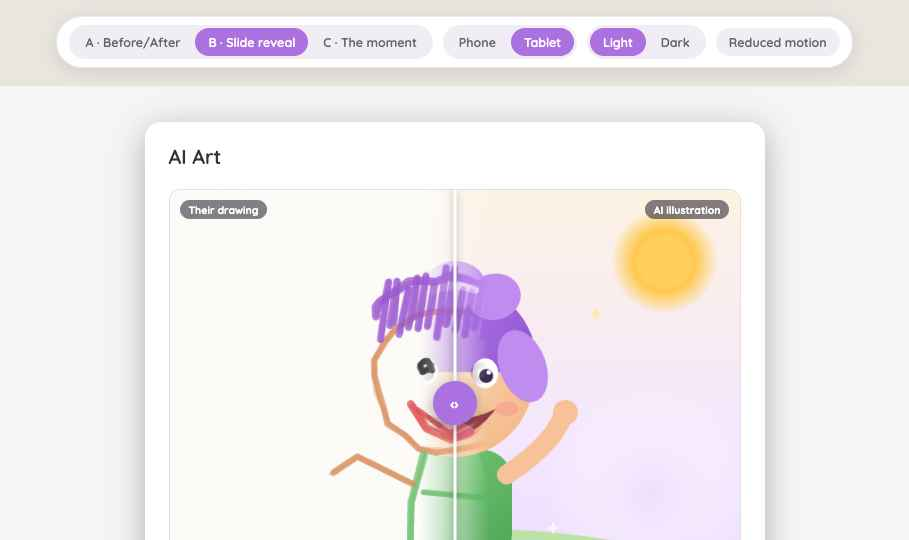

# Splotch — AI Art section redesign handoff

Redesign of the **locked (not-yet-set-up) state** of the "AI Art" section inside Splotch's Parent
Center settings modal. Splotch is a drawing app for toddlers (2+); the AI Art feature turns a
child's drawing into a polished illustration via a bring-your-own Gemini API key (BYOK).

Source repo: `KyleMit/Splotch` (main branch). All tokens/components below were lifted from the real
source, not approximated.

## The problem being solved

The old locked state opened with a wall of mechanics — BYOK explanation, billing, key storage — and
never showed what the feature *does*. Hesitant parents never enabled it. The redesign leads with the
payoff (a distinctive child drawing next to its AI render, proving the AI preserved the child's
creative intent) and demotes the key form to "the how" under "the why".

**Chosen direction: Version C — "The child's moment"** (see below). Rationale: it tells the
narrative without requiring interaction (Version B's scrubber relies on parents knowing to drag),
and it teaches the parent what their child will actually experience: draw → tap the wand → reveal.

## Shared structure (all versions)

Content column inside the section pane, top to bottom, 16px gap:

1. **Hero** — the transformation demo (this is the only thing that varies per version)
2. **Headline** (17.5px / 700 / `--text-strong`) + one supporting sentence (13px / `--text-mid`)
3. **Three reassurance chips** (pill, `--surface-2` bg, 1px `--border`, 12px/600 `--text-mid`, green
   ✓ / lock icon in `--success-accent`):
   * "Free tier is plenty" · "Key stays on this device" · "Kids never see settings"
4. **Demoted key form** in a `--surface-2` card (radius 12, padding 16) — everything from the
   current production section is preserved:
   * "How it works" overline + condensed BYOK explanation (key saved on device only, billed to
     parent's Google account, we never keep a copy)
   * `
` disclosure: "How do I get a Gemini API key?" → 4 steps linking to Google AI Studio,
     plus "The free tier is generous…" note
   * Label "Gemini API Key", text input (placeholder "Paste your Gemini API key") + disabled purple
     **Save** button
   * Reassurance line with lock icon in `--success-text`: "Your key is encrypted and stored only in
     this browser on this device."
   * Faint hint: "Have an access code? You can enter it here too."
   * Optional variant: whole card collapses behind a "Set it up — about 2 minutes ›" summary

## Version C — The child's moment (chosen)

* **3-beat vignette strip** (grid, 3 equal columns, 10px gap; each beat = 4:3 rounded-12 card +
  caption below, 11.5px/600 `--text-mid`):
  1. Child's drawing → caption "They draw"
  2. Drawing at 35% opacity on `--paper` bg, centered 46px purple wand button (real `wand-stars.svg`
     icon) with gentle scale pulse + 4 staggered twinkling ✦ sparkles (gold `#f2c14e` and brand
     purple) → "One magic tap"
  3. The AI render with one glowing sparkle → "Ta-da!"
  * Numbered badges (18px brand circles, 1/2/3) top-left of each card
* **Mini gallery** beneath: overline "WORKS ON ANYTHING THEY DRAW" (11px caps, `--text-faint`), then
  2 before→after thumbnail pairs (46px tall, radius 8, "→" between) showing range (cat,
  house+rainbow)
* Copy: **"One magic tap, and their drawing comes back as a storybook picture."** / "Still
  unmistakably theirs — same colors, same character, same big smile."
* Sparkle intensity is deliberately calm/subtle — warm and trustworthy beats flashy. No confetti.

Dark theme and phone width:

 

## Alternate versions (built, not chosen)

**Version A — static before/after hero.** Two images side by side (grid `1fr 1fr`, 36px gap),
captions "Their drawing" / "AI illustration", 32px purple → circle centered on the seam, and two
dashed callout pills bridging the images ("same purple hair" at ~12% height, "same big smile" at
~58%) so intent-preservation is stated, not inferred. Best for non-interactive surfaces
(screenshots, store listings).

**Version B — draggable reveal scrubber.** Single 4:3 frame: AI render as base layer, child's
drawing on top masked with a feathered linear-gradient "melt" edge (±6% feather) at the divider.
44px purple ‹› handle, white divider line, corner labels, bobbing "Slide to see the magic ↔" hint
pill until first drag, gentle sine idle motion (±9%, ~5.6s period) inviting touch.
`prefers-reduced-motion` swaps to a static side-by-side fallback. Rejected as primary because it
requires the parent to know to drag.

## Design language (from Splotch source)

* **Font:** Quicksand (variable / Google Fonts), weights 400–700. Friendly rounded — this is the
  app's only typeface.
* **Shape:** soft rounded everything — cards radius 12–16, pills `999px`, modal radius 16 with
  `0 8px 32px rgba(0,0,0,.3)` shadow.
* **Brand:** purple `#ab71e1` (hover `#9961d1`), white-on-brand.
* **Key tokens (light / dark):**
  * `--app-bg: #f5f5f5 / #17171d` · `--surface: #fff / #23232b` · `--surface-2: #f8f8f8 / #2d2d37`
  * `--border: #e0e0e0 / #3d3d49` · `--paper: #fcfbf8 / #211f29`
  * `--text-strong: #333 / #eceaf2` · `--text: #555 / #c9c7d3` · `--text-mid: #666 / #b3b1bf` ·
    `--text-muted: #888 / #918f9c` · `--text-faint: #999 / #85838f`
  * `--brand-wash: #ede7f6 / #3b2f4f` · `--brand-text: #7c50bb / #c9a9f0`
  * `--success-wash: #e9f7ec / #24382b` · `--success-text: #2e7d4f / #8bcfa4` ·
    `--success-accent: #4caf50`
  * `--danger-wash: #fdecec / #422a2c` · `--danger-text: #b04a4a / #e09393`
* **Spacing scale:** 4/8/12/16/20/24/32/40. Font sizes: 12/13/14/16/18/22/28; inputs
  `max(16px, 14px)` to avoid iOS zoom.
* **Motion:** fast .15s / base .2s / slow .35s; pop easing `cubic-bezier(0.34,1.4,0.64,1)`.
* Dark theme = same layout, token swap only (`data-theme='dark'` attribute pattern,
  `prefers-color-scheme` respected when unset).

## Frame context

* **Tablet** (≥700px viewport): Parent Center is an 860px modal with a 232px sidebar nav + scrolling
  content pane (~556px content width). This redesign is the pane body under the "AI Art" pane title
  (22px/600).
* **Phone**: Parent Center is a 500px-max card; sections are full-page drill-ins from a hub list,
  with a back chevron (40px `--surface-2` circle, brand chevron) + 20px/600 title header. Content
  padding 0 24px 28px.
* The section must work at both widths and both themes — 4 combinations total.

## Assets in this package

* `assets/hero-before.png` / `hero-after.png` — the demo pair: wobbly crayon character with purple
  scribble hair, uneven eyes, big red smile + the polished storybook render that unmistakably keeps
  the purple hair, smile, and wave. **These are believable placeholders** — swap in the real child
  drawing + real Gemini render when available.
* `assets/cat-*.png`, `assets/house-*.png` — gallery pairs (also placeholders).
* `screenshots/` — the five states referenced above.

## Copy bank

* A: "Turn their drawing into a magical illustration — keeping every choice they made." / "The AI
  adds the polish; your child keeps the credit."
* B: "Their drawing, made magical." / "Slide to compare — the purple hair and the big smile stay
  exactly as your child made them."
* C (chosen): "One magic tap, and their drawing comes back as a storybook picture." / "Still
  unmistakably theirs — same colors, same character, same big smile."
* Chips: "Free tier is plenty" · "Key stays on this device" · "Kids never see settings"

## Implementation notes

* Keep the existing production form logic untouched (verify key → save → success message → feature
  toggles appear); only the locked-state presentation changes.
* All images get `1px solid var(--border)` + radius 12 so the light paper artwork reads correctly on
  dark surfaces.
* Sparkle/twinkle keyframes: opacity .15→1, scale .55→1 with slight rotation, 1.8s ease-in-out,
  staggered delays (0/.5/1/1.4s). Wand pulse: scale 1→1.07, 2s.
* Honor `prefers-reduced-motion`: freeze the wand pulse and sparkles (or render them static at
  mid-opacity).
* Text minimum 11px only for captions/overlines; body copy 12.5–13px; headline wraps with
  `text-wrap: pretty`.
