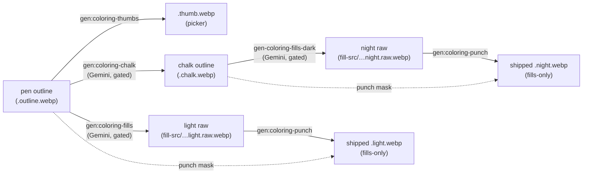

# The coloring-page image pipeline — pen → chalk → fills → punch

The living reference for how Splotch's coloring-page art is produced, gated, reviewed, and shipped.
This doc describes the **current** pipeline only — written to let a fresh session run the next
category without re-deriving any of it. The approaches that were tried and retired (canonical-eye
retouching, thin-stroke normalization as the dark-mode fix, the rejected alternatives, and the
eye-failure gallery that produced today's gates) live in [`legacy/README.md`](../legacy/README.md).

Companion docs: `README.md` (runbook), `contact-sheet.md` (review surface), the decision records in
[`docs/`]() — [pen/chalk fork](pen-chalk-fork.md), [chalk edge crisping](chalk-edge-crisping.md),
[inpainted fill punch](inpainted-fill-punch.md), [asset naming](asset-naming.md),
[fill vocabulary](fill-vocabulary.md), [asset-gen architecture](architecture.md) — plus ADR-0043
(magic-brush reveal) and ADR-0052 (dark mode) in `docs/adrs/`. Every illustration here is a frozen
copy in the sibling `pipeline-assets/` — live assets regenerate, these don't.

## The pipeline at a glance



The line work is **forked per theme** (the pen/chalk split, [pen-chalk-fork.md](pen-chalk-fork.md)):
the **pen outline** is black ink on white paper — the light-mode overlay and the source every other
asset derives from. The **chalk outline** is white ink on a black board — the dark-mode overlay, a
Gemini redraw of the inverted pen that makes the judgment calls a blind invert can't: eye sclera and
catchlights become deliberate SOLID WHITE, pupils stay black, everything else stays thin strokes.
The chalk is *stored* ink-on-white (`{page}.chalk.webp`, the negation of what dark mode displays) so
the app's existing dark treatment (`invert(1)` + screen) renders it unchanged and every ink-on-white
tool in this folder reads it unmodified. Orientations without a chalk fall back to inverting the
pen, so categories migrate incrementally. (Why a single shared outline couldn't serve both themes —
the white-blob problem and two earlier generations of fixes — is chronicled in
[`legacy/README.md`](../legacy/README.md).)

| Asset                           | Lives in                           | Shipped?                                                                                                                               | Produced by                                              |
| ------------------------------- | ---------------------------------- | -------------------------------------------------------------------------------------------------------------------------------------- | -------------------------------------------------------- |
| `{page}.outline.webp`           | `web/static/coloring/{book}/`      | yes — the PEN outline: light-mode overlay, source of all derivations                                                                   | hand-curated + `normalize-outline-strokes.mjs`           |
| `{page}.chalk.webp`             | `web/static/coloring/{book}/`      | yes — the CHALK outline: dark-mode overlay + night punch mask, stored ink-on-white                                                     | `gen-coloring-chalk.mjs` from the pen                    |
| `{page}.thumb.webp`             | `web/static/coloring/{book}/`      | yes — picker grid (from the pen; the picker inverts it in dark mode)                                                                   | `gen-coloring-thumbs.mjs`                                |
| `{page}.{light,night}.raw.webp` | `tools/asset-gen/fill-src/{book}/` | no — committed source of truth for fills, keeps its own outlines so audits can score registration                                      | `gen-coloring-fills.mjs` / `gen-coloring-fills-dark.mjs` |
| `{page}.{light,night}.webp`     | `web/static/coloring/{book}/`      | yes — magic-brush reveal, fills-only (outline pixels inpainted with bled fill color, opaque: pen mask for light, chalk mask for night) | `punch-fill-outlines.mjs` from the raw                   |

Everything shipped is a **static, committed artifact** — no generation at build or run time, no
server dependency, trivially cacheable. The renderer is deliberately dumb: light mode multiplies the
pen outline over light paper; dark mode inverts the chalk (shipped ink-on-white) to white chalk and
screens it over dark paper (ADR-0052); the reveal layers the punched fill underneath. Because screen
with white is white, the chalk's solid whites always survive into the final combined image — no
runtime smarts needed. All intelligence lives at generation time, behind gates, with a human review
at the end.

## Stage 1 — Pen outlines

The pen outline is the source of everything: the light overlay renders it, the light punch masks
with it, the light-fill generator conditions on it, the chalk redraws from it, and the thumbnail is
a resize of it. **Every downstream regeneration flows from a pen change**, so a pen edit means
regenerating the page's whole suite (thumb + chalk + light + night + punch).

### Outline quality, and the audit that measures it

`npm run gen:coloring-outlines:audit -- [category]` — deterministic, no API:

| Invariant                  | Measure (lib/solid-regions.mjs, lib/eye-fill.mjs)                                                                                                            | Bar        | The regression that created it                                                                                                                                                          |
| -------------------------- | ------------------------------------------------------------------------------------------------------------------------------------------------------------ | ---------- | --------------------------------------------------------------------------------------------------------------------------------------------------------------------------------------- |
| No solid regions           | biggest connected blob surviving a morphological opening; radius is **adaptive** — `clamp(ceil(p90strokeWidth/2)+2, 5, 8)` from a chamfer distance transform | ≤ 100 px   | owl/ant/trex white-blob eyes; a fixed r=8 then missed bee-tall's small pupils (strokes are only ~4 px wide)                                                                             |
| …including fragmented ones | **total** interior px page-wide                                                                                                                              | ≤ 60 px    | bee-tall's first redraw kept a solid pupil whose catchlight holes fragmented the eroded interior into pieces that each ducked the blob bar (103 total vs 0–4 on honest pages)           |
| Sane eye complexity        | deepest eye-scale nesting chain (`scoreEyeRings`)                                                                                                            | ≤ 4 levels | caterpillar-tall's redraw produced "hypno swirl" eyes — extra concentric circles that registration *can't* catch (they hug the old pupil boundary) and solidity can't either (all thin) |

Since the pen/chalk fork, a solid pen region is a **light-theme quality call**, not a dark-mode
breaker: light mode covers punched holes with its own black ink, and the chalk redraw makes its own
judgment from whatever pen it gets. Thin-stroke pens still read better as coloring pages (classic
outlined pupils) and give the light-fill generator cleaner inputs, so the audit stays — as advice,
not a prerequisite. Covers (`{book}/cover.webp`) appear in the audit but are picker-only, so their
solid regions are harmless noise.

### The normalizer

`npm run gen:coloring-outlines:normalize -- <page…> [--apply] [--notes "…"]
[-t F] [--max-attempts N]`
— Gemini image-edit (`gemini-3.1-flash-image`) redraws solid regions as thin outlined shapes (eyes:
exactly one pupil ring + one catchlight circle), keep-best-of-N with a rising temperature ladder,
candidates land in `.coloring-samples-dark/normalize/`. Six gates per candidate:

1. **solidity** — the point of the exercise;
2. **ring depth** ≤ 4 — no swirl eyes;
3. **eyes preserved** — every source eye-core cluster still has a core in the candidate. Added after
   a low-temperature retry **deleted a whole eye** and still scored 99.7% locally (whitened eye
   interiors are exempt from drift by design, and a thin eyeball ring is too few pixels to sink a
   tile);
4. **keep** ≥ 92% and **worst-tile keep** ≥ 80% (`lib/outline-match.mjs`) against a *reference* —
   the source with solid interiors and over-ringed eye interiors whitened out, because removing
   those is the goal, not drift;
5. **reverse keep** ≥ 90% — no invented strokes (same whitening applied to the candidate's eye
   interiors, so the replacement pupil isn't "invented");
6. temperature/`--notes` levers when the model resists (bee-tall's pupils took an eye-specific note
   at t 0.7–0.8; caterpillar's faithful de-swirl took t 0.2 plus "CHANGE NOTHING ELSE ANYWHERE").

The registration gate also catches semantic damage: the first bee-wide normalization silently
**deleted a cloud** (worst-tile keep 0%), fixed with a `--notes` telling it the sky has three
clouds.

### The from-scratch alternative

`npm run gen:coloring-outlines:fresh -- <page> --scene "…" [--eyes] [--apply]
[--max-attempts N] [-t F] [--notes "…"]`
— when the pen's *anatomy* is the root problem (solid-ink pupils, a motif the fill model keeps
misreading), don't edit the drawing — replace it. Text-to-image with a baseline style prompt
matching the shipped catalog plus a 1–2 sentence scene (same subject, deliberately NOT the same
composition), gated offline on solidity, ring depth, eye-core presence (`--eyes`), border whiteness,
and ink density; candidates land in `.coloring-samples/fresh/`. A fresh pen invalidates the page's
entire suite — regenerate thumb → light → chalk → night → punch. Decision record + the 2026-07-13
five-page pass: [fresh-outline-regen.md](fresh-outline-regen.md).

## Stage 1.5 — Chalk outlines

`npm run gen:coloring-chalk -- <page-or-category…> [--apply] [--notes "…"]
[-t F] [--max-attempts N] [--force]`
— Gemini image-edit redraws the inverted pen as a chalk line drawing (`gen-coloring-chalk.mjs`),
keep-best-of-N with a rising temperature ladder, candidates in `.coloring-samples-dark/chalk/` (each
with a `.display.webp` preview of what dark mode will show and a registration overlay). Four gates
per candidate (`--rescore` re-runs them over saved candidates offline — no API — after a gate
change):

1. **keep ≥ 92% / worst-tile ≥ 80%** (`lib/outline-match.mjs`) — every pen STROKE is still traced in
   place. The reference is the pen with its SOLID INTERIORS whitened out (rim kept — the same
   exemption the normalizer grants its redraws), so a chalk that correctly whitens a big solid pupil
   into sclera + outlined pupil no longer reads as lost ink; 19 of the 2026-07 catalog's chalks
   failed the raw-pen version of this gate for no other reason and had to ship by hand-cp before the
   fix (IDEAS #11, landed with the 3.1 migration). Only the forward direction is gated: a chalk
   legitimately *adds* ink (its solid whites), so the reverse direction is covered by the enclosure
   gate instead;
2. **enclosure** — new ink is judged by WHERE it lands, not how thick it is: inside a pen-bounded
   interior it's a deliberate whitening; on the open background (flood-reachable from the page
   border) it's an invented shape and fails. The first draft judged by *thickness* (a morphological
   opening) and misread every whitened sclera — a thin annulus around the pupil — as an invented
   stroke, rejecting 9 of nature's 12 perfectly good chalks;
3. **white budget** — total whitened area ≤ 10% of the page (a chalk that whitens a whole body is a
   review-worthy surprise, not a judgment call);
4. **eye polarity** — pen eye cores the committed light raw paints DARK (pupils) must stay
   non-ink/fillable in the chalk; cores it paints BRIGHT (catchlights) should be chalk ink (warns
   only). Added after the first spider/caterpillar chalks whitened whole eyeballs — pupil included —
   which the registration gates can't see (the rings are all still traced) and the night-fill
   composite gate only catches after a fill has been burned. **Blind spot: this gate needs pen eye
   CORES to exist.** A solid-ink pen pupil has no nested rings, so `findEyeCores` finds nothing and
   the gate passes vacuously — vehicles/police-tall's 3.1 chalk whitened both pupils this way and
   only composite review caught it (fixed with an erase-and-redraw `--notes`). On any solid-pen-eye
   page, render the night composite before trusting a chalk (`ISSUES.md`).

Candidates render to ink polarity through a **crisping S-curve** (`lib/crisp-ink.mjs`) instead of
the pen tools' gentle contrast: on the dark board the invert + screen render and the binary night
punch turn a soft antialias ramp or a faintly-grey ground into a ring of dark specks around every
line ([decision record](chalk-edge-crisping.md)).

Judgment-call misfires the gates can't see (a chalk that whitens something canon says is dark — the
ladybug's first take gave it white shell spots) are caught only by human review of the
`.display.webp`; the fix is a page `--notes` at low temperature.

After applying a chalk, regenerate the page's **night fill** (it conditions on the chalk) and
re-punch. Thumbs and light fills are untouched — they belong to the pen.

## Stage 2 — The punch

`npm run gen:coloring-punch -- [pages…]` re-derives every shipped fill from its committed raw: where
the line art is dark (luma < 150) the fill's pixels are **inpainted** — replaced by the surrounding
fill color bled inward — and the shipped fill is fully opaque (`lib/punch-fill.mjs`;
[decision record](inpainted-fill-punch.md) — the punch originally cut these pixels to transparency,
whose alpha edge resampled against the dark paper into a dotted dark ring around every line at
display scale). The mask is **per-theme**: light raws punch against the pen, night raws against the
chalk when the page has one (both ship ink-on-white, so the mask math is identical; pages without a
chalk fall back to the pen). Why: the app's overlay already draws the line art, so a revealed fill
carrying its *own* copy of the outlines would double every line, and any drift between the copies
shows as ghosting (ADR-0043 "reveal fills only"). Punching the night fill with the chalk is also
what makes the chalk's solid whites land in the final image: the fill's own paint there is cleared
to neighbor color, and the screened chalk white owns the region. Deterministic and offline — after
any raw, pen, or chalk change, re-punch.


*Left to right: outline → raw light fill (keeps its outlines, committed to `fill-src/`) → the
shipped punched fill composited over magenta so the punched-out line work is visible. (Illustration
from the transparent-punch era — today those pixels hold bled fill color instead of alpha holes.)*

Sharp gotcha, documented in `CLAUDE.md` and worth repeating for any future alpha-carrying asset (the
punch itself no longer ships alpha): never `joinChannel` an alpha plane and encode — sharp tags it
as a generic extra channel and the encoder silently flattens it. Interleave an explicit RGBA buffer,
and verify outputs with `sharp(out).metadata()` → `hasAlpha: true`.

## Stage 3 — Light fills

`npm run gen:coloring-fills -- <pages…>` sends the pen outline to Gemini with `FILL_PROMPT` ("color
it in neatly… keep every black outline exactly where it is… flat colors, no blank white, pupils
solid black with a white catchlight"). Post-processing and gates, keep-best-of-5:

* `alignToSource` (`lib/align-to-source.mjs`) — edge-map correlation undoes the few-pixel global
  nudge the model tends to add;
* **keep ≥ 92% / worst-tile ≥ 80%** — the worst-tile gate exists because a 93% global keep once
  shipped with a single flower drifted to 34% (nature/ant-wide, pre-gate);
* **white ≤ 5%** — big blank areas read as uncolored under the brush;
* **eyes** — at least one eye core reads lively (`judgeLightEyes`); zero lively cores means the
  outline itself is broken.

Passing output writes the raw to `fill-src/` and punches the shipped fill in one step.

## Stage 4 — Night fills

```bash
node --experimental-strip-types --disable-warning=ExperimentalWarning \
  tools/asset-gen/bin/gen-coloring-fills-dark.mjs <category|page> [flags]
```

Targets: a category (`nature`), one orientation (`nature --tall` / `nature --wide`), or a single
cell (`nature/ant-tall`). Tuning: `--samples N` (takes per page), `--max-attempts N` (default 3; 4–5
is a better batch default), `-t F`, `--notes "…"`, plus per-gate bars (`--drift-threshold`,
`--night-luma-max`, `--line-white-min`) and `--dilate-lines N`. Writes to the gitignored
`.coloring-samples-dark/` — never to shipped assets.

The model input is the **chalk outline as dark mode displays it** (white marks on near-black — the
negation of the shipped ink-on-white chalk), falling back to the inverted pen for un-forked pages.
The prompt asks for a cozy moonlit recolor: deep evening background (never daytime "sky blue"),
natural — dimmed, not grey/ghostly — subject colors, white marks stay bright white. The eye
instruction is input-dependent: with a chalk, the whites are already painted (solid sclera +
catchlight are chalk) and the fill's only eye job is a deep near-black pupil; without one, the fill
paints all three tones itself. If a category's renders drift from these traits, tweak the prompt and
regenerate — never hand-fix images.

Four gates, keep-best-of-N (fallback ranking prefers takes with more surviving eyes over least
drift) — registration/mood/line gates score against the chalk (the line art the fill must sit
under):

| Gate             | Catches                                                                           | Bar                                                                                                                                                                                                                                                            |
| ---------------- | --------------------------------------------------------------------------------- | -------------------------------------------------------------------------------------------------------------------------------------------------------------------------------------------------------------------------------------------------------------- |
| `scoreDrift`     | invented shapes (thin white strokes far from any source line)                     | ≤ 0.004 (clean ≈ 0)                                                                                                                                                                                                                                            |
| `scoreNightness` | daytime "sky blue" background (median luma of the flood-filled true background)   | ≤ 100 (good ≈ 15–50). **Regens should pass `--night-luma-max 60`**: the whole catalog was regenerated at that bar in the 3.1 migration (shipped range 18–48, closing IDEAS #4's 4× mood spread), and a default-bar regen can reintroduce a dusk outlier        |
| `scoreLineColor` | the model re-inking white outlines dark (they'd double against the chalk overlay) | median ≥ 150 (white ≈ 154–250)                                                                                                                                                                                                                                 |
| `judgeNightEyes` | flat-flooded eyes (below)                                                         | every strong light-lively core stays lively — judged on the **simulated final composite** (`lib/night-composite.mjs`: chalk-punched fill + screened chalk over dark paper) when the page has a chalk, since the chalk owns the whites; cores keyed off the pen |

### Levers for stubborn pages, in escalation order

Since the 3.1 migration these are genuine escalations, not batch defaults: the full-catalog regen
needed none of levers 1–3 on any page (94/94 nights at lineW 255; 72 first-take), and the only
`--notes` were judgment calls, not gate fights (`docs/gemini-3.1-migration.md`). The list below
documents 2.5-era case history — expect to reach for it again mainly after a future model change.

1. **More attempts against a stricter gate** — the retry loop keeps hunting instead of settling at
   the boundary: `--max-attempts 8 --line-white-min 175` (fixed farm/dog-wide 70→219 and
   dinosaur/velociraptor-wide 70→223 in ≤ 6 tries each).
2. **A LOW temperature** (`-t 0.25–0.3`) — keeps the model faithful to the white-line input where a
   high temperature makes it re-ink dark (farm/duck-tall only came white at `-t 0.25`).
3. **`--dilate-lines 2`** — thickens the white input lines before the model sees them; for pale
   subjects whose own light fill tempts dark re-inking (creatures/unicorn-wide, stuck at lineW 138
   through every temperature, cleared in one pass at 218). Pair with a low `-t` and the strict gate.
4. **`--notes`** — page-specific instruction (the dark-bodied spider needed "THE EYES ARE THE STAR
   OF THIS PAGE" to stop flooding them navy; the ladybug's shell spots needed "paint every shell
   circle deep near-black").

On 3.1 expect near-zero flagged pages per category (the 2.5-era budget was roughly one flagged
`-wide` per category). Borderline-but-light pages (a dim moonlit rim, lineW ≈ 150) are fine. Gemini
occasionally 503s ("high demand") — just re-run the failed page.

### Shipping (manual on purpose — the human gate)

1. Review the samples on the contact sheet (`--source samples`) — Combined view, both themes, zoom
   the eyes.
2. Copy each approved take to its raw path and re-punch:
   ```bash
   cp .coloring-samples-dark/<cat>/<page>-<orient>.webp \
      tools/asset-gen/fill-src/<cat>/<page>-<orient>.night.raw.webp
   npm run gen:coloring-punch -- <cat>
   ```
   Never copy a lined fill straight into `web/static/coloring/` — the shipped `.night.webp` must be
   the punched (fills-only) derivation of the raw.
3. Wire the catalog in `web/src/lib/state/books.ts` — the `night` and `chalk` orientation lists per
   page: `page('nature', 'ant', 'Ant', ['portrait', 'landscape'], ['portrait', 'landscape'])`.
4. `npm run check:assets` + `npm run check` + `npm run test:unit`, rebuild the contact sheet
   `--source shipped`, optionally verify live with the `run-splotch` skill (dark mode → apply page →
   magic-brush reveal), commit.

Light mode must stay byte-identical throughout a night-fill pass. Night fills have no thumbnails
(never in the picker grid); `bookAssetPaths()` lists them for check-assets automatically once wired.

## How the eye detector works

`lib/eye-fill.mjs` — the shared machinery behind the eye gates in the normalizer, the chalk
generator, the fill generators, and the audits. (The shipped failure gallery that motivated each
gate is in [`legacy/README.md`](../legacy/README.md).)

Detection: an **eye core** is the innermost region of a nested `A ⊂ B ⊂ C` enclosure chain in
eye-like size bands (a catchlight interior or a small pupil disc). Strict double-nesting with bbox
containment is what keeps it precise — a loose "small enclosed region" filter matches blanket checks
and leaf cells and drowns the real eyes.

Measurement: each core's median luma vs its **neighborhood band** — a tight geometric annulus just
outside the core's ring (`rIn = r+3`, `rOut = rIn + max(12, 0.6r)`), sampling only pixels ≥ 1 px
clear of ink, judged at the p15/p85 extremes. A core is **lively** if it's genuinely light with
something genuinely dark beside it, or vice versa (light ≥ 150, dark ≤ 100, gap ≥ 60) —
polarity-agnostic, because outline anatomy varies.

That band definition is the survivor of four failed ones — do not "improve" it without re-running
every fixture noted in `legacy/README.md`:

1. **label-filtered band** (sample the parent region) — parent-march tunnels past *tangent* rings;
   read bee-tall's black pupil as sclera;
2. **sealed flood** (BFS through pixels ≥ 2 px clear of ink) — starves behind *double-stroked*
   rings; called the spider's correct eye dead;
3. **leaky flood** (plain BFS) — escapes hairline ring gaps; drowned the spider's cream sclera in
   dark face pixels and blessed the caterpillar's dead eye with its lit cheek;
4. **wide annulus** — samples the cheek/face directly; same false verdicts.

Judgment: the **light fill is the reference** for which cores are real eyes — shell spots and
segment dots nest exactly like eyes but are flat (or weakly lit, light side < 180) in the light fill
and never gate. A night fill passes when **every** strongly-lit reference core stays lively
(`judgeNightEyes`). Per-eye-any-core enforcement was tried and shipped a dead-sclera ladybug — the
white catchlight carried the verdict.

Two suppressions landed with the 3.1 migration (IDEAS #12) keep the night judge honest instead of
noisy:

* **Band-blind cores don't gate** — a core whose annulus is mostly pen ink (`annulusInkFrac > 0.5`,
  an accident-era solid pupil around a catchlight) has meaningless band stats in both fills
  (farm/duck-wide's side-profile eye measured 0.74; the true spiral-eye failures sit at 0.26–0.29).
* **On chalk-forked pages, cores with no chalk-white nearby don't gate** — every real eye in the
  composite has chalk white at hand (catchlight core or sclera ≈ 255), so a core the chalk never
  marked (wheel hubs, rover screens, roof lights — lively by day, legitimately dark at night) is not
  an eye. The committed, human-reviewed chalk is effectively the per-page eye annotation. Corollary:
  on pages where the chalk itself is wrong (whitened pupils, the police-tall class) the night judge
  is silent too — chalk review has to catch those (Stage 1.5 gate 4's blind-spot note).

`judgeLightEyes` has NO such suppressions — light-side flat-eye flags on side-profile or band-blind
pages are known false-positive noise (`ISSUES.md`).

Debugging technique that keeps resolving disputes between scores and eyes: **ASCII luma maps**. When
a crop and a score disagree, dump the region as characters — it's diffable, zoomable, and doesn't
lie:

```
##########+           +#########     # = dark   . = mid   ' ' = light
#########.             +########     A 40×40 window around a disputed
########.   .+++..      .#######     eye, rendered from raw luma —
#######.  .+######+.     .######     this settled the spider verdict
```

## Iteration methodology

The loop that has worked, per category:

1. **Audit first** (`gen:coloring-outlines:audit`, `gen:coloring-fills:audit`,
   `gen:coloring-fills:audit:eyes`) — all deterministic and free.
2. **Generate chalks** (`gen:coloring-chalk --apply`), eyeballing every `.display.webp` — gates have
   been fooled, each time by something no existing gate measured.
3. **Regenerate the suite** for changed pages: thumbs → light fills → night fills → punch.
4. **Rebuild the contact sheet and publish it as an Artifact** — judge on the Combined view in BOTH
   themes; zoom the eyes. The sheet is the review surface of record (`contact-sheet.md`):

   

5. **After a regen wave, run the exploration auditors too** (proven in the 3.1 migration; not yet
   promoted to first-class scripts — `ISSUES.md`): the invented-shape detector
   (`ideas-exploration/idea-13/code/invented-shape-audit.mjs`) — the only thing that caught
   house-tall's two invented sky flowers, invisible to every standard gate — and the residual-halo
   auditor (`ideas-exploration/idea-7/code/audit-night-halo.mjs`). Both import `./lib/*.mjs`, so
   copy them into `tools/asset-gen/` to run (the halo script's main-guard also expects its original
   `idea7-…` filename). For gate-blind classes (solid-pen-eye chalks, subject/background contrast),
   batch-render the night composites (`lib/night-composite.mjs`) into per-category montages and
   eyeball them — that sweep is what caught police-tall's whitened pupils and circle-wide's
   sky-colored disc.
6. `check:assets` + `check` + `test:unit`, commit, push.

Hard-won process lessons:

* **Scores can lie in both directions.** A 99.7% local keep hid a deleted eye; a "flat eyes" warning
  flagged a perfect fill. When a gate and your eyes disagree, the gate is wrong until proven
  otherwise — crop the pixels.
* **Every gate came from a shipped (or nearly shipped) regression** (the gallery:
  `legacy/README.md`). Expect the next category to produce a failure no current gate measures; add
  the gate, don't just fix the instance. Keep known-bad fixtures around (commit list in
  `legacy/README.md`) to recalibrate against.
* **Keep-best-of-N with a temperature ladder beats prompt-tweaking** for one-off resistance;
  `--notes` beats both for *persistent* resistance.
* **One category per pass, review gate between categories.** Budget roughly: chalks 1–6
  attempts/page, fills 1–10; the worst single page so far (spider-tall night, pre-fork) burned ~26
  attempts before the `--notes` lever.
* **Never edit shipped images by hand**; regenerate from the source and let the gates re-run. Raws
  are the source of truth for fills; the pen for everything.

## Command reference

| Command                                                     | Purpose                                                                                         | API key? |
| ----------------------------------------------------------- | ----------------------------------------------------------------------------------------------- | -------- |
| `npm run gen:coloring-outlines:audit -- [cat]`              | solid regions + ring depth per pen outline                                                      | no       |
| `npm run gen:coloring-outlines:normalize -- <page…>`        | thin-stroke pen redraw, 6 gates, `--apply` to ship                                              | yes      |
| `npm run gen:coloring-outlines:fresh -- <page> --scene "…"` | brand-new pen from a text scene (same subject, new drawing), 5 offline gates, `--apply` to ship | yes      |
| `npm run gen:coloring-chalk -- <page-or-cat…>`              | chalk-outline redraw from the pen, 4 gates, `--apply` to ship, `--rescore` offline              | yes      |
| `npm run gen:coloring-fills -- <pages…>`                    | light fills (gated) + auto-punch                                                                | yes      |
| `node … gen-coloring-fills-dark.mjs <pages…>`               | night fills (gated) → samples                                                                   | yes      |
| `npm run gen:coloring-punch -- [pages…]`                    | re-derive shipped fills from raws (pen/chalk masks)                                             | no       |
| `npm run gen:coloring-fills:audit -- [cat]`                 | registration drift on committed raws                                                            | no       |
| `npm run gen:coloring-fills:audit:eyes -- [cat]`            | eye liveliness on committed raws (night judged as the chalk composite)                          | no       |
| `npm run gen:coloring-thumbs -- [cat]`                      | picker thumbnails                                                                               | no       |
| `npm run gen:contact-sheet -- <cat>`                        | the review sheet (publish as Artifact)                                                          | no       |

## Status and the next category

| Category                          | Pen outlines                                   | Chalk outlines    | Night fills | Notes                                                                                                                                                                                                                                                                             |
| --------------------------------- | ---------------------------------------------- | ----------------- | ----------- | --------------------------------------------------------------------------------------------------------------------------------------------------------------------------------------------------------------------------------------------------------------------------------- |
| Nature                            | ✅ thin-stroke, all 12                         | ✅ all 12         | ✅          | the pilot for the fork. The 3.1 regen cleared the historical flat-pupil ⚠ on caterpillar-wide + ladybug-wide (2.5 refused their spiral-catchlight eyes across 11+ attempts each; 3.1 painted them lively unprompted — the pen de-swirl is no longer urgent).                      |
| Space, Farm, Dinosaurs, Creatures | ❌ accident-era (normalization stays optional) | ✅ all 12 each    | ✅          | first migrated 2026-07 on 2.5 in one autonomous batch, fully regenerated on 3.1 (see the [migration record](gemini-3.1-migration.md)). The owl kept its best-case look through the regen.                                                                                         |
| Objects, Shapes, Vehicles         | ❌                                             | ✅ (11 / 11 / 12) | ✅          | shapes' "geometric solids" turned out to be giant cartoon pupils — the face pipeline applied cleanly. vehicles/train-wide's historical dark-outline ⚠ is gone (3.1 passed it first take, lineW 255). police-tall's chalk needed an erase `--notes` (whitened pupils, gate-blind). |

Every category now ships pen + chalk + light + night; `heart-tall` and `umbrella-wide` have full
asset suites on disk but stay uncataloged in `books.ts` (single-orientation pages). Batch lessons
from the 2026-07 migration, all verified on overlays/composites before hand-shipping:

* ~~**The worst-tile keep gate can't credit whitened pen solids.**~~ Fixed with the 3.1 migration
  (IDEAS #11): the keep reference now whitens pen solid interiors (Stage 1.5 gate 1), and the 3.1
  full-catalog chalk regen shipped 94/94 through the gates with zero hand-cp overrides (the 2.5
  batch needed 19).
* **Dark-bodied subjects can defeat the line-color gate without being wrong.** vehicles/train-wide
  held lineW 51–105 through ~27 attempts of every lever (strict gate, low temp, dilate, notes); its
  simulated composite (`lib/night-composite.mjs`) rendered perfectly — the chalk owns the lines and
  the punch clears the fill's ink. When a page resists the gate, render the composite before burning
  more attempts. (3.1 does not re-ink — it passed train-wide first take at lineW 255 — but the
  composite-before-more-attempts habit stays the right first move whenever any page resists any
  gate.)
* **The eye-flavored redraw instruction can refuse eyeless scenes** — objects/house-wide came back
  "there are no eyes in the image to edit." A `--notes` telling the model the eyeless scene is
  expected fixed it in one pass. Same lever fixed shapes/rectangle-wide whitening every shape solid.
* **Flat-eye warnings on non-face cores are routine on the LIGHT side only** (wheel hubs, roof
  lights, grille slots, rover screens): the detector is calibrated on nature faces. The night judge
  suppresses them since IDEAS #12 (chalk-white-nearby + band-blind rules, "How the eye detector
  works"), so a night-side FAIL is now worth believing; light-side FAILs still need visual
  adjudication.

Next-category runbook: pen audit → normalize offenders if the light page warrants it (worst-first,
`--apply`) → thumbs → light fills → **chalks** (`gen:coloring-chalk --apply`) → night fills (they
condition on the chalk) → ship raws + punch → wire `books.ts` (`night` + `chalk` orientation lists)
→ all three audits → contact sheet review in both themes → checks → commit.

The Stage 4 model input — the chalk as dark mode displays it (negated, white-on-black), here the owl
whose sclera the chalk owns:


## Where the next problems are likely to come from

* ~~**Shapes is not a face category.**~~ Resolved 2026-07: the audit's "geometric solids" were giant
  cartoon pupils — shapes IS a face category and processed cleanly (rectangle-wide's
  whiten-everything misfire took one outlines-only `--notes` retry; the whitened-pupil keep blind
  spot needed hand-shipping, see the status-table lessons).
* ~~**The owl.**~~ Resolved 2026-07: landed its predicted best case with no `--notes` — solid white
  sclera, black pupils + catchlights preserved, and the regenerated night fill kept the look the
  pre-fork raw had.
* **Chalk whites the fill disagrees with.** The chalk decides what is white at authoring time; the
  night fill can't overrule it (the punch wins). A chalk that whitens something the night palette
  wanted colored (a tooth on a dark face, a marking) is only caught by human review — no gate
  compares the chalk's whites to the fill's intent.
* **Dark-bodied subjects at night** (spider precedent): the model wants to flood them; eyes and
  markings vanish. Reach for `--notes` early.
* **The eye detector's anatomy assumptions.** Nested-circle eyes, cores ≥ 6 px, eye-scale area
  bands, and the 180 strong-reference bar were all calibrated on *nature*. New art styles
  (side-profile eyes, closed happy eyes `>‿<`, characters wearing glasses — the owl's witch hat
  already flirts with this) can break detection silently: no cores found = vacuous pass. The audit
  prints core counts; a face page reporting 0 cores is a red flag to investigate, not a pass.
* **Model drift.** The default model is `gemini-3.1-flash-image` since the 2026-07 full-catalog
  regeneration ([run record](gemini-3.1-migration.md)); it cleared 2.5's re-inking, nudge, and
  eye-flooding habits, so the temperature ladder and `--dilate-lines` are now escalation levers, not
  defaults. A future model upgrade re-rolls all of those tendencies; the gates should catch
  regressions, but attempt budgets will need re-tuning again. One 3.1-specific habit to watch:
  faithful edits — it resists erase-style chalk edits on solid pen pupils (police-tall needed an
  explicit erase `--notes`).
* **Registration tolerance stack-up.** outlineMatch tolerates ±2 px at 512; alignToSource corrects
  only *global* shifts. A redraw that locally warps by 3–4 px passes gates but can shimmer under the
  punch. No incident yet; if ghosting appears at reveal edges, this is the first suspect.
* **Light-mode uncolored pages show outlined pupils** (on normalized categories) instead of solid
  ink. Classic coloring-book convention, and the colored result is unchanged — but it's a visible
  product change on pages kids may know. If it tests badly, the smart-chalk prototype's rimmed-solid
  rendering (`legacy/README.md`, option A) is the fallback that preserves solid ink in light mode.
* **Cross-fill consistency.** The light and night fills are independent generations; nothing checks
  that the bee's stripes or the blanket's pattern have the same *palette logic* across modes (the
  ant's picnic blanket is red/white by day and teal/olive by night today). Nobody has complained; if
  consistency ever matters, it needs a new scorer.

## Doc debt

* `legacy/night-fills.md` preserves the pre-fork playbook verbatim; if a lever documented only there
  proves load-bearing again, migrate it here rather than linking into legacy from active docs.
