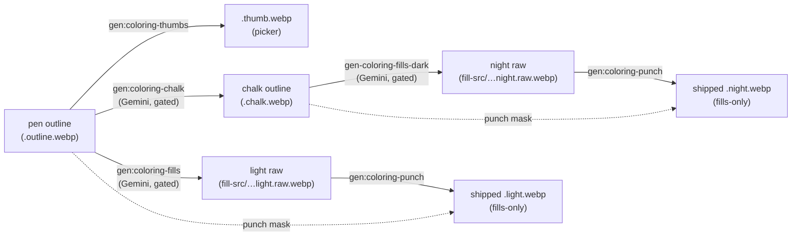
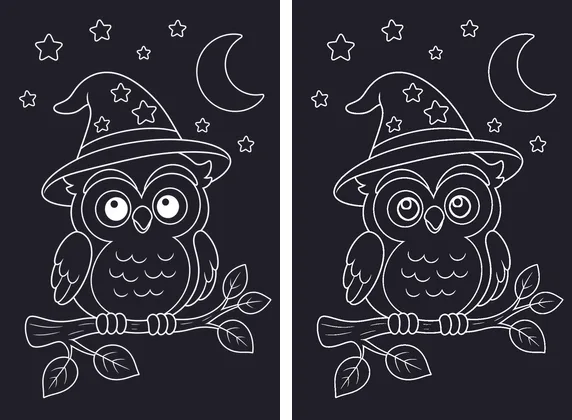
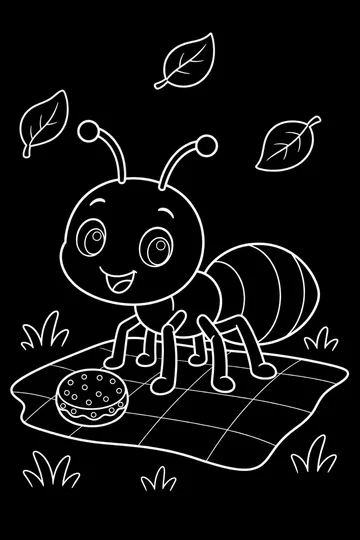
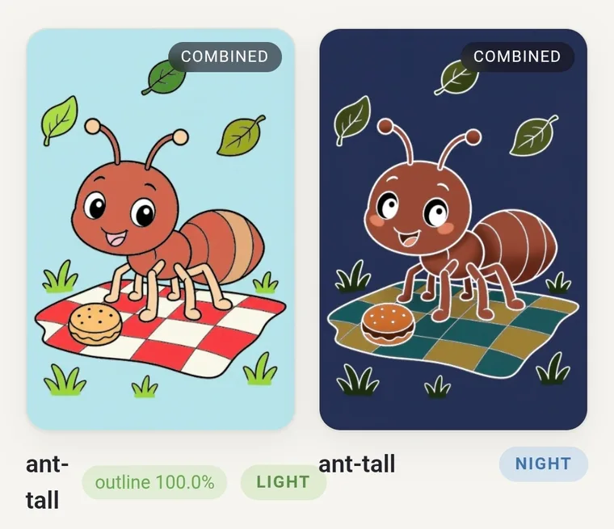

# The coloring-page image pipeline — outline → punch → day/night fills

The living reference for how Splotch's coloring-page art is produced, gated,
reviewed, and shipped: the current approach, the approaches we tried and
rejected, the failure modes we've already hit (with pictures), and where the
next ones are likely to come from. Written to let a fresh session run the next
category without re-deriving any of this.

Companion docs: `README.md` (runbook), `night-fills.md` (night-fill
operational playbook — its "canonical eye" sections predate thin-stroke
outlines, see [Doc debt](#doc-debt)), `contact-sheet.md` (review surface),
ADR-0043 (magic-brush reveal), ADR-0052 (dark mode), ADR-0053 (asset-gen
architecture). Every illustration here is a frozen copy in
`pipeline-assets/` — live assets regenerate, these don't.

## The pipeline at a glance



The line work is **forked per theme** (the pen/chalk split): the **pen
outline** is black ink on white paper — the light-mode overlay and the source
every other asset derives from. The **chalk outline** is white ink on a black
board — the dark-mode overlay, a Gemini redraw of the inverted pen that makes
the judgment calls a blind invert can't: eye sclera and catchlights become
deliberate SOLID WHITE, pupils stay black, everything else stays thin strokes.
The chalk is *stored* ink-on-white (`{page}.chalk.webp`, the negation of what
dark mode displays) so the app's existing dark treatment (`invert(1)` +
screen) renders it unchanged and every ink-on-white tool in this folder reads
it unmodified. Orientations without a chalk fall back to inverting the pen —
the pre-fork behavior — so categories migrate incrementally.

| Asset | Lives in | Shipped? | Produced by |
| --- | --- | --- | --- |
| `{page}.outline.webp` | `web/static/coloring/{book}/` | yes — the PEN outline: light-mode overlay, source of all derivations | hand-curated + `normalize-outline-strokes.mjs` |
| `{page}.chalk.webp` | `web/static/coloring/{book}/` | yes — the CHALK outline: dark-mode overlay + night punch mask, stored ink-on-white | `gen-coloring-chalk.mjs` from the pen |
| `{page}.thumb.webp` | `web/static/coloring/{book}/` | yes — picker grid (from the pen; the picker inverts it in dark mode) | `gen-coloring-thumbs.mjs` |
| `{page}.{light,night}.raw.webp` | `tools/asset-gen/fill-src/{book}/` | no — committed source of truth for fills, keeps its own outlines so audits can score registration | `gen-coloring-fills.mjs` / `gen-coloring-fills-dark.mjs` |
| `{page}.{light,night}.webp` | `web/static/coloring/{book}/` | yes — magic-brush reveal, fills-only (outlines punched to alpha: pen mask for light, chalk mask for night) | `punch-fill-outlines.mjs` from the raw |

Everything shipped is a **static, committed artifact** — no generation at
build or run time, no server dependency, trivially cacheable. The renderer is
deliberately dumb: light mode multiplies the pen outline over light paper;
dark mode inverts the chalk (shipped ink-on-white) to white chalk and screens
it over dark paper (ADR-0052); the reveal layers the punched fill underneath.
Because screen with white is white, the chalk's solid whites always survive
into the final combined image — no runtime smarts needed. All intelligence
lives at generation time, behind gates, with a human review at the end.

## Why the fork: the white-blob problem

Before the pen/chalk split, one outline served both themes, and both halves of
the renderer assumed **every dark outline pixel is a thin stroke**:

1. the punch cut every outline-dark pixel out of the fills
   (`lib/punch-fill.mjs`, luma < 150), and
2. dark mode inverted the whole outline (`--lineart-filter: invert(1)`).

A large SOLID black region (a cartoon pupil, a tire, a black patch) broke
both at once: its correct fill pixels were deleted by the punch, then the
invert painted the hole **pure white**. A white *border* reads fine; a white
*blob* does not. The owl demonstrates the whole problem in one page:

| The blanket invert on solid pupils | …but the raw night fill already had the eyes |
| --- | --- |
|  |  |


*The source of it all: solid-black pupils in the outline (owl, pre-fix — the
creatures category still looks like this).*

Two approaches shipped against this, in order:

1. **Thin-stroke normalization** (2026-07, first pass): normalize every
   outline to thin strokes only, making the blanket invert and the punch
   correct by construction. It worked — but reusing a single outline across
   both themes kept forcing compromises: whites the *dark* render genuinely
   wants solid (an eye's sclera) can't exist in a shared outline without
   breaking the light theme, so the night fill had to paint them and the eye
   gates had to police it.
2. **The pen/chalk fork** (current): give dark mode its own line art. The
   chalk redraw decides per-feature what is solid white and what stays black,
   the night punch masks with the chalk, and the traditional blanket
   invert/punch machinery stays dumb — the chalk's whites are *correct by
   authorship*, and they survive the punch + screen by construction.

Normalization remains valuable on the PEN side: light-mode pages get classic
outlined pupils (a solid pen pupil is harmless in light mode — the overlay's
black covers the punched hole — but outlined reads better as a coloring page),
and a blob-free pen gives the light-fill generator clean inputs. It is no
longer what keeps dark mode correct.


*ant-tall before (solid pupils) and after (thin outlined pupil + catchlight
circle). Light-mode fills paint the pupil black again, so the colored result
is unchanged; the uncolored page now shows outlined pupils, classic
coloring-book style.*


*ant-tall at night, before and after. The before looks passable only by
accident — the old solid pupil inverted to a white eyeball and the glare dot
became a fake pupil (the "canonical eye" trick in the pre-2026-07 docs). The
after is the same look produced by design: the night fill paints the eye and
survives the punch.*

### Approaches considered and rejected

| # | Approach | Why not |
| --- | --- | --- |
| A | **Structure-aware "smart chalk"** — build-time morphological classifier splits thin strokes from solid interiors; ship a derived `.chalk.webp` per page; dark mode renders it instead of `invert(1)`; punch keeps solid interiors | Fully prototyped and it worked (below) — but a *classifier* can only preserve what the pen happens to contain; it can't decide a thin-ringed sclera should go solid white. The pen/chalk fork ships the same asset shape (a `.chalk.webp` per page) with an *author* instead of a classifier. |
| B | Same classifier at **runtime** (canvas, per page-apply) | The exact main-thread work ADR-0043 moved to build time, on low-end tablets. |
| C | **Canonical-eye retouch** at scale (solid pupil + one big glare, so the invert *accident* lands well) | Eyes-only; nothing for tires/patches/shapes; keeps the accident as the mechanism. This was the pre-2026-07 playbook (see the mermaid saga in `night-fills.md`). |
| D | **AI-generated dedicated night line art** per page | Two *independently-generated* line arts drift out of registration — the ghosting class ADR-0043 exists to prevent. The pen/chalk fork is D **domesticated**: the chalk is an *edit of the pen* (not a fresh generation), gated on outlineMatch registration exactly like the fills, so every pen stroke provably survives in place and only bounded solid whites are added. |


*Option A's prototype output (right) vs the blanket invert (left). It rescued
the owl's eyes without touching any asset — worth knowing it exists if a
category ever can't be normalized — but outline normalization made it
unnecessary.*



*Option A also solved the uncolored page (left: today's blob pupils; right:
rimmed outlines). With thin-stroke outlines the uncolored page is simply
correct.*

## Stage 1 — Pen outlines

The pen outline is the source of everything: the light overlay renders it, the
light punch masks with it, the light-fill generator conditions on it, the
chalk redraws from it, and the thumbnail is a resize of it. **Every downstream
regeneration flows from a pen change**, so a pen edit means regenerating the
page's whole suite (thumb + chalk + light + night + punch).

### Outline invariants, and the audit that enforces them

`npm run gen:coloring-outlines:audit -- [category]` — deterministic, no API:

| Invariant | Measure (lib/solid-regions.mjs, lib/eye-fill.mjs) | Bar | The regression that created it |
| --- | --- | --- | --- |
| No solid regions | biggest connected blob surviving a morphological opening; radius is **adaptive** — `clamp(ceil(p90strokeWidth/2)+2, 5, 8)` from a chamfer distance transform | ≤ 100 px | owl/ant/trex white-blob eyes; a fixed r=8 then missed bee-tall's small pupils (strokes are only ~4 px wide) |
| …including fragmented ones | **total** interior px page-wide | ≤ 60 px | bee-tall's first redraw kept a solid pupil whose catchlight holes fragmented the eroded interior into pieces that each ducked the blob bar (103 total vs 0–4 on honest pages) |
| Sane eye complexity | deepest eye-scale nesting chain (`scoreEyeRings`) | ≤ 4 levels | caterpillar-tall's redraw produced "hypno swirl" eyes — extra concentric circles that registration *can't* catch (they hug the old pupil boundary) and solidity can't either (all thin) |

Covers (`{book}/cover.webp`) appear in the audit but are picker-only — never
colored, never inverted as a full-page overlay — so their solid regions are
harmless noise.

### The normalizer

`npm run gen:coloring-outlines:normalize -- <page…> [--apply] [--notes "…"]
[-t F] [--max-attempts N]` — Gemini image-edit
(`gemini-2.5-flash-image`) redraws solid regions as thin outlined shapes
(eyes: exactly one pupil ring + one catchlight circle), keep-best-of-N with a
rising temperature ladder, candidates land in
`.coloring-samples-dark/normalize/`. Six gates per candidate:

1. **solidity** — the point of the exercise;
2. **ring depth** ≤ 4 — no swirl eyes;
3. **eyes preserved** — every source eye-core cluster still has a core in the
   candidate. Added after a low-temperature retry **deleted a whole eye** and
   still scored 99.7% locally (whitened eye interiors are exempt from drift by
   design, and a thin eyeball ring is too few pixels to sink a tile);
4. **keep** ≥ 92% and **worst-tile keep** ≥ 80% (`lib/outline-match.mjs`)
   against a *reference* — the source with solid interiors and over-ringed eye
   interiors whitened out, because removing those is the goal, not drift;
5. **reverse keep** ≥ 90% — no invented strokes (same whitening applied to the
   candidate's eye interiors, so the replacement pupil isn't "invented");
6. temperature/`--notes` levers when the model resists (bee-tall's pupils took
   an eye-specific note at t 0.7–0.8; caterpillar's faithful de-swirl took
   t 0.2 plus "CHANGE NOTHING ELSE ANYWHERE").

The registration gate also catches semantic damage: the first bee-wide
normalization silently **deleted a cloud** (worst-tile keep 0%), fixed with a
`--notes` telling it the sky has three clouds.

## Stage 1.5 — Chalk outlines

`npm run gen:coloring-chalk -- <page-or-category…> [--apply] [--notes "…"]
[-t F] [--max-attempts N] [--force]` — Gemini image-edit redraws the inverted
pen as a chalk line drawing (`gen-coloring-chalk.mjs`), keep-best-of-N with a
rising temperature ladder, candidates in `.coloring-samples-dark/chalk/` (each
with a `.display.webp` preview of what dark mode will show and a registration
overlay). Four gates per candidate (`--rescore` re-runs them over saved
candidates offline — no API — after a gate change):

1. **keep ≥ 92% / worst-tile ≥ 80%** (`lib/outline-match.mjs`, pen →
   candidate) — every pen stroke is still traced in place. Only the forward
   direction is gated: a chalk legitimately *adds* ink (its solid whites), so
   the reverse direction is covered by the enclosure gate instead;
2. **enclosure** — new ink is judged by WHERE it lands, not how thick it is:
   inside a pen-bounded interior it's a deliberate whitening; on the open
   background (flood-reachable from the page border) it's an invented shape
   and fails. The first draft judged by *thickness* (a morphological opening)
   and misread every whitened sclera — a thin annulus around the pupil — as an
   invented stroke, rejecting 9 of nature's 12 perfectly good chalks;
3. **white budget** — total whitened area ≤ 10% of the page (a chalk that
   whitens a whole body is a review-worthy surprise, not a judgment call);
4. **eye polarity** — pen eye cores the committed light raw paints DARK
   (pupils) must stay non-ink/fillable in the chalk; cores it paints BRIGHT
   (catchlights) should be chalk ink (warns only). Added after the first
   spider/caterpillar chalks whitened whole eyeballs — pupil included — which
   the registration gates can't see (the rings are all still traced) and the
   night-fill composite gate only catches after a fill has been burned.

After applying a chalk, regenerate the page's **night fill** (it conditions on
the chalk) and re-punch. Thumbs and light fills are untouched — they belong to
the pen.

## Stage 2 — The punch

`npm run gen:coloring-punch -- [pages…]` re-derives every shipped fill from
its committed raw: alpha = 0 where the line art is dark (luma < 150), 255
elsewhere (`lib/punch-fill.mjs`). The mask is **per-theme**: light raws punch
against the pen, night raws against the chalk when the page has one (both ship
ink-on-white, so the mask math is identical; pages without a chalk fall back
to the pen). Why: the app's overlay already draws the line art, so a revealed
fill carrying its *own* copy of the outlines would double every line, and any
drift between the copies shows as ghosting (ADR-0043 "reveal fills only").
Punching the night fill with the chalk is also what makes the chalk's solid
whites land in the final image: the fill's pixels there are removed, and the
screened chalk white shows through. Deterministic and offline — after any raw,
pen, or chalk change, re-punch.


*Left to right: outline → raw light fill (keeps its outlines, committed to
`fill-src/`) → the shipped punched fill composited over magenta so the
punched-out line work is visible. Note the eyes survive the punch now — with
the old solid-pupil outline, the entire pupil was punched away.*

Sharp gotcha, documented in `CLAUDE.md` and worth repeating: never
`joinChannel` an alpha plane and encode — sharp tags it as a generic extra
channel and the encoder silently flattens it. Interleave an explicit RGBA
buffer.

## Stage 3 — Light fills

`npm run gen:coloring-fills -- <pages…>` sends the outline to Gemini with
`FILL_PROMPT` ("color it in neatly… keep every black outline exactly where it
is… flat colors, no blank white, pupils solid black with a white catchlight").
Post-processing and gates, keep-best-of-5:

- `alignToSource` (`lib/align-to-source.mjs`) — edge-map correlation undoes
  the few-pixel global nudge the model tends to add;
- **keep ≥ 92% / worst-tile ≥ 80%** — the worst-tile gate exists because
  a 93% global keep once shipped with a single flower drifted to 34%
  (nature/ant-wide, pre-gate);
- **white ≤ 5%** — big blank areas read as uncolored under the brush;
- **eyes** — at least one eye core reads lively (`judgeLightEyes`); zero
  lively cores means the outline itself is broken.

Passing output writes the raw to `fill-src/` and punches the shipped fill in
one step.

## Stage 4 — Night fills

`node --experimental-strip-types --disable-warning=ExperimentalWarning
tools/asset-gen/gen-coloring-fills-dark.mjs <pages…> [--max-attempts N]
[-t F] [--notes "…"]` — the input is the **chalk outline as dark mode displays
it** (white marks on near-black — the negation of the shipped ink-on-white
chalk), falling back to the inverted pen for un-forked pages:



The prompt asks for a cozy moonlit recolor: deep evening background, natural
(dimmed, not grey) subject colors, white marks stay bright white. The eye
instruction is input-dependent: with a chalk, the whites are already painted
(solid sclera + catchlight are chalk) and the fill's only eye job is a deep
near-black pupil; without one, the fill paints all three tones itself. Four
gates, keep-best-of-N (fallback ranking prefers takes with more surviving
eyes over least drift) — registration/mood/line gates score against the chalk
(the line art the fill must sit under):

| Gate | Catches | Bar |
| --- | --- | --- |
| `scoreDrift` | invented shapes (thin white strokes far from any source line) | ≤ 0.004 (clean ≈ 0) |
| `scoreNightness` | daytime "sky blue" background (median luma of the flood-filled true background) | ≤ 100 (good ≈ 15–50) |
| `scoreLineColor` | the model re-inking white outlines dark (they'd double against the chalk overlay) | median ≥ 150 (white ≈ 154–250) |
| `judgeNightEyes` | flat-flooded eyes (below) | every strong light-lively core stays lively — judged on the **simulated final composite** (chalk-punched fill + screened chalk over dark paper) when the page has a chalk, since the chalk owns the whites; cores keyed off the pen |

Levers for stubborn pages, in order: more attempts against the gates → a low
`-t` (~0.25–0.3, keeps the model faithful) → `--dilate-lines 2` (pale subjects
that tempt dark re-inking) → `--notes` (page-specific; the dark-bodied spider
needed "THE EYES ARE THE STAR OF THIS PAGE" to stop flooding them navy).

Shipping is manual on purpose (human gate): copy the sample to
`fill-src/<page>.night.raw.webp`, `gen:coloring-punch`, wire `books.ts` if the
category is new, `check:assets`.

## The eye problem — a chronicle

Eyes are where every failure in this pipeline has concentrated, because they
are the highest-contrast, most anatomically-particular structure on the page,
and toddlers look at them first. Everything below actually shipped or nearly
shipped; the gates exist because scores kept lying.

| Failure | What it looked like | Caught by (now) |
| --- | --- | --- |
| Solid pupils invert to white blobs |  | solidity audit (blob) |
| Small pupils duck a fixed erosion radius |  | adaptive radius from measured stroke width |
| Fake-hollow redraw: still solid, holes fragment the blob metric | (never committed — blob 46 but 103 total interior px) | total-interior bar |
| "Hypno swirl" eyes: too many concentric rings, poisoning both fills |  | ring-depth ≤ 4 |
| Redraw deletes an eye entirely, registration barely notices |  | eyes-preserved gate |
| Night fill floods the whole eye one color — rings never colored in |  | eye-fill gate |
| Night fill paints the catchlight but leaves the sclera dead (eye reads as a dark socket) |  | all-cores enforcement in `judgeNightEyes` |

And the fixed versions that shipped:

| | | |
| --- | --- | --- |
|  |  |  |

### How the eye detector works (and how it got here)

`lib/eye-fill.mjs`. Detection: an **eye core** is the innermost region of a
nested `A ⊂ B ⊂ C` enclosure chain in eye-like size bands (a catchlight
interior or a small pupil disc). Strict double-nesting with bbox containment
is what keeps it precise — a loose "small enclosed region" filter matches
blanket checks and leaf cells and drowns the real eyes.

Measurement: each core's median luma vs its **neighborhood band** — a tight
geometric annulus just outside the core's ring (`rIn = r+3`,
`rOut = rIn + max(12, 0.6r)`), sampling only pixels ≥ 1 px clear of ink,
judged at the p15/p85 extremes. A core is **lively** if it's genuinely light
with something genuinely dark beside it, or vice versa (light ≥ 150,
dark ≤ 100, gap ≥ 60) — polarity-agnostic, because outline anatomy varies.

That band definition is the survivor of four failed ones — do not "improve"
it without re-running every fixture below:

1. **label-filtered band** (sample the parent region) — parent-march tunnels
   past *tangent* rings; read bee-tall's black pupil as sclera;
2. **sealed flood** (BFS through pixels ≥ 2 px clear of ink) — starves behind
   *double-stroked* rings; called the spider's correct eye dead;
3. **leaky flood** (plain BFS) — escapes hairline ring gaps; drowned the
   spider's cream sclera in dark face pixels and blessed the caterpillar's
   dead eye with its lit cheek;
4. **wide annulus** — samples the cheek/face directly; same false verdicts.

Judgment: the **light fill is the reference** for which cores are real eyes —
shell spots and segment dots nest exactly like eyes but are flat (or weakly
lit, light side < 180) in the light fill and never gate. A night fill passes
when **every** strongly-lit reference core stays lively (`judgeNightEyes`).
Per-eye-any-core enforcement was tried and shipped the dead-sclera ladybug —
the white catchlight carried the verdict.

Debugging technique that kept resolving disputes between scores and eyes:
**ASCII luma maps**. When a crop and a score disagree, dump the region as
characters — it's diffable, zoomable, and doesn't lie:

```
##########+           +#########     # = dark   . = mid   ' ' = light
#########.             +########     A 40×40 window around a disputed
########.   .+++..      .#######     eye, rendered from raw luma —
#######.  .+######+.     .######     this settled the spider verdict
```

## Iteration methodology

The loop that has worked, per category:

1. **Audit first** (`gen:coloring-outlines:audit`, `gen:coloring-fills:audit`,
   `gen:coloring-fills:audit:eyes`) — all deterministic and free.
2. **Normalize offenders**, worst-first, `--apply` only on gate-passing
   candidates; eyeball every candidate image anyway (gates have been fooled —
   each time by something no existing gate measured).
3. **Regenerate the suite** for changed pages: thumbs → light fills → night
   fills → punch.
4. **Rebuild the contact sheet and publish it as an Artifact** — judge on the
   Combined view in BOTH themes; zoom the eyes. The sheet is the review
   surface of record (`contact-sheet.md`):

   

5. `check:assets` + `check` + `test:unit`, commit, push.

Hard-won process lessons:

- **Scores can lie in both directions.** A 99.7% local keep hid a deleted eye;
  a "flat eyes" warning flagged a perfect fill. When a gate and your eyes
  disagree, the gate is wrong until proven otherwise — crop the pixels.
- **Every new gate came from a shipped (or nearly shipped) regression.** Expect
  the next category to produce a failure no current gate measures; add the
  gate, don't just fix the instance. Keep known-bad fixtures around (git
  history has them — see the commit list below) to recalibrate against.
- **Keep-best-of-N with a temperature ladder beats prompt-tweaking** for
  one-off resistance; `--notes` beats both for *persistent* resistance
  (bee-wide's deleted cloud, the spider's flooded eyes).
- **One category per pass, review gate between categories.** Budget roughly:
  outline normalization 1–8 attempts/page, fills 1–10; the worst single page
  so far (spider-tall night) burned ~26 attempts before the `--notes` lever.
- **Never edit shipped images by hand**; regenerate from the source and let
  the gates re-run. Raws are the source of truth for fills; outlines for
  everything.

Useful history (this branch, `feat/thin-stroke-outlines`):

| Commit | What |
| --- | --- |
| `b801d1c` | pre-normalization baseline (solid-pupil outlines, accident-era night fills) |
| `3a686ad` | solidity gate + normalizer tooling |
| `4482aca` | first nature normalization — includes the swirl-eyed caterpillar outline (fixture) |
| `6840bba` | eye-fill gate, adaptive radius, bee/snail renormalized |
| `551ab52` | ring-depth gate, caterpillar de-swirled — includes the dead-sclera ladybug night raw (fixture) |
| `d96ae6f` | all-cores night-eye enforcement, final band definition, ladybug/spider regenerated |

## Command reference

| Command | Purpose | API key? |
| --- | --- | --- |
| `npm run gen:coloring-outlines:audit -- [cat]` | solid regions + ring depth per pen outline | no |
| `npm run gen:coloring-outlines:normalize -- <page…>` | thin-stroke pen redraw, 6 gates, `--apply` to ship | yes |
| `npm run gen:coloring-chalk -- <page-or-cat…>` | chalk-outline redraw from the pen, 4 gates, `--apply` to ship | yes |
| `npm run gen:coloring-fills -- <pages…>` | light fills (gated) + auto-punch | yes |
| `node … gen-coloring-fills-dark.mjs <pages…>` | night fills (gated) → samples | yes |
| `npm run gen:coloring-punch -- [pages…]` | re-derive shipped fills from raws | no |
| `npm run gen:coloring-fills:audit -- [cat]` | registration drift on committed raws | no |
| `npm run gen:coloring-fills:audit:eyes -- [cat]` | eye liveliness on committed raws (light + night) | no |
| `npm run gen:coloring-thumbs -- [cat]` | picker thumbnails | no |
| `npm run gen:contact-sheet -- <cat>` | the review sheet (publish as Artifact) | no |

## Status and the next category

| Category | Pen outlines | Chalk outlines | Night fills | Notes |
| --- | --- | --- | --- | --- |
| Nature | ✅ thin-stroke, all 12 | ✅ all 12 | ✅ chalk-era, all gates green | the pilot for both the normalization and the fork |
| Space, Farm, Dinosaurs, Creatures | ❌ accident-era | ❌ | shipped, accident-era | owl (blob 1919), trex, dog, cat, dragon, etc. flagged by the audit |
| Objects, Shapes, Vehicles | ❌ | ❌ | none yet | chalk + night fills together when each category is processed |

Next-category runbook: pen audit → normalize offenders if the light page
warrants it (worst-first, `--apply`) → thumbs → light fills → **chalks**
(`gen:coloring-chalk --apply`) → night fills (they condition on the chalk) →
ship raws + punch → wire `books.ts` (`night` + `chalk` orientation lists — see
`night-fills.md` step 4) → all three audits → contact sheet review in both
themes → checks → commit.

Note the fork loosens the old hard ordering: a solid-pupil pen no longer
*breaks* dark mode (the chalk redraw makes its own judgment from whatever pen
it gets, and light mode covers punched holes with its own black ink), so pen
normalization is a light-theme quality call, not a dark-theme prerequisite.

## Where the next problems are likely to come from

- **Shapes is not a face category.** `circle-tall` (blob 1921),
  `star-tall` (901), `rectangle-tall` (1266) carry big *geometric* solids.
  The chalk generator's instruction is eye-flavored, the eye detector will be
  inert (no nested triples), and a big pen solid is *new territory for the
  chalk redraw*: should a solid star stay solid white chalk (probably — it's
  under the 10% white budget only if small) or become an outline? Expect to
  extend the instruction and lean on `--notes` and careful review; expect
  night fills with almost no gate coverage beyond drift/night/line-color.
- **The owl.** Its giant eyes are now the chalk's *best case* (huge sclera →
  solid white chalk, exactly what a chalk artist would do) — but its pupils
  are the biggest solids in the catalog and the raw night fill (which is
  gorgeous) is the target to preserve. Consider `--notes` from the start.
- **Chalk whites the fill disagrees with.** The chalk decides what is white
  at authoring time; the night fill can't overrule it (the punch wins). A
  chalk that whitens something the night palette wanted colored (a tooth on a
  dark face, a marking) is only caught by human review — no gate compares the
  chalk's whites to the fill's intent.
- **Dark-bodied subjects at night** (spider precedent): the model wants to
  flood them; eyes and markings vanish. Reach for `--notes` early.
- **The eye detector's anatomy assumptions.** Nested-circle eyes, cores
  ≥ 6 px, eye-scale area bands, and the 180 strong-reference bar were all
  calibrated on *nature*. New art styles (side-profile eyes, closed happy
  eyes `>‿<`, characters wearing glasses — the owl's witch hat already
  flirts with this) can break detection silently: no cores found = vacuous
  pass. The audit prints core counts; a face page reporting 0 cores is a
  red flag to investigate, not a pass.
- **Model drift.** Everything is tuned against `gemini-2.5-flash-image`
  behavior observed in 2026-07 (its nudge, its re-inking habit, its
  eye-flooding on dark bodies). A model upgrade re-rolls all of those
  tendencies; the gates should catch regressions, but attempt budgets and
  temperature ladders will need re-tuning.
- **Registration tolerance stack-up.** outlineMatch tolerates ±2 px at 512;
  alignToSource corrects only *global* shifts. A redraw that locally warps
  by 3–4 px passes gates but can shimmer under the punch. No incident yet;
  if ghosting appears at reveal edges, this is the first suspect.
- **Light-mode uncolored pages now show outlined pupils** instead of solid
  ink. Classic coloring-book convention, and the colored result is
  unchanged — but it's a visible product change on pages kids may know.
  If it tests badly, Option A's rimmed-solid rendering is the fallback that
  preserves solid ink in light mode.
- **Cross-fill consistency.** The light and night fills are independent
  generations; nothing checks that the bee's stripes or the blanket's
  pattern have the same *palette logic* across modes (the ant's picnic
  blanket is red/white by day and teal/olive by night today). Nobody has
  complained; if consistency ever matters, it needs a new scorer.

## Doc debt

- `night-fills.md` still documents the **canonical-eye** ("solid pupil + one
  glare") recipe, the eyes-are-line-art-driven model, and the single-outline
  (pre-fork) flow — all obsolete for chalked categories. Its per-category
  workflow and gate documentation are still accurate. Rewrite once the
  remaining categories migrate.
- `retouch-line-art.mjs`'s default instruction is the canonical-eye edit —
  superseded by `normalize-outline-strokes.mjs` for solid regions; still
  useful for arbitrary non-eye retouches.
- The Stage 4 input illustration (`nightfill-inverted-input-ant.webp`) shows
  the pre-fork inverted pen; the current input is the chalk with its solid
  eye whites. Refresh when the illustrations are next regenerated.
